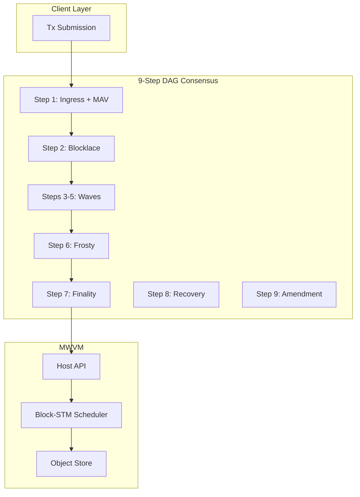

# Morpheum WASM VM (MWVM) Documentation

**Version**: 2.4 (February 2026)  
**Compatible with**: Morpheum 2.0 9-Step DAG Consensus (Mormcore), Object-Centric MVCC + Block-STM Scheduler, Flash Path, Frosty Epochs, Step-8 Recovery, Constitutional Amendment, KYA/DID Delegation.

---

## Overview

MWVM is the **production-ready WebAssembly smart contract VM** for the Morpheum blockchain. It is designed for:

- **DAG-native execution** — Causal snapshots, Block-STM parallelism, Flash-path fast finality
- **Object-centric state** — Versioned objects with MVCC; no global shared mutable state
- **Gasless + deposit model** — Refundable storage deposits instead of execution gas
- **Agentic-first** — Idempotency keys, safe retries, multi-agent workflows
- **Host-mediated security** — All I/O via sandboxed Host API; WASM = pure compute
- **KYA/DID delegation** — Scoped, revocable agent authorization via Verifiable Credentials (v2.4)

---

## Documentation Index

### [Proposals](./proposals/)

Design proposals, version progression (draft1–draft9), and foundational architecture. **Start here**: [proposals/README.md](./proposals/README.md).

| Document | Description |
|----------|-------------|
| [draft9-v2.4.md](./proposals/draft9-v2.4.md) | **MWVM v2.4 (current)** — KYA/DID + VC delegation, 43+ Host API functions |
| [draft8-v2.3.md](./proposals/draft8-v2.3.md) | MWVM v2.3 — Native upgrade & migration, stable contract address |
| [keyhost.md](./proposals/keyhost.md) | **Host API** — 43+ functions (object_*, idempotency, oracle, staking, crosschain, KYA/delegation) |
| [io.md](./proposals/io.md) | Load/write/execute, race prevention, MVCC + Block-STM, nonce design |
| [storage.md](./proposals/storage.md) | WASM storage model — linear memory + host-provided object/KV |
| [vm-2.md](./proposals/vm-2.md) | v2.0 compatibility matrix |
| [comparison.md](./proposals/comparison.md) | ZK Cairo vs Move vs WASM VM comparison |

### [Cost](./cost/)

Gasless deployment, refundable storage deposits, cost formulas.

| Document | Description |
|----------|-------------|
| [cost.md](./cost/cost.md) | **Deployment design** — MsgStoreCode, MsgInstantiate, MsgMigrate; 1 $MORPH / 100 KB deposit |
| [cost-driver.md](./cost/cost-driver.md) | **Cost formula table** — Full formulas for StoreCode, Instantiate, Migrate, DeleteCode |

### [MEV](./mev/)

MEV analysis for WASM vs EVM.

| Document | Description |
|----------|-------------|
| [mev.md](./mev/mev.md) | MEV comparison — WASM chains (faster, less reentrancy) vs EVM; Morpheum positioning |

### [Test Framework](./test-framework/)

MormTest — local WASM testing, agentic workflows, MCP.

| Document | Description |
|----------|-------------|
| [test-framework.md](./test-framework/test-framework.md) | **MormTest architecture** — Simulator, Host API mocks, test harnesses |
| [morm-test.md](./test-framework/morm-test.md) | MormTest v2 — resource-optimal, time-travel, agentic support |
| [mcp-feature.md](./test-framework/mcp-feature.md) | **Mormtest-MCP** — JSON protocol for ZeroClaw, OpenClaw, NetClaw |
| [test-mcp.md](./test-framework/test-mcp.md) | MCP structure optimization for multi-agent collaboration |
| [test-mcp2.md](./test-framework/test-mcp2.md) | Additional MCP specifications |

---

## Quick Reference

| Concept | Reference |
|---------|-----------|
| Current production spec | [draft9-v2.4.md](./proposals/draft9-v2.4.md) |
| Host API (43+ functions) | [keyhost.md](./proposals/keyhost.md) |
| Object model + MVCC | [io.md](./proposals/io.md), [storage.md](./proposals/storage.md) |
| Deployment flow | [cost.md](./cost/cost.md) |
| Cost formulas | [cost-driver.md](./cost/cost-driver.md) |
| Local testing | [test-framework.md](./test-framework/test-framework.md), [morm-test.md](./test-framework/morm-test.md) |
| Agentic / MCP | [mcp-feature.md](./test-framework/mcp-feature.md) |
