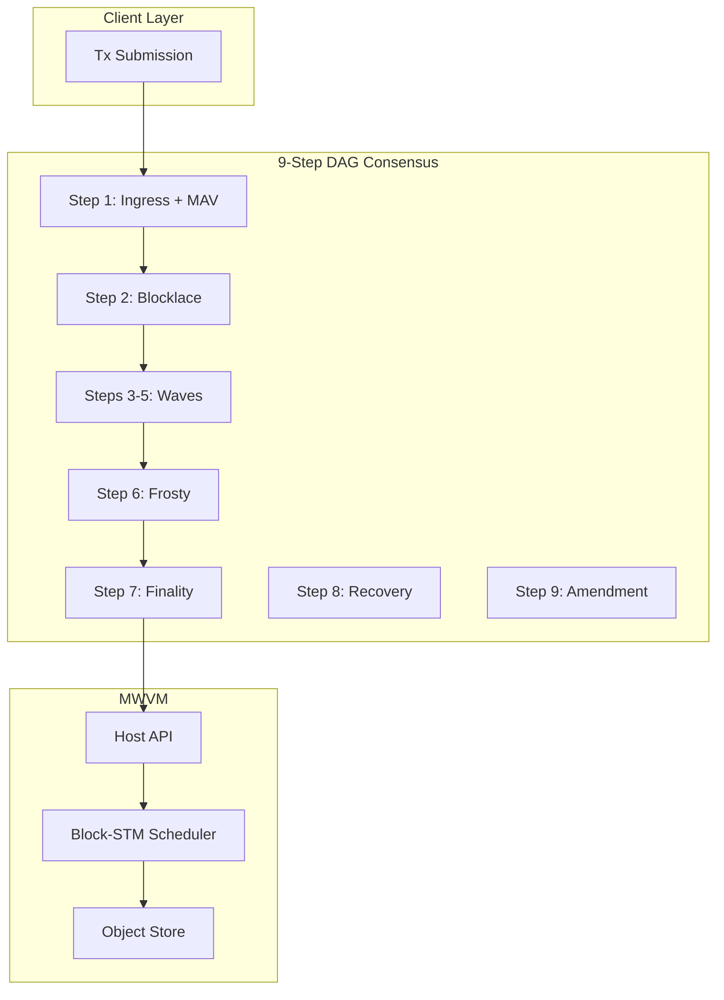

# Morpheum WASM VM (MWVM) Documentation

**Version**: 2.0 (February 2026)  
**Compatible with**: Morpheum 2.0 9-Step DAG Consensus (Mormcore), Object-Centric MVCC + Block-STM Scheduler, Flash Path, Frosty Epochs, Step-8 Recovery, Constitutional Amendment.

---

## Overview

MWVM is the **production-ready WebAssembly smart contract VM** for the Morpheum blockchain. It is designed for:

- **DAG-native execution** — Causal snapshots, Block-STM parallelism, Flash-path fast finality
- **Object-centric state** — Versioned objects with MVCC; no global shared mutable state
- **Gasless + deposit model** — Refundable storage deposits instead of execution gas
- **Agentic-first** — Idempotency keys, safe retries, multi-agent workflows
- **Host-mediated security** — All I/O via sandboxed Host API; WASM = pure compute

---

## Documentation Index

### [Design](./design/)

Architecture, storage model, I/O, Host API, and VM comparison.

| Document | Description |
|----------|-------------|
| [vm-2.md](./design/vm-2.md) | **MWVM v2.0 spec** — DAG-native optimizations, Host API, Flash path |
| [draft5.md](./design/draft5.md) | Production-ready MWVM specification for Mormcore |
| [keyhost.md](./design/keyhost.md) | **Host API** — 28+ functions (object_*, idempotency, oracle, staking, crosschain, ZK/TEE/FHE) |
| [io.md](./design/io.md) | Load/write/execute, race prevention, MVCC + Block-STM, nonce design |
| [storage.md](./design/storage.md) | WASM storage model — linear memory + host-provided object/KV |
| [comparison.md](./design/comparison.md) | ZK Cairo vs Move vs WASM VM comparison |
| [draft1.md](./design/draft1.md) – [draft4.md](./design/draft4.md) | Earlier design iterations |

### [Cost](./cost/)

Gasless deployment, refundable storage deposits, cost formulas.

| Document | Description |
|----------|-------------|
| [cost.md](./cost/cost.md) | **Deployment design** — MsgStoreCode, MsgInstantiate, MsgMigrate; 1 $MORPH / 100 KB deposit |
| [cost-driver.md](./cost/cost-driver.md) | **Cost formula table** — Full formulas for StoreCode, Instantiate, Migrate, DeleteCode |

### [MEV](./mev/)

MEV analysis for WASM vs EVM.

| Document | Description |
|----------|-------------|
| [mev.md](./mev/mev.md) | MEV comparison — WASM chains (faster, less reentrancy) vs EVM; Morpheum positioning |

### [Test Framework](./test-framework/)

MormTest — local WASM testing, agentic workflows, MCP.

| Document | Description |
|----------|-------------|
| [test-framework.md](./test-framework/test-framework.md) | **MormTest architecture** — Simulator, Host API mocks, test harnesses |
| [morm-test.md](./test-framework/morm-test.md) | MormTest v2 — resource-optimal, time-travel, agentic support |
| [mcp-feature.md](./test-framework/mcp-feature.md) | **Mormtest-MCP** — JSON protocol for ZeroClaw, OpenClaw, NetClaw |
| [test-mcp.md](./test-framework/test-mcp.md) | MCP structure optimization for multi-agent collaboration |
| [test-mcp2.md](./test-framework/test-mcp2.md) | Additional MCP specifications |

---

## Quick Reference

| Concept | Reference |
|---------|-----------|
| Host API (28+ functions) | [keyhost.md](./design/keyhost.md) |
| Object model + MVCC | [io.md](./design/io.md), [storage.md](./design/storage.md) |
| Deployment flow | [cost.md](./cost/cost.md) |
| Cost formulas | [cost-driver.md](./cost/cost-driver.md) |
| Local testing | [test-framework.md](./test-framework/test-framework.md), [morm-test.md](./test-framework/morm-test.md) |
| Agentic / MCP | [mcp-feature.md](./test-framework/mcp-feature.md) |
