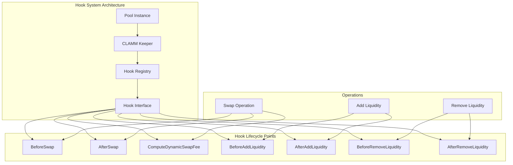
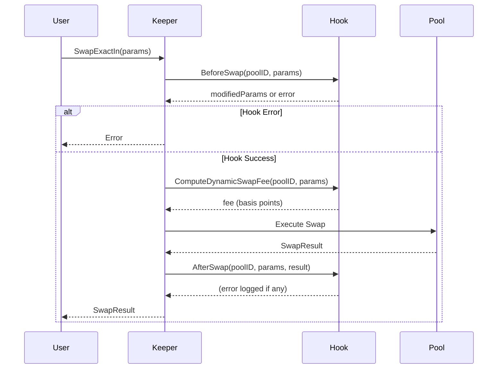
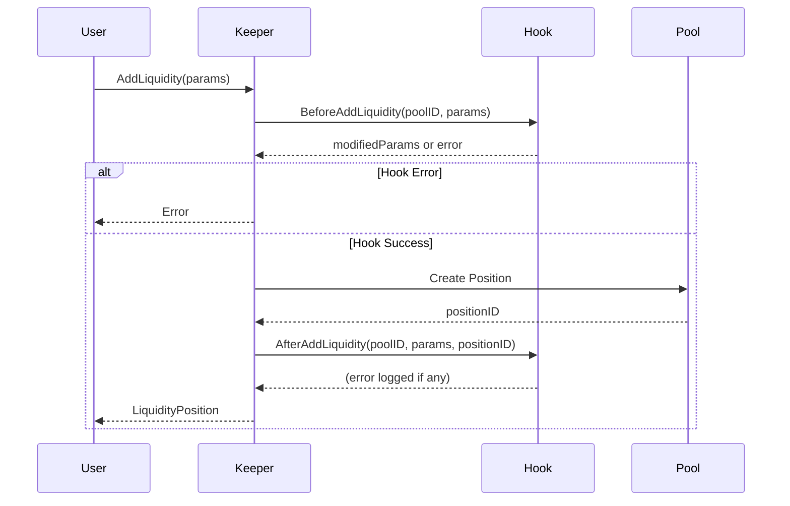

# CLAMM Hooks System Documentation

## Overview

The CLAMM (Concentrated Liquidity Automated Market Maker) module implements a flexible hook system inspired by Balancer V3's hook architecture. Hooks enable extensibility without requiring smart contracts in the DAG architecture, allowing custom logic to be injected at various lifecycle points during pool operations.

## Architecture



## Core Components

### 1. HookInterface

The `HookInterface` defines the contract that all hooks must implement. It provides lifecycle methods for different pool operations.

**Location:** `pkg/modules/clamm/types/interfaces.go`

```go
type HookInterface interface {
    // Registration and configuration
    OnRegister(ctx context.Context, poolID string, params map[string]interface{}) error
    GetHookFlags() HookFlags

    // Swap lifecycle hooks
    BeforeSwap(ctx context.Context, poolID string, swap SwapParams) (*SwapParams, error)
    AfterSwap(ctx context.Context, poolID string, swap SwapParams, result *SwapResult) error
    ComputeDynamicSwapFee(ctx context.Context, poolID string, swap SwapParams) (*big.Int, error)

    // Liquidity lifecycle hooks
    BeforeAddLiquidity(ctx context.Context, poolID string, params LiquidityParams) (*LiquidityParams, error)
    AfterAddLiquidity(ctx context.Context, poolID string, params LiquidityParams, positionID string) error
    BeforeRemoveLiquidity(ctx context.Context, poolID string, positionID string) error
    AfterRemoveLiquidity(ctx context.Context, poolID string, positionID string, amounts []*big.Int) error
}
```

### 2. HookFlags

`HookFlags` indicates which lifecycle points a hook implements. This allows the keeper to efficiently check if a hook should be called.

**Location:** `pkg/modules/clamm/types/types.go`

```go
type HookFlags struct {
    BeforeSwap            bool
    AfterSwap             bool
    BeforeAddLiquidity    bool
    AfterAddLiquidity     bool
    BeforeRemoveLiquidity bool
    AfterRemoveLiquidity  bool
    DynamicSwapFee        bool
    CustomLogic           bool
}
```

### 3. BaseHook

`BaseHook` provides a default implementation of `HookInterface` with no-op methods. Custom hooks can embed `BaseHook` and override only the methods they need.

**Location:** `pkg/modules/clamm/hooks/base_hook.go`

**Usage Example:**
```go
type MyCustomHook struct {
    *BaseHook
    // Custom fields
}

func NewMyCustomHook() *MyCustomHook {
    flags := types.HookFlags{
        BeforeSwap: true,
        AfterSwap:  true,
    }
    return &MyCustomHook{
        BaseHook: hooks.NewBaseHook(flags),
    }
}
```

## Hook Lifecycle Points

### Swap Hooks

#### BeforeSwap

Called before swap execution. Can modify swap parameters or perform validation.

**Execution Flow:**
1. Hook is called with original swap parameters
2. Hook can return modified parameters or error
3. If error is returned, swap is aborted
4. Modified parameters are validated before swap execution

**Use Cases:**
- Slippage protection
- Volume limits
- Time-based restrictions
- Parameter adjustments

**Example Implementation:**
```go
func (h *MyHook) BeforeSwap(ctx context.Context, poolID string, swap types.SwapParams) (*types.SwapParams, error) {
    // Validate swap size
    if swap.AmountIn.Cmp(h.maxSwapSize) > 0 {
        return nil, fmt.Errorf("swap size exceeds maximum")
    }
    
    // Modify slippage protection
    if swap.AmountOutMin == nil {
        // Calculate minimum based on current price
        swap.AmountOutMin = h.calculateMinAmountOut(swap)
    }
    
    return &swap, nil
}
```

#### ComputeDynamicSwapFee

Calculates dynamic swap fees based on pool conditions. Returns fee in basis points (0-10000).

**Execution Flow:**
1. Hook is called before swap execution
2. Hook calculates fee based on swap parameters and pool state
3. Fee must be between 0-10000 basis points
4. Fee is applied during swap execution

**Use Cases:**
- Volatility-based fees
- Volume-based fee adjustments
- Time-based fee changes
- Market condition adjustments

**Example Implementation:**
```go
func (h *DynamicFeeHook) ComputeDynamicSwapFee(ctx context.Context, poolID string, swap types.SwapParams) (*big.Int, error) {
    baseFee := h.baseFee
    
    // Calculate volatility adjustment
    volatilityAdjustment := h.calculateVolatilityAdjustment(swap)
    
    // Add adjustment
    fee := new(big.Int).Add(baseFee, volatilityAdjustment)
    
    // Cap at 10000 basis points (100%)
    maxFee := big.NewInt(10000)
    if fee.Cmp(maxFee) > 0 {
        fee = maxFee
    }
    
    return fee, nil
}
```

#### AfterSwap

Called after swap execution completes. Cannot modify swap results but can perform side effects.

**Execution Flow:**
1. Hook is called after swap completes successfully
2. Hook receives original parameters and swap result
3. Errors are logged but do not fail the swap (swap already completed)

**Use Cases:**
- Logging and analytics
- External notifications
- Fee distribution
- Event emission

**Example Implementation:**
```go
func (h *MyHook) AfterSwap(ctx context.Context, poolID string, swap types.SwapParams, result *types.SwapResult) error {
    // Log swap for analytics
    h.analytics.LogSwap(poolID, swap, result)
    
    // Emit event
    h.eventEmitter.Emit("swap_completed", map[string]interface{}{
        "poolId": poolID,
        "amount_in": swap.AmountIn,
        "amount_out": result.AmountOut,
    })
    
    return nil
}
```

### Liquidity Hooks

#### BeforeAddLiquidity

Called before adding liquidity to a pool. Can modify liquidity parameters.

**Execution Flow:**
1. Hook is called with original liquidity parameters
2. Hook can return modified parameters or error
3. If error is returned, liquidity addition is aborted
4. Modified parameters are used for position creation

**Use Cases:**
- Parameter validation
- Amount adjustments
- Range restrictions
- Fee calculations

**Example Implementation:**
```go
func (h *MyHook) BeforeAddLiquidity(ctx context.Context, poolID string, params types.LiquidityParams) (*types.LiquidityParams, error) {
    // Validate tick range
    if params.TickUpper - params.TickLower < h.minTickRange {
        return nil, fmt.Errorf("tick range too small")
    }
    
    // Adjust amounts based on current price
    adjustedParams := h.adjustAmountsForPrice(params)
    
    return &adjustedParams, nil
}
```

#### AfterAddLiquidity

Called after liquidity is successfully added. Receives the created position ID.

**Execution Flow:**
1. Hook is called after position is created
2. Hook receives original parameters and position ID
3. Errors are logged but do not fail the operation

**Use Cases:**
- Position tracking
- External notifications
- Reward calculations
- Event emission

#### BeforeRemoveLiquidity

Called before removing liquidity. Can perform validation or restrictions.

**Execution Flow:**
1. Hook is called with position ID
2. Hook can return error to abort removal
3. If error is returned, liquidity removal is aborted

**Use Cases:**
- Lock period enforcement
- Minimum liquidity requirements
- Withdrawal restrictions
- Fee collection

**Example Implementation:**
```go
func (h *MyHook) BeforeRemoveLiquidity(ctx context.Context, poolID string, positionID string) error {
    // Check lock period
    position := h.getPosition(positionID)
    if time.Now().Unix() < position.LockedUntil {
        return fmt.Errorf("position is still locked")
    }
    
    return nil
}
```

#### AfterRemoveLiquidity

Called after liquidity is successfully removed. Receives the amounts returned.

**Execution Flow:**
1. Hook is called after liquidity removal completes
2. Hook receives position ID and token amounts returned
3. Errors are logged but do not fail the operation

**Use Cases:**
- Cleanup operations
- External notifications
- Analytics tracking
- Event emission

## Hook Registration

### RegisterHook

Hooks are registered with a pool using the `RegisterHook` method on the keeper.

**Location:** `pkg/modules/clamm/keeper/pool.go`

**Process:**
1. Validate pool exists
2. Check hook limit per pool (configurable)
3. Call hook's `OnRegister` method for validation
4. Store hook in registry
5. Update pool's `HookFlags`

**Example:**
```go
// Create a dynamic fee hook
hook := hooks.NewDynamicFeeHook(
    big.NewInt(30),  // Base fee: 30 basis points (0.3%)
    big.NewInt(5),   // Volatility multiplier
)

// Register with pool
err := keeper.RegisterHook(ctx, poolID, hook)
if err != nil {
    return fmt.Errorf("failed to register hook: %w", err)
}
```

### Hook Registry

The keeper maintains a thread-safe registry mapping pool IDs to hooks.

**Location:** `pkg/modules/clamm/keeper/keeper.go`

```go
type Keeper struct {
    // ...
    hooks map[string]types.HookInterface
    mu    sync.RWMutex
}
```

## Implementation Examples

### DynamicFeeHook

A complete example hook that implements dynamic fee calculation based on volatility.

**Location:** `pkg/modules/clamm/hooks/dynamic_fee_hook.go`

**Features:**
- Volatility-based fee adjustment
- Swap size consideration
- Fee capping at 100% (10000 basis points)

**Usage:**
```go
hook := hooks.NewDynamicFeeHook(
    big.NewInt(30),  // Base fee: 0.3%
    big.NewInt(5),   // Volatility multiplier
)

flags := hook.GetHookFlags()
// flags.DynamicSwapFee = true
// flags.BeforeSwap = true
```

### Creating Custom Hooks

To create a custom hook:

1. **Embed BaseHook:**
```go
type MyCustomHook struct {
    *hooks.BaseHook
    // Custom fields
    maxSwapSize *big.Int
    minTickRange int64
}
```

2. **Set HookFlags:**
```go
func NewMyCustomHook() *MyCustomHook {
    flags := types.HookFlags{
        BeforeSwap:         true,
        AfterSwap:          true,
        BeforeAddLiquidity: true,
    }
    
    return &MyCustomHook{
        BaseHook:    hooks.NewBaseHook(flags),
        maxSwapSize: big.NewInt(1e20),
        minTickRange: 100,
    }
}
```

3. **Implement Required Methods:**
```go
func (h *MyCustomHook) BeforeSwap(ctx context.Context, poolID string, swap types.SwapParams) (*types.SwapParams, error) {
    // Custom logic
    if swap.AmountIn.Cmp(h.maxSwapSize) > 0 {
        return nil, fmt.Errorf("swap too large")
    }
    return &swap, nil
}

func (h *MyCustomHook) AfterSwap(ctx context.Context, poolID string, swap types.SwapParams, result *types.SwapResult) error {
    // Custom logic (logging, events, etc.)
    return nil
}
```

4. **Register the Hook:**
```go
err := keeper.RegisterHook(ctx, poolID, hook)
```

## Hook Execution Flow

### Swap Execution with Hooks



### Add Liquidity Execution with Hooks



## Thread Safety

The hook system is designed with thread safety in mind:

1. **Read-Write Locks:** The keeper uses `sync.RWMutex` for concurrent access
2. **Hook Registry:** Protected by mutex during registration and lookup
3. **Hook Execution:** Hooks are read-locked during execution to allow concurrent reads
4. **State Isolation:** Each hook instance should be stateless or use its own synchronization

**Best Practices:**
- Hooks should be stateless when possible
- If state is needed, use proper synchronization within the hook
- Avoid blocking operations in hooks (use async patterns)
- Keep hook execution fast to avoid blocking pool operations

## Error Handling

### Hook Registration Errors

- **Pool Not Found:** Hook cannot be registered to non-existent pool
- **Hook Limit Exceeded:** Maximum hooks per pool limit reached
- **Validation Failure:** Hook's `OnRegister` method returned error

### Hook Execution Errors

- **Before Hooks:** Errors abort the operation (swap/liquidity addition/removal)
- **After Hooks:** Errors are logged but do not fail the operation (already completed)
- **Dynamic Fee:** Errors abort the swap; invalid fees (outside 0-10000) abort the swap

## Configuration

### Keeper Parameters

Hooks are controlled by keeper parameters:

- **HookRegistrationEnabled:** Whether hooks can be registered
- **MaxHooksPerPool:** Maximum number of hooks per pool (default: 1)

**Location:** `pkg/modules/clamm/types/params.go`

## Querying Hook Information

### GetHookFlags

Query the hook flags for a pool to see which lifecycle points are enabled.

**gRPC Endpoint:** `GetHookFlags`

**Example:**
```go
resp, err := client.GetHookFlags(ctx, &clammv1.GetHookFlagsRequest{
    PoolId: poolID,
})

flags := resp.HookFlags
// flags.BeforeSwap
// flags.DynamicSwapFee
// etc.
```

## Best Practices

### 1. Hook Design

- **Single Responsibility:** Each hook should have a clear, single purpose
- **Stateless:** Prefer stateless hooks for better concurrency
- **Fast Execution:** Keep hook execution time minimal
- **Error Handling:** Return clear, actionable error messages

### 2. Hook Registration

- **Register Early:** Register hooks when pools are created or initialized
- **Validate Configuration:** Use `OnRegister` to validate hook configuration
- **Check Limits:** Be aware of maximum hooks per pool

### 3. Hook Implementation

- **Use BaseHook:** Embed `BaseHook` to avoid implementing all methods
- **Set Flags Correctly:** Only set flags for lifecycle points you implement
- **Validate Inputs:** Always validate inputs in hook methods
- **Handle Edge Cases:** Consider zero values, nil pointers, etc.

### 4. Testing

- **Unit Tests:** Test hook logic in isolation
- **Integration Tests:** Test hooks with actual pool operations
- **Error Cases:** Test error handling and edge cases
- **Concurrency:** Test hook behavior under concurrent access

## Limitations

1. **One Hook Per Pool:** Currently, only one hook can be registered per pool
2. **No Hook Chaining:** Hooks cannot call other hooks
3. **Synchronous Execution:** Hooks execute synchronously (blocking)
4. **No State Persistence:** Hook state is not persisted across restarts (hooks must be re-registered)

## Future Enhancements

Potential improvements to the hook system:

1. **Multiple Hooks:** Support multiple hooks per pool with execution order
2. **Hook Chaining:** Allow hooks to call other hooks
3. **Async Execution:** Support asynchronous hook execution for non-critical operations
4. **State Persistence:** Persist hook configuration and state
5. **Hook Marketplace:** Registry of reusable hooks
6. **Hook Versioning:** Support hook versioning and upgrades

## Related Documentation

- **CLAMM Module:** `docs/clamm/hyper_clamm_system_design.md`
- **Pool Features:** `docs/clamm/pool_features.md`
- **ReCLAMM Features:** `docs/clamm/reclamm-features.md`

## Appendix

### Hook Interface Methods Reference

| Method | Purpose | Can Modify | Can Abort | Called When |
|--------|---------|------------|-----------|-------------|
| `OnRegister` | Validate hook configuration | No | Yes | Hook registration |
| `GetHookFlags` | Return enabled lifecycle points | No | No | Hook registration, queries |
| `BeforeSwap` | Pre-swap validation/modification | Yes | Yes | Before swap execution |
| `AfterSwap` | Post-swap side effects | No | No | After swap completion |
| `ComputeDynamicSwapFee` | Calculate dynamic fee | No | Yes | Before swap execution |
| `BeforeAddLiquidity` | Pre-add validation/modification | Yes | Yes | Before liquidity addition |
| `AfterAddLiquidity` | Post-add side effects | No | No | After position creation |
| `BeforeRemoveLiquidity` | Pre-remove validation | No | Yes | Before liquidity removal |
| `AfterRemoveLiquidity` | Post-remove side effects | No | No | After liquidity removal |

### HookFlags Reference

| Flag | Purpose | Related Methods |
|------|---------|----------------|
| `BeforeSwap` | Enable before-swap hook | `BeforeSwap` |
| `AfterSwap` | Enable after-swap hook | `AfterSwap` |
| `DynamicSwapFee` | Enable dynamic fee calculation | `ComputeDynamicSwapFee` |
| `BeforeAddLiquidity` | Enable before-add hook | `BeforeAddLiquidity` |
| `AfterAddLiquidity` | Enable after-add hook | `AfterAddLiquidity` |
| `BeforeRemoveLiquidity` | Enable before-remove hook | `BeforeRemoveLiquidity` |
| `AfterRemoveLiquidity` | Enable after-remove hook | `AfterRemoveLiquidity` |
| `CustomLogic` | Enable custom logic mode | Used for custom liquidity modes |
