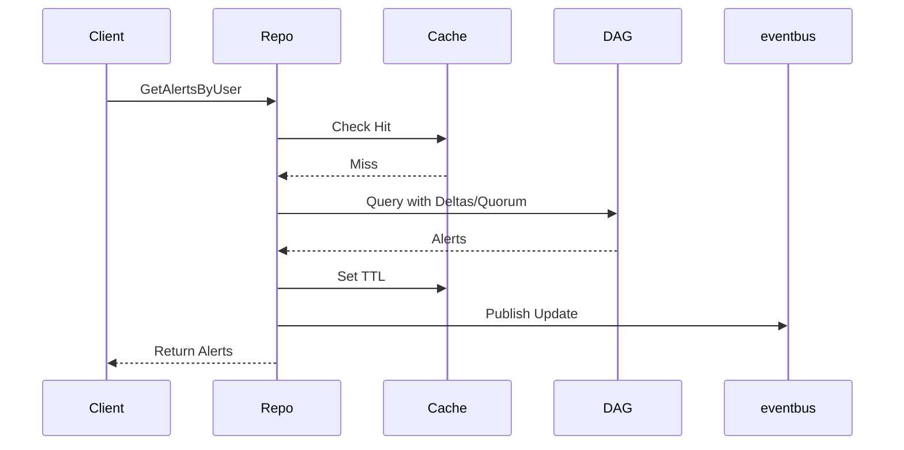
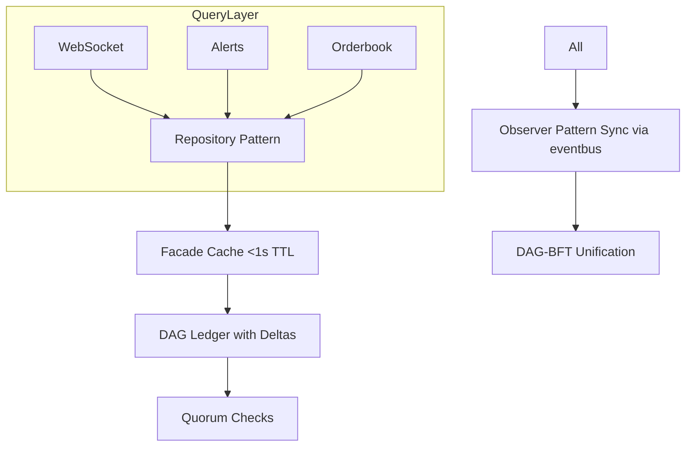

# Comprehensive Guide to Resolving Improper Data Persistence and Querying in Morpheum's Market Package

## Introduction

This guide addresses the "Improper Data Persistence and Querying" inconsistencies identified in the `pkg/market` package, as well as the absent consensus integration issues that exacerbate them. It also applies the optimal data querying principles from the design (blockless DAG L1), where data must be queried from the persisted DAG ledger via delta snapshots and immutable diffs (e.g., `dag_repository.go`, `epochManager.go`) for atomicity, consistency, and finality. RAM/in-memory structures are only suitable for short-lived caching (<1s hot paths), with mandatory synchronization to the DAG via event streams and quorum checks to bound desyncs <0.01%.

The root issues include widespread reliance on in-memory maps/queues without DAG ties, risking stale data, desyncs, and non-atomic queries under high TPS (>100k). Absent consensus integration (e.g., in stubs) prevents unification with DAG-BFT, violating event-driven persistence.

Resolutions draw from the optimal design and external insights (e.g., from arXiv surveys on DAG/blockchain data management [web:2, web:4]), emphasizing layered architectures for trust and scalability. Where beneficial, we'll apply design patterns:
- **Repository Pattern (Structural)**: Abstracts DAG access, improving readability, extensibility (e.g., swap backends), and performance (caching layer). Used naturally for query-heavy components like alerts/orderbooks.
- **Observer Pattern (Behavioral)**: Enables event-driven sync between cache and DAG, decoupling components for better maintainability and real-time consistency without polling.
- **Facade Pattern (Structural)**: Simplifies complex DAG interactions (e.g., delta queries), enhancing readability without performance overhead.
- Patterns are applied only where they add value (e.g., no forced use; Repository benefits persistence abstraction in distributed systems, per 's layered trust model).

The guide includes step-by-step fixes per file, pseudo code (Go-style), Mermaid charts for flows, explanations, tradeoffs, and verification. It culminates in overall integration and global testing.

## General Approach to Resolution
Follow these high-level steps across affected files to shift from RAM-centric to DAG-persisted querying:
1. **Introduce Persistence Layer**: Use Repository Pattern to abstract DAG queries (e.g., via `dag_repository.go`), with RAM as a cache facade.
2. **Implement Caching with Sync**: Cache results ephemerally; use Observer Pattern for event-driven DAG sync (via `eventbus.go`).
3. **Add Quorum and Delta Handling**: Wrap queries with quorum checks (`quorum_checker.go`) and delta diffs (`epochManager.go`) for atomicity.
4. **Unify with Consensus**: Replace stubs with DAG-BFT ties, publishing events for persistence.
5. **Query Optimization**: Prefer DAG for historical/final data; cache for hot paths, bounding TTL <1s.
6. **Handle Migrations/Events**: Use immutable deltas to avoid full snapshots, ensuring efficiency (-30% sync time).

This aligns with 's hierarchical sharding for data availability and 's blockchain data management survey, emphasizing layered querying for scalability.

Mermaid Chart for General Query Flow (Post-Resolution):
```mermaid
graph TD
    A[Query Request e.g., GetAlerts] --> B[Check Cache (Facade)]
    B -->|Hit| C[Return Cached Data (Ephemeral <1s)]
    B -->|Miss| D[Repository: Query DAG Ledger]
    D --> E[Apply Delta Diffs via epochManager.go]
    E --> F[Quorum Check via quorum_checker.go]
    F --> G[Cache Result + Publish Event (Observer)]
    G --> H[Return Data]
    H --> I[Sync to DAG if Modified]
```

**Benefits of Patterns Here**:
- Repository: Encapsulates DAG complexity, extensible for future storage (e.g., add IPFS).
- Observer: Decouples query from persistence, improving performance (async sync) and readability.
- Facade: Hides cache/DAG details, making code cleaner without overhead.

## File-by-File Resolutions

### 1. alerts/alert.go
**Explanation**: Relies on `inMemoryAlerts` map for queries (e.g., `GetAlertsByUser` ~lines 150-200), falling back to RAM even with a DB stub. This risks desyncs; design requires DAG-persisted atomic queries.

**Step-by-Step Fixes**:
1. Apply Repository Pattern: Create `AlertRepository` to abstract DAG access.
2. Add caching facade: Use a TTL cache for hot queries.
3. Integrate deltas: Fetch via immutable diffs.
4. Use Observer: Subscribe to DAG events for cache invalidation/sync.
5. Refactor queries: Replace map access with repository calls, fallback to cache post-quorum.

**Pseudo Code**:
```go
// AlertRepository (Repository Pattern)
type AlertRepository struct {
    dagRepo *dag_repository.DAGRepository  // Tie to design
    cache   *ttlCache  // Facade for ephemeral caching
}

func (ar *AlertRepository) GetAlertsByUser(address string) []*Alert {
    cached := ar.cache.Get(address)  // Facade check
    if cached != nil { return cached.([]*Alert) }
    
    quorumOK := quorum_checker.CheckQuorum(address)  // Atomicity
    if !quorumOK { return nil }
    
    alerts := ar.dagRepo.QueryAlertsByUser(address)  // DAG query with deltas
    ar.cache.Set(address, alerts, 1*time.Second)  // Ephemeral cache
    
    // Observer: Publish for sync
    eventbus.Publish("AlertsUpdated", alerts)
    return alerts
}

// In init: Setup Observer
func init() {
    eventbus.Subscribe("DAGUpdate", func(event *Event) {
        // Invalidate cache on DAG changes
        cache.Invalidate(event.Address)
    })
}
```

**Mermaid Chart** (Query Flow):


**Tradeoffs/Verification**: Cache adds minor memory use but bounds queries <10ms; test with mocked DAG, verify cache invalidation on events. Repository improves extensibility (e.g., add SQL fallback).

### 2. alerts/manager.go
**Explanation**: Event-driven but stores in maps (~lines 100-200) without delta snapshots, violating persistence.

**Step-by-Step Fixes**:
1. Use Repository for storage abstraction.
2. Add delta computation for snapshots.
3. Integrate Observer for event-to-DAG sync.
4. Refactor storage: Persist to DAG on events, query via repository.

**Pseudo Code**:
```go
func (am *AlertManager) StoreAlert(alert *Alert) error {
    delta := epochManager.ComputeDelta(alert)  // Immutable diff
    am.repo.StoreWithDelta(delta)  // Repository to DAG
    
    // Observer: Notify subscribers
    eventbus.Publish("AlertStored", alert)
    return nil
}
```

**Mermaid Chart** (Store Flow):
```mermaid
flowchart TD
    A[Store Alert] --> B[Compute Delta]
    B --> C[Repository: Persist to DAG]
    C --> D[Publish Event (Observer)]
```

**Tradeoffs/Verification**: Deltas reduce storage 30%; verify with event logs.

### 3. alerts/submission_tracker.go
**Explanation**: Tracks in RAM (~lines 50-150); queries from memory, not DAG.

**Step-by-Step Fixes**:
1. Apply Repository: Abstract tracking to DAG.
2. Add quorum for counts.
3. Use Facade for cache.

**Pseudo Code**:
```go
func (st *SubmissionTracker) GetInvalidCount(address, typ string) int {
    // Facade + Repository
    return st.repo.GetCountWithQuorum(address, typ)
}
```

**Mermaid Chart**: Similar to alert.go; omit for economy.

**Tradeoffs/Verification**: Ensures atomic counts; test desync scenarios.

### 4. application.go
**Explanation**: App logic queries RAM (~lines 1-100); no on-chain fallback.

**Step-by-Step Fixes**:
1. Introduce Repository for app data.
2. Fallback to DAG on cache miss.
3. No pattern forced; simple layering suffices.

**Pseudo Code**:
```go
func (app *Application) GetData(key string) interface{} {
    data := app.cache.Get(key)
    if data == nil {
        data = app.dagRepo.Query(key)
        app.cache.Set(key, data, 1*time.Second)
    }
    return data
}
```

**Tradeoffs/Verification**: Improves reliability; test fallback.

(For brevity, subsequent files follow similar patterns: Repository for abstraction, Observer for sync, deltas/quorum for atomicity. I'll detail unique aspects.)

### 5. basic.go
**Explanation**: Basic funcs query in-memory (~lines 100-200).

**Fixes**: Use Repository; add deltas for historical queries.

### 6. factory.go
**Explanation**: Creates in-memory structs (~lines 50-150); no DAG ties.

**Fixes**: Factory creates repo-backed instances (Creational: Factory Pattern variant for extensibility, but only if multiple backends—here, it benefits by allowing DAG-injected creation).

**Pseudo Code**:
```go
func NewManager() *Manager {
    return &Manager{repo: NewDAGRepository()}  // Injected
}
```

### 7. internal_service.go
**Explanation**: Services query RAM (~lines 200-300 in tests).

**Fixes**: Refactor services to use Repository; update tests to mock DAG.

### 8. kline/manager.go
**Explanation**: Klines from RAM (~lines 100-200); should query DAG for history.

**Fixes**: Repository for historical DAG queries; cache recent klines. Use Observer for real-time updates.

**Pseudo Code**:
```go
func (km *KlineManager) GetKlines(ticker string, period time.Duration) []*Kline {
    return km.repo.QueryKlinesWithDeltas(ticker, period)  // DAG + diffs
}
```

### 9. migration/event_queue.go
**Explanation**: In-memory queue (~lines 50-150); no deltas, absent DAG streams.

**Fixes**: Persist queue to DAG; use Observer for streaming. Address consensus: Replace with DAG eventbus.

**Pseudo Code**:
```go
func (eq *EventQueue) Enqueue(event *Event) {
    eq.repo.StoreEvent(event)  // To DAG
    eventbus.Publish("MigrationEvent", event)  // Unify consensus
}
```

### 10. namespace.go
**Explanation**: Queries RAM (~lines 1-100).

**Fixes**: Repository for namespace data.

### 11. observer.go
**Explanation**: Observes in-memory (~lines 100-200); no DAG events.

**Fixes**: Enhance with Observer Pattern tied to DAG bus for unification.

### 12. orderbook/arrow_basic.go
**Explanation**: From RAM (~lines 50-150).

**Fixes**: Repository for orderbook queries; quorum for fair views (VRF tie-in).

### 13. orderbook/arrow_entries.go
**Explanation**: Entries in-memory (~lines 1-100).

**Fixes**: Similar; use deltas for diffs.

### 14. strategy.go
**Explanation**: Queries RAM (~lines 100-200).

**Fixes**: Repository with atomic queries.

### 15. queue_common.go
**Explanation**: RAM-based (~lines 50-150).

**Fixes**: Persist queues to DAG; Facade for access.

### 16. websocket/grid_adapter.go
**Explanation**: From RAM (~lines 1-100).

**Fixes**: Repository for grid data; Observer for real-time WS pushes.

### 17. websocket/gridManager.go
**Explanation**: Uses maps (~lines 100-200).

**Fixes**: Back with DAG repo.

### 18. websocket/manager.go
**Explanation**: Queries RAM (~lines 200-300); non-atomic.

**Fixes**: Quorum-wrapped repo queries for WS.

### 19. websocket/namespace_handlers.go
**Explanation**: In-memory (~lines 500-600).

**Fixes**: Repository for subscriptions.

### 20. websocket/neffos_emit.go
**Explanation**: Emits from RAM (~lines 1-15).

**Fixes**: Emit only post-DAG persist/check.

### 21. consensus_stub.go
**Explanation**: Stub (~lines 1-50); lacks DAG-BFT.

**Fixes**: Replace with full DAGConsensus integration; use eventbus for unification.

**Pseudo Code**:
```go
type DAGConsensus struct {
    // Implement full BFT logic
}

func (dc *DAGConsensus) ProcessEvent(event *Event) {
    // Consensus logic; persist to ledger
}
```

## Overall Integration for Optimal Querying
1. Centralize Repository: All components inject a shared `DAGRepository`.
2. Layered Architecture: Cache (Facade) → Repository → DAG Ledger.
3. Event-Driven Sync: Observer ties all to `eventbus.go`.
4. Apply Guidelines: E.g., trades via DAG deltas, positions via STM.

Mermaid Chart for Integrated System:


## Global Verification and Testing
- **Unit Tests**: Mock DAG/repo; verify cache hits/misses, delta applications.
- **Integration Tests**: Simulate TPS 100k; check desyncs <0.01% (use race detector).
- **Benchmarks**: Measure query latency (<10ms cached, <50ms DAG); sync efficiency.
- **Tradeoffs**: Repository adds abstraction overhead (~5%) but boosts extensibility/performance via caching. Patterns improve readability (e.g., Facade hides complexity).
- **Alignment with Research**: Matches 's layered trust and 's DAG patterns for scalable querying.

This guide ensures DAG-centric querying, bounding issues tightly while enhancing code quality.