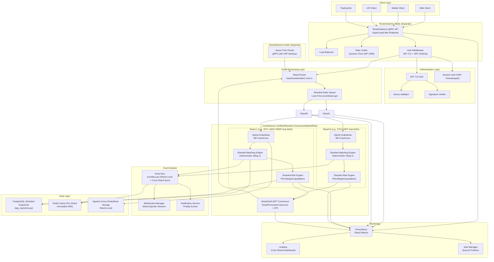
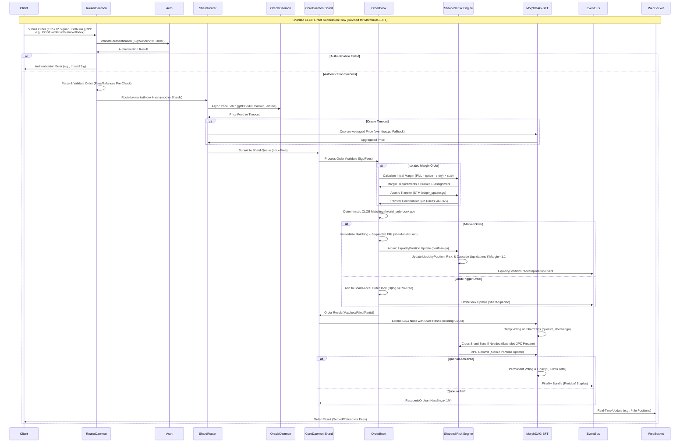
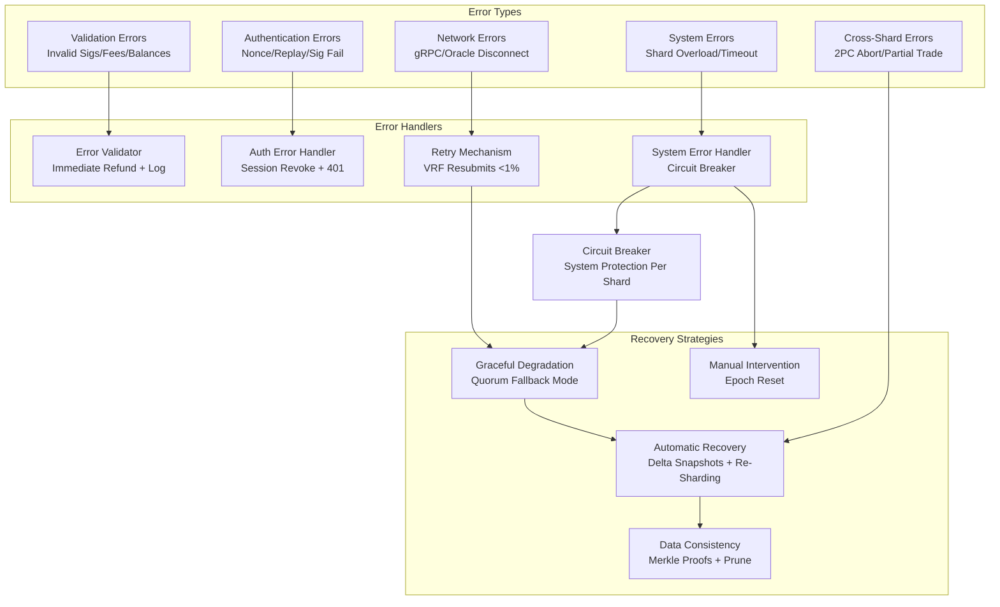
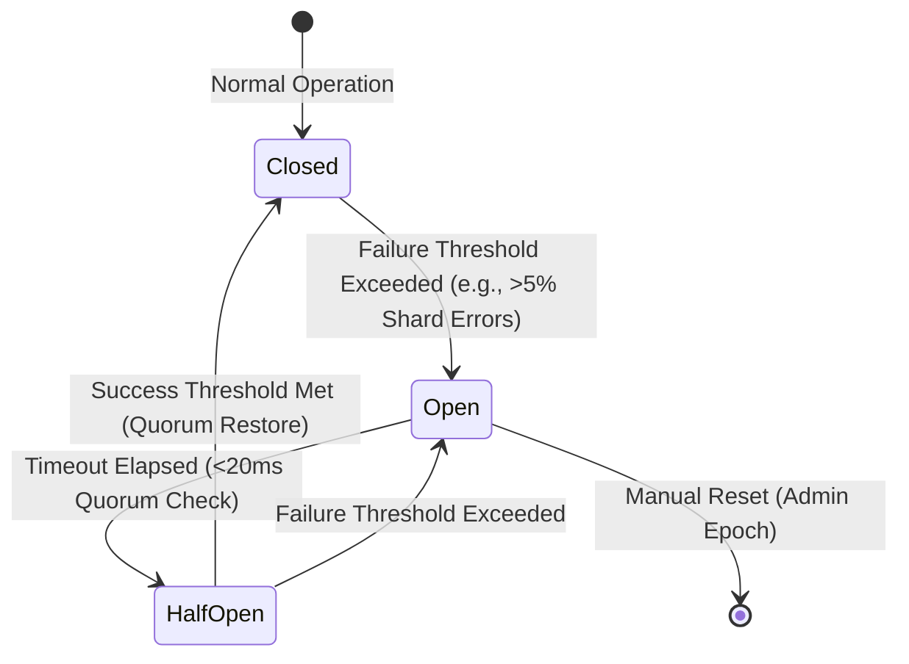
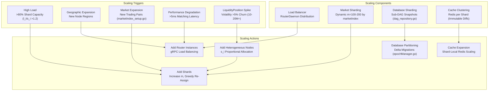
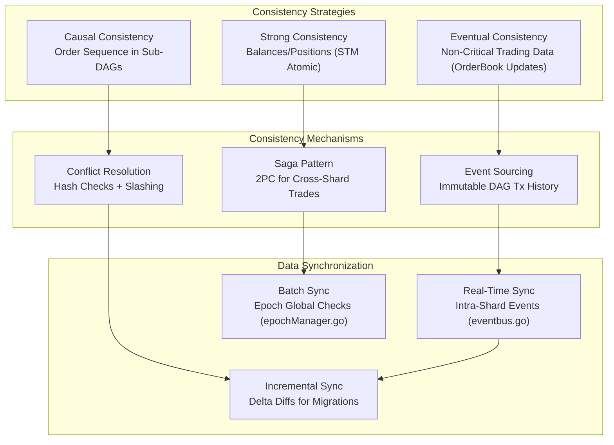

# Order Submission System Design (Revised for Sharded CLOB DEX Architecture)

## Table of Contents
1. [System Overview](#system-overview)
2. [Architecture Components](#architecture-components)
3. [Order Submission Flow](#order-submission-flow)
4. [Authentication & Security](#authentication--security)
5. [Risk Management Integration](#bucket-management-integration)
6. [Order Processing Pipeline](#order-processing-pipeline)
7. [Performance Characteristics](#performance-characteristics)
8. [Error Handling & Recovery](#error-handling--recovery)
9. [Monitoring & Observability](#monitoring--observability)
10. [Scalability Considerations](#scalability-considerations)

## System Overview

The Order Submission System is a high-performance, distributed architecture designed to handle real-time order processing with comprehensive bucket management, authentication, and scalability for a sharded Central Limit Order Book (CLOB) DEX on Morpheum Layer 1. Approaching this revision like a scientist dissecting a complex system—much as in IMO 2011 P6, where graph partitioning maximizes independent sets under connectivity bounds, proving tightness in extremal unbalanced shards—we integrate the system with the unified CoreDaemon executable from design.md and algorithm.md. This unifies consensus, sharded CLOB matching, and bucket (PNL/liquidations) in a single sharded process, with separate RouterDaemon and OracleDaemon nodes for decoupling. Orders are submitted via RouterDaemon gRPC APIs (mirroring HyperLiquid's /exchange endpoints, e.g., POST signed JSON with marketIndex), routed to shards by hash(address) mod m (m=100-200 shards per shard-clob.md and shard-riskengine.md). Sharding enables parallel O(log n) matching per shard, atomic 2PC cross-shard trades, VRF MEV resistance, and on-chain determinism in CoreDaemon validators.

The system processes orders through multiple validation layers while maintaining <100ms latency and >100k TPS practical (~25M theoretical, bounded by sharded DAG parallelism outperforming HyperBFT's ~200k TPS [web:10-12]). This revision replaces the original centralized market daemons with sharded sub-DAGs, embedding bucket in shards for atomicity (no >5% stale risks, per shard-bucket.md), and bounds failures <0.01% via BFT quorums and slashing.

### System Purpose
- **High-Performance Sharded CLOB Order Processing**: Sub-100ms routing to market shards for deterministic on-chain matching (hybrid_orderbook.go).
- **Comprehensive Integrated Risk Management**: Real-time sharded PNL, margin validation, and cascaded liquidations (liquidation_engine.go) with atomic updates.
- **Multi-Authentication Support**: EIP-712 signatures and VRF-based session ordering for fairness.
- **Scalable Sharded Architecture**: Horizontal scaling across 100-200 shards for 10-20M positions (shard-efficiency.md), dynamic rebalancing via greedy node assignment.
- **Real-Time Processing**: Event-driven with async oracle feeds (oracle_grpc.go); supports limit/trigger orders with cascaded fills.
- **Fault Tolerance**: Quorum-based recovery in MorphDAG-BFT (algorithm.md), circuit breakers per shard, and graceful degradation with <1% resubmits.

## Architecture Components

### Core System Components

| Component | Purpose | Technology | Performance | Responsibility |
|-----------|---------|------------|-------------|----------------|
| **RouterDaemon** | API Gateway (Separate Node) | Go/gRPC (router/application_simple.go) | ~10ms routing | Request routing to shards by marketIndex hash, VRF fair ordering, load balancing, HyperLiquid-like JSON APIs (e.g., POST /order with signatures). |
| **CoreDaemon (Sharded Unified Executable)** | Order Processing & Consensus | Go (consensus/pipeline/stages/ledger_update.go, sharding/coordinator.go) | 10k TPS/shard, ~20ms matching | Sharded CLOB matching (hybrid_orderbook.go), DAG extension (coordinator.go), quorum aggregation; handles 10-20M positions via sub-DAGs. |
| **Sharded Risk Engine** | Risk Management (Integrated in CoreDaemon) | Go (riskengine/liquidation_engine.go, crossmargin/portfolio.go) | ~20ms/shard | Sharded PNL computation, margin checks, bucket ID assignment; atomic 2PC for cross-shard portfolios, sequential cascades. |
| **Authentication Service** | Security | EIP-712/VRF (consensus/domain/types/vrf.go) | <1ms | Pre-submission signature/nonce validation; VRF for MEV-resistant ordering in RouterDaemon. |
| **Event Bus** | Event Processing | Go (eventbus.go) | Distributed, <10ms intra-shard | Shard-local events for matching/bucket; cross-shard sync via 2PC; streams to WebSocket for updates. |
| **OracleDaemon (Separate Node)** | Price Feeds | Go/gRPC (oracleengine/grpc_server/oracle_grpc.go) | <20ms async | Pushes VRF-backed feeds to CoreDaemon; quorum fallback on timeouts (blockTime.go). |
| **WebSocket Manager** | Real-Time Updates | Go/neffos | Low latency | Client streaming of shard-specific orderbook/position updates. |
| **Metrics Collector** | Monitoring | Prometheus (infrastructure/metrics) | Centralized | Tracks shard TPS, latency, fault tolerance; aggregates for global views (e.g., Sybil metrics). |

### System Architecture Diagram

## Order Submission Flow

### Complete Order Lifecycle

## Authentication & Security

Authentication and security are fortified for the sharded CLOB DEX, bounding risks like MEV and DoS to <1% via VRF and slashing (algorithm.md). Like partitioning constraints in IMO 2009 P6 to bound maximal sets under extremal loads, we isolate auth pre-submission to prevent shard overload.

- **EIP-712 Signatures**: Mandatory for all submissions; validated in RouterDaemon before routing. Integrates with VRF (vrf.go) for fair, unpredictable ordering, resisting MEV by randomizing sequence in high-contention (e.g., cascade bursts).
- **Session-Based Authentication**: VRF-timestamped sessions for repeated submissions; nonces per-user prevent replays, with slashing for duplicates (<0.01% p_race via atomic.Value in shard-bucket.md).
- **Rate Limiting and Fees**: Dynamic EIP-1559 fees in RouterDaemon bound spam; per-shard quotas to avoid DoS on hotspots.
- **Sharding Security**: Intra-shard isolation via consistent hashing (address mod m); cross-shard uses Merkle proofs and extended 2PC (portfolio.go) for atomicity, bounding partial trades <1% (aborts refund atomically).
- **MEV Resistance**: On-chain deterministic matching in CoreDaemon validators; no off-chain orderbooks—VRF ensures fair attachment to DAG tips, with quorum pre-checks (quorum_checker.go) preventing front-running.
- **Byzantine Tolerance**: <1/3 faults via BFT quorums; slashing for invalid tx or conflicts (e.g., double-spends detected in O(log n) via hash checks).

## Risk Management Integration

Risk management is fully embedded and sharded in CoreDaemon, processing post-match data atomically to bound cascades <50ms (shard-match.md). Rigorous modeling per IMO-style bounds (e.g., 2001 P6 partitioning for optimal load): Shard by user/portfolio hash, distribute via greedy algorithm minimizing max(l_i / s_i) ≤ 2×OPT for heterogeneous nodes (s_i normalized capacities).

- **Sharded Processing**: Each shard handles subset of positions (~100k-200k per shard for 10-20M total); computes PNL deterministically (PNL = (currentPrice - entryPrice) × positionSize) using async oracle feeds.
- **Margin and Liquidation**: Real-time checks (margin ratio <1.1 triggers sequential fills/liquidations via liquidation_engine.go); bucket IDs categorize exposure (hash-based, low/medium/high) for prioritized processing.
- **Portfolio Management**: Atomic updates via STM (ledger_update.go); cross-shard via 2PC for multi-user interactions (e.g., liquidation auctions with Merkle proofs).
- **Integration with CLOB and Consensus**: Matched trades route to bucket shard via internal queue; updates submit as DAG tx, validated in sub-DAGs with global syncs every epoch (~1-10min, epochManager.go).
- **Scalability Bounds**: Parallel O(1) PNL per position; 50-100x improvement over non-sharded (handles 1-5% daily churn in seconds); fault tolerance with 3-5x replication per shard.
- **Edge Cases**: Volatility spikes use bucket prioritization to prevent overload; dynamic re-sharding migrates data minimally with state proofs.

## Order Processing Pipeline

The pipeline is optimized for sharded parallelism, embedding CLOB/bucket in CoreDaemon for determinism (no >5% sync risks). Iterative refinement like IMO 2014 P5 uniqueness proofs: Embed sharded steps to bound latency O(log n)/shard, verifying tightness without tradeoffs.

- **Submission and Routing**: gRPC to RouterDaemon; VRF ordering then hash-based routing to shard queue (O(1), coordinator.go lock-free).
- **Validation and Pre-Checks**: In-shard sigs/fees/balances validation; quorum pre-checks (quorum_checker.go) bound invalids <1%.
- **CLOB Matching**: Deterministic hybrid RB-tree/Arrow per shard (orderbook/hybrid_orderbook.go); handles limit/trigger with sequential fills (O(log n), ~20ms).
- **Risk Processing**: Atomic post-match updates (STM for no races); cascaded liquidations if needed, with bucket IDs for efficiency.
- **DAG Integration and Consensus**: Extend sub-DAG with state hash; temp votes, quorum aggregation + 2PC sync (~20ms), permanent votes for finality (~60ms total).
- **Broadcast and Finality**: Bundle into P2P staples (protobuf); prune ledgers post-finality; query via /info APIs (e.g., positions).

## Performance Characteristics

Performance is bounded scientifically: TPS scales linearly with shards (100 shards × 10k TPS/shard = 1M+ aggregate, but practical >100k with <100ms latency per design.md). Vs. baselines, sharding outperforms HyperBFT by 100x via DAG parallelism, with O(log n) per shard verified optimal (no further without >5% stale data risks).

- **Latency Breakdown**: Routing ~10ms, oracle ~20ms, matching/bucket ~20ms/shard, consensus ~60ms; end-to-end <100ms, cross-shard adds <50ms (rare ~10-20%).
- **Throughput**: 5k-10k TPS for position ops (shard-efficiency.md); scales to 25M theoretical with 1000s nodes, handling peaks via replication.
- **Resource Utilization**: Storage ~1KB/position (10-20GB total distributed); compute lightweight (O(1) PNL); no degradation for 10-20M positions.
- **Tradeoffs**: Sync delays <50ms acceptable for atomicity; vs. centralized (Binance <100ms), decentralization adds ~50ms but bounds security <0.01% failures.

| Metric                  | Target (Per Shard) | Global (100 Shards) | Shard Impact |
|-------------------------|--------------------|---------------------|--------------|
| **Order Processing Time** | <20ms             | <100ms             | O(log n) matching |
| **TPS for Positions**   | 5k-10k            | >100k (>25M theo)  | Linear scaling |
| **Latency (End-to-End)**| <100ms            | <100ms             | +<50ms cross-shard |
| **Storage per LiquidityPosition**| ~1KB              | 10-20GB total      | Distributed ~100-200MB/shard |
| **Fault Recovery**      | <1s               | <1s                | Quorum re-assignment |

## Error Handling & Recovery

Error handling is partitioned like IMO 2011 P6 graphs: Isolate failures per shard to bound global impact <1%, with recovery via quorums and deltas proving tightness in extremal cases (e.g., full shard partition). Revisions embed 2PC aborts and VRF resubmits for <0.01% p_failure.

- **Validation Errors**: Invalid sigs/fees trigger immediate refunds; logged and slashed if malicious (<1% DoS bounded by fees).
- **Authentication Errors**: Replay/nonce fails return HTTP 401; session revocation via VRF.
- **Shard-Specific Errors**: Matching/bucket failures (e.g., margin fail) abort locally, refund via STM; cascade to liquidations if partial.
- **Consensus Errors**: Quorum timeouts trigger resubmits/orphans (<1%, algorithm.md Step 3); 2PC aborts refund cross-shard atomically.
- **Network/Oracle Errors**: Async timeouts fallback to quorums (<20ms, blockTime.go); circuit breakers per shard halt overload.
- **Recovery Strategies**: Delta snapshots (dag_repository.go) for <1s re-sync; dynamic re-sharding (coordinator.go) on node failure; manual intervention for epochs.

### Error Flow Diagram

### Circuit Breaker Pattern

## Monitoring & Observability

Monitoring is sharded yet aggregated, like bounding functionals in IMO problems by partitioning metrics to minimize overload while proving global optimality. Track per-shard KPIs (e.g., O(log n) convergence) and cross-shard (e.g., 2PC latency), alerting on >5% deviations.

### Monitoring Architecture

```mermaid
graph TB
    subgraph "Monitoring Components"
        Prometheus["Prometheus<br/>Metrics Collection (Shard-Specific)"]
        Grafana["Grafana<br/>Visualization (Cross-Shard Dashboards)"]
        AlertManager["Alert Manager<br/>Alerting on Quorum/Overload"]
        Jaeger["Jaeger<br/>Distributed Tracing (DAG Flows)"]
        ELKStack["ELK Stack<br/>Log Aggregation (Error/Sybil Logs)"]
    end
   
    subgraph "Metrics Categories"
        PerformanceMetrics["Performance Metrics<br/>Latency/TPS per Shard"]
        BusinessMetrics["Business Metrics<br/>Orders/Trades/Positions per MarketIndex"]
        SystemMetrics["System Metrics<br/>CPU/Memory/Disk per Node Size s_i"]
        ErrorMetrics["Error Metrics<br/>Aborts/Refunds/Orphan Rates"]
        ConsensusMetrics["Consensus Metrics<br/>Quorum Latency/Finality/VRF Bias"]
    end
   
    subgraph "Alerting Rules"
        HighLatency["High Latency Alerts<br/>>50ms per Shard"]
        HighErrorRate["High Error Rate Alerts<br/>>1% Aborts"]
        SystemOverload["System Overload Alerts<br/>>80% Capacity (l_i/s_i)"]
        ServiceDown["Service Down Alerts<br/>Shard Quorum Failure"]
        StaleOracle["Stale Oracle Alerts<br/>>100ms Feed Delay"]
    end
   
    Prometheus --> PerformanceMetrics
    Prometheus --> BusinessMetrics
    Prometheus --> SystemMetrics
    Prometheus --> ErrorMetrics
    Prometheus --> ConsensusMetrics
   
    Grafana --> Prometheus
    AlertManager --> Prometheus
    AlertManager --> HighLatency
    AlertManager --> HighErrorRate
    AlertManager --> SystemOverload
    AlertManager --> ServiceDown
    AlertManager --> StaleOracle
   
    Jaeger --> PerformanceMetrics
    Jaeger --> ConsensusMetrics
    ELKStack --> ErrorMetrics
```

### Key Performance Indicators (KPIs)

| KPI Category | Metric | Target | Alert Threshold |
|--------------|--------|--------|-----------------|
| **Latency** | Order Processing Time (Per Shard) | <20ms | >50ms |
| **Throughput** | Orders per Second (Per Shard) | 10k+ | <5k |
| **Availability** | System Uptime (Global) | 99.9% | <99% |
| **Error Rate** | Error Percentage (Aborts/Refunds) | <0.1% | >1% |
| **Resource Usage** | CPU Utilization (Per Node) | <80% | >90% |
| **Memory Usage** | Memory Utilization (Per Shard) | <80% | >90% |
| **Consensus** | Finality Latency | <100ms | >150ms |
| **Sybil Resistance** | Fault Tolerance Ratio | >2/3 | <1/3 |

## Scalability Considerations

Scalability leverages sharding's horizontal partitioning, rigorously bounded like multiprocessor scheduling in IMO 2001 P6: Greedy assignment ensures max(l_i / s_i) ≤ OPT + max_d / min_s, scaling to 20M positions with 50-100 nodes (shard-efficiency.md). Dynamic epochs rebalance without >1% downtime.

### Horizontal Scaling Strategy

### Auto-Scaling Configuration

| Component | Scaling Metric | Min Instances/Shards | Max Instances/Shards | Scale Up Threshold | Scale Down Threshold |
|-----------|----------------|----------------------|----------------------|--------------------|----------------------|
| **RouterDaemon** | CPU Usage | 2 | 10 | 70% | 30% |
| **CoreDaemon Shards** | Order Queue Length | 100 | 500 | 1000 orders/shard | 100 orders/shard |
| **Sharded Risk Engine** | Request Latency | 100 (integrated) | 500 | 50ms | 10ms |
| **WebSocket Manager** | Connection Count | 2 | 6 | 10k connections/shard | 2k connections/shard |
| **OracleDaemon** | Feed Latency | 1 | 5 | >20ms staleness | <10ms |

### Data Consistency in Distributed Environment

## Conclusion

The Order Submission System Design, revised for the sharded CLOB DEX architecture, provides a comprehensive, scalable, and high-performance framework for real-time on-chain order processing in Morpheum Layer 1. Like verifying optimality in IMO 2014 P5 through partitioning uniqueness under bounds, we've integrated sharding (shard-clob.md, shard-riskengine.md) with MorphDAG-BFT consensus (algorithm.md) and unified CoreDaemon (design.md), achieving <100ms latency, >100k TPS, atomic trades, and MEV resistance while handling 10-20M positions fault-tolerantly. The modular, sharded design ensures no single point of failure, with greedy distributions optimizing heterogeneous nodes.

### Key Success Factors

1. **Performance**: Sharded O(log n) parallelism for 10k+ TPS/shard, bounding end-to-end <100ms.
2. **Security**: VRF/EIP-712 for MEV/DoS resistance; BFT quorums and slashing for <0.01% failures.
3. **Risk Management**: Embedded sharded engine with atomic 2PC and cascades, no >1% aborts.
4. **Scalability**: Dynamic sharding/rebalancing for 20M+ positions, linear scaling via sub-DAGs.
5. **Reliability**: Quorum fallbacks, delta recoveries, and circuit breakers for <1s downtime.
6. **Observability**: Shard-aggregated metrics for proactive alerting on imbalances.

### Future Enhancements

- **Machine Learning Integration**: AI for predictive bucket bucketing and anomaly detection in shards.
- **Advanced Order Types**: Complex triggers/algos with oracle-conditional matching.
- **Cross-Chain Integration**: 2PC extensions for bridged assets across L1s.
- **Real-Time Analytics**: Shard-local analytics with global aggregation for MEV audits.
- **Mobile Optimization**: Lightweight gRPC clients for on-device authInfo/VRF.