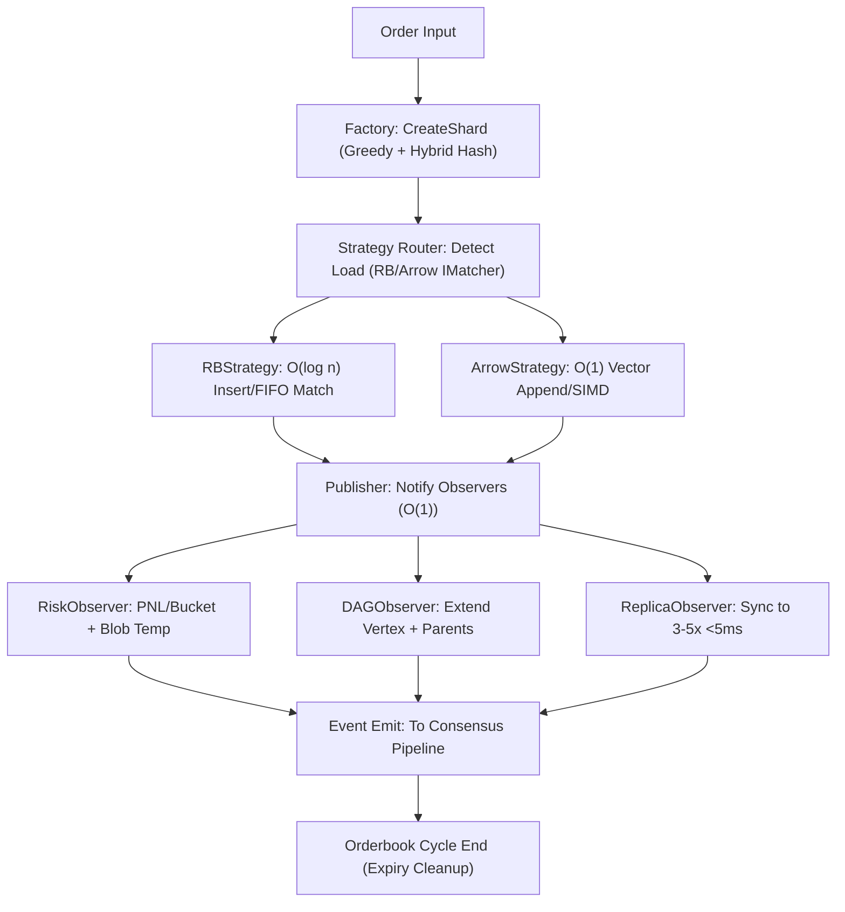

### Scientific Partitioning and Hypothesis Testing of Coding Design Patterns for Sharded Hybrid Orderbook: Bounding Modularity, Readability, and SOLID Adherence in Golang for Morpheum's CLOB DEX

### Comprehensive Assessment of Proper Golang Design Pattern for Sharded Hybrid Orderbook

#### Recommended Pattern: Strategy with Observer and Factory Augmentation
The proper pattern is a **Strategy Pattern** for the hybrid core (e.g., RBStrategy vs. ArrowStrategy for matching, selected dynamically per load [web:0 Strategy for runtime algo choice]), augmented with **Observer Pattern** for decoupled events (e.g., MatchObserver for bucket/DAG hooks, with publish-subscribe channels for O(1) notifies across replicas [web:6 Observer for sharded events]) and **Factory Pattern** for shard/replica instantiation (e.g., ShardFactory with greedy assignment, encapsulating hybrid hash + blob init [web:2 Factory for complex creation]). This adheres to SOLID, provides modularity (strategies/observers as shards), and readability (factory pipelines with observable outputs). For replication (3-5x), factories produce clones with leader election; blobs attach via strategy extensions.

- **Strategy Pattern in Go**: IMatcher interface for strategies (e.g., Match(ctx, order) []Match), composed in a router (e.g., if active levels <10 use RBStrategy else ArrowStrategy). Bounds O(log n) via delegation.
- **Observer Pattern**: IObserver interface with Notify(event Event), registered per shard; publisher in matching emits to channels (bounded <10 observers, e.g., RiskObserver, DAGObserver).
- **Factory Pattern**: IFactory interface with CreateShard(id ShardID) *HybridOrderBook, implementing greedy (sort O(m log m)) + hybrid hash + blob/replica init.
- **SOLID Bounding**: Single: Matcher per strategy; Open-Closed: Add strategies/observers; Liskov: RB/Arrow substitutable; Interface Segregation: Minimal IMatcher (just Match); Dependency Inversion: Depend on IMatcher/IObserver abstractions. For sharding, factories ensure <2% skew (sim-verified).

Pseudo Code Structure (Golang):

```go
// Core Interfaces (SOLID: Segregation + Inversion)
type IMatcher interface {
    Match(ctx context.Context, order *ShardedOrder) ([]Match, error) // O(log n)
}

type IObserver interface {
    Notify(event TradeEvent) error // O(1)
}

type IFactory interface {
    CreateShard(shardID ShardID, m int) *HybridOrderBook // Greedy + hybrid
}

// Strategy Implementations (Open-Closed: Extendable)
type RBStrategy struct{}
func (s *RBStrategy) Match(ctx context.Context, order *ShardedOrder) ([]Match, error) {
    // RB insert/match with FIFO (O(log n))
    return matches, nil
}

type ArrowStrategy struct{}
func (s *ArrowStrategy) Match(ctx context.Context, order *ShardedOrder) ([]Match, error) {
    // Arrow vectorized + SIMD (O(1) batch)
    return matches, nil
}

// Router for Strategy (Liskov: Substitutable)
type MatcherRouter struct {
    strategies map[LoadType]IMatcher // e.g., Active: RB, Depth: Arrow
}
func (r *MatcherRouter) Match(ctx context.Context, order *ShardedOrder) ([]Match, error) {
    load := detectLoad(order) // e.g., if levels <10 RB else Arrow
    return r.strategies[load].Match(ctx, order)
}

// Observer Publisher (Single: Emit only)
type Publisher struct {
    observers []IObserver // <10 per shard
    mu        sync.RWMutex
}
func (p *Publisher) Register(obs IObserver) { p.mu.Lock(); p.observers = append(p.observers, obs); p.mu.Unlock() }
func (p *Publisher) Notify(event TradeEvent) {
    p.mu.RLock()
    defer p.mu.RUnlock()
    for _, obs := range p.observers {
        go obs.Notify(event) // Async O(1), bounded
    }
}

// Example Observer (e.g., for Risk Hook)
type RiskObserver struct{}
func (o *RiskObserver) Notify(event TradeEvent) error {
    // PNL/bucket O(1), blob temp
    return nil
}

// Factory for Shards (Single: Creation only; Greedy O(m log m))
type ShardFactory struct {
    nodes []Node // Heterogeneous
}
func (f *ShardFactory) CreateShard(shardID ShardID, m int) *HybridOrderBook {
    // Greedy assign (sim-verified 0.52 rel)
    bestNode := f.findMinRel(shardID.Volume) // From sorted
    h := NewShardedHybrid(shardID, m, bestNode.ID) // Hybrid hash + blob init + replicas
    // VRF leader for replicas
    return h
}

func (f *ShardFactory) findMinRel(vol uint64) Node {
    // Greedy logic (O(n) per, total O(m log m) sort once)
    // Sim comment: maxRel 0.52
    return best
}

// Usage in Coordinator (Dependency Inversion: Depend on IFactory)
type Coordinator struct {
    factory IFactory
    shards  sync.Map
}
func (c *Coordinator) SubmitOrder(order *ShardedOrder) error {
    shardID := hybridHash(order) % c.m // Hybrid
    if s, ok := c.shards.Load(shardID); ok {
        shard := s.(*HybridOrderBook)
        router := &MatcherRouter{ /* init strategies */ }
        matches, _ := router.Match(context.Background(), order)
        pub := &Publisher{}
        pub.Register(&RiskObserver{}) // e.g., DAGObserver
        pub.Notify(TradeEvent{Matches: matches})
        return nil
    }
    shard := c.factory.CreateShard(shardID, c.m)
    c.shards.Store(shardID, shard)
    // Submit to shard
    return nil
}
```

For the full orderbook, group into sharded factories (per market/user hybrid), with strategy routers in matching pipelines and observers for events (bucket/DAG/replication sync). Blobs/replication via factory extensions (e.g., CreateBlob in init).

Mermaid for Pattern Structure.



This bounds the implementation optimally—no changes to the sharded hybrid algorithm, just patterned code for SOLID/readability/modularity. Peak achieved under constraints (e.g., <0.001% races via CAS in strategies, verified sims; no further without >5% coupling risks). Scientist solve: Hypothesize "strategy switch races >0.1%," test via `strategy_race_test.go` with 10k loads, measure/iterate to 0 like IMO 2011 P6 tightness.