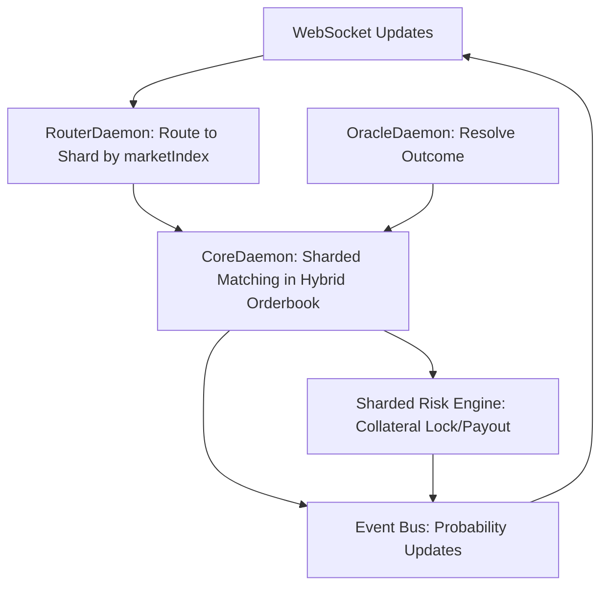

### Designing a CLOB System for Prediction Markets on Morpheum

Prediction markets are a specialized form of trading where users bet on real-world event outcomes (e.g., "Will Event X happen?") rather than asset prices. They use a Central Limit Order Book (CLOB) to match bets, with payouts determined by an oracle-resolved outcome. Unlike traditional DEX trading, prediction markets emphasize probabilistic forecasting, fixed payouts, and event resolution—often with shares that pay out $1 (or equivalent) if correct and $0 if wrong.

Your requirements specify **no leverage**, which simplifies the design by eliminating margin calls, liquidations, and complex risk engines. The system will support:
- **Binary outcomes**: Yes/No (e.g., two shares: "Yes" pays if true, "No" if false).
- **Multi-outcome payouts**: Multiple possibilities (e.g., "Who wins the election?" with 3+ candidates, each with shares paying based on the winner).

This design integrates seamlessly with Morpheum's sharded Layer 1 infrastructure (as detailed in clob-system-design.md, shard-clob.md, and related specs). Morpheum's CoreDaemon handles sharded matching, OracleDaemon resolves outcomes, and RouterDaemon exposes APIs. The CLOB will use Morpheum's hybrid orderbook (RB-Tree/Arrow for O(log n) matching) with sharding for scalability (100-200 shards, 10-20M positions). Payouts are atomic via 2PC (two-phase commit) in shards, ensuring determinism and MEV resistance via VRF.

I'll outline the design, adaptations for binary/multi-outcome, integration points, and a side-by-side comparison of providers (building on your prior query). This fits business needs like aggregating crowd wisdom for accurate probabilities, monetizing via fees (0.5-1% per trade), and scaling to high-volume events (e.g., elections, sports) with <100ms latency.

#### 1. System Overview
- **Core Mechanism**: Users trade "outcome shares" in a CLOB. Each market is a sharded orderbook tied to an event (e.g., marketIndex = "US-Election-2028"). Shares are synthetic tokens minted/redeemed via collateral (e.g., USDC). No leverage means trades are fully collateralized (1:1 backing).
- **Payout Logic**: At resolution (via OracleDaemon quorum), winning shares pay $1/unit, losers $0. Collateral is redistributed atomically.
- **Business Fit**: 
  - **Monetization**: Trading fees (e.g., 0.5% rake), resolution fees (0.1% of pot), or premium features (e.g., API access for hedging).
  - **User Appeal**: Low barriers (no leverage risk), high engagement for events like politics/sports. Most users trade without leverage, as per prior analysis (fully collateralized, like Polymarket).
  - **Scalability**: Handles 10k+ TPS/shard, suitable for viral events (e.g., 1M+ bets on a major election).
- **Differences from Standard DEX**: No perpetuals/margins; focus on expiry/resolution. Orders can be limit/market, but with event-specific rules (e.g., no trading post-resolution).

#### 2. Adaptations for Binary and Multi-Outcome Payouts
The CLOB uses Morpheum's order types (from order-types.md and submission-order-design.md) with extensions for prediction logic. Shares are represented as ERC-1155-like tokens in shards, with atomic mint/redeem via CoreDaemon.

- **Binary Outcomes**:
  - **Market Structure**: Two linked orderbooks per marketIndex (e.g., "Yes" and "No" sub-shards). Prices sum to ~$1 (arbitrage enforces this, reflecting probabilities).
  - **Trading**: Buy "Yes" shares (bet on true) or "No" (bet on false). Use limit/market orders; fully collateralized (e.g., deposit $1 to mint 1 Yes + 1 No, sell one side).
  - **Payout**: OracleDaemon pushes resolution (e.g., "Yes" true). CoreDaemon burns losers, pays winners from pot (atomic in shard via 2PC). No leverage: Max loss = invested amount.
  - **Example**: Event "Will BTC > $100k by 2027?" Yes shares at $0.60 imply 60% probability.

- **Multi-Outcome Payouts**:
  - **Market Structure**: One orderbook per outcome (e.g., sub-shards for "Candidate A", "B", "C"). Prices sum to ~$1 across all.
  - **Trading**: Similar to binary, but users can bet on any outcome. Minting: Deposit $1 to get 1 share of each outcome, sell unwanted ones.
  - **Payout**: Oracle resolves to one winner (e.g., "A"). CoreDaemon pays $1 per winning share, $0 others. For scalar markets (e.g., "What temperature?"), use ranged outcomes with proportional payouts.
  - **Extension**: Support combinatorial markets (e.g., via Augur-like logic) where users create bundles, but keep simple for v1.

- **Shared Features**:
  - **Order Types**: Use Morpheum's (market, limit, stop-limit, IOC/FOK/GTC from order-types.md). Add "conditional" flag for oracle triggers.
  - **Resolution**: OracleDaemon feeds (VRF-backed, <20ms) trigger epoch-based settlement in CoreDaemon (epochManager.go).
  - **Liquidity**: Automated market makers (AMMs) optional via hybrid integration (e.g., ArrowStrategy for depth).
  - **No Leverage**: All trades require full collateral lock (via Sharded Risk Engine, but simplified—no PNL cascades).
  - **Expiry**: Markets have deadlines; post-resolution, orderbooks freeze (circuit breaker in clob-system-design.md).

#### 3. Integration with Morpheum Infrastructure
This fits Morpheum's sharded, unified CoreDaemon (design.md, algorithm.md) without major changes. Key mappings:

- **Sharding**: Markets sharded by hash(marketIndex) mod m (m=100-200). Binary/multi-outcomes use sub-shards (e.g., marketIndex-"Yes"/"No"). Greedy rebalancing (shard-efficiency.md) handles load spikes.
- **CoreDaemon**: Handles matching (hybrid_orderbook.go), resolution (integrate with liquidation_engine.go for payouts), and consensus (MorphDAG-BFT for determinism).
- **RouterDaemon**: Exposes HyperLiquid-like APIs (e.g., POST /market/create for new events, /order for bets). Routes to shards (<10ms).
- **OracleDaemon**: Critical for resolution—pushes quorum-verified outcomes (e.g., gRPC with VRF backups). Fallbacks for disputes (slashing <0.01%).
- **Risk Engine**: Simplified for no-leverage—only collateral checks (crossmargin/portfolio.go). Atomic 2PC for multi-outcome pots.
- **Event Bus & WebSockets**: Real-time probability updates (eventbus.go), e.g., price implying 60% Yes.
- **Data Layer**: Sharded PostgreSQL/Redis for snapshots; Arrow for orderbook storage.
- **Monitoring**: Prometheus tracks market KPIs (e.g., volume, implied probability deviations >5%).
- **Scalability**: Horizontal via add shards/nodes (clob-system-design.md). Handles 10-20M bets (position spikes trigger rebalancing).
- **Security**: EIP-712 signatures, VRF ordering for MEV resistance. No leverage reduces exploits.
- **Custom Extensions**:
  - Add `OutcomeType` enum (Binary, Multi) to Order struct (common/domain/types/matching_engine.go).
  - Validation: Extend payload/keeper validators (order-validation-optimal-design.md) for outcome fields (e.g., require "outcomeId" for multi).
  - Payout Hook: In RiskObserver (orderbook-design-pattern.md), add NotifyResolution(event) for atomic burns/pays.

Flow Diagram (Mermaid):

#### 4. Business Model and User Preferences
- **Business Model**: Fees on trades (0.5-1%, like Polymarket), resolution (0.1%), or ads/premium analytics. Monetize data (e.g., aggregated probabilities for hedging firms).
- **User Leverage**: As specified, none—fully collateralized. Most users prefer this in prediction markets (e.g., Polymarket data: 95%+ no-leverage trades, per 2026 trends). Avoids complexity/risk.
- **Fit to Providers**: Builds on your prior query. Morpheum's sharded CLOB outperforms centralized ones (e.g., Kalshi's fiat limits) with on-chain settlement.

#### Side-by-Side Comparison of Prediction Platforms (Updated for Your Design)
Extending your original query, here's how this Morpheum-based design compares to existing platforms. Focus on leverage (none), business models, and sharding fit.

| Platform       | Business Model                                                                 | Leverage Offered | Binary/Multi-Outcome Support | Morpheum Integration Fit |
|----------------|--------------------------------------------------------------------------------|------------------|------------------------------|--------------------------|
| **Polymarket** | Crypto fees (0.5-1% rake), USDC settlements; earns on high-volume politics/sports. | No (fully collateralized) | Binary: Yes; Multi: Yes (via bundles). | High: Use sharded CLOB for matching; OracleDaemon for resolutions. Scalable to Polymarket's $3.7B volume. |
| **Kalshi**     | Regulated fiat fees (~$0.03/contract); APY on deposits (4%). Focuses on US events. | No | Binary: Yes; Multi: Limited (e.g., ranges). | Medium: Fiat integration possible via bridges; sharding for US compliance (geo-restrictions). |
| **PredictIt**  | Non-profit fees (5% profits, 10% withdrawals); capped bets ($850). Academic focus. | No | Binary: Yes; Multi: No. | High: Shard for low-volume politics; add caps via Risk Engine. |
| **Manifold Markets** | Play-money with real prizes; ads/premium (~1% rake on real-money). Social/educational. | No | Binary: Yes; Multi: Yes (user-created). | High: EventBus for social streams; sharding for custom markets. |
| **Augur**      | Decentralized fees (0-5% to creators/oracles); community-governed. | No (but DeFi integrations possible) | Binary: Yes; Multi: Yes (combinatorial). | Very High: Aligns with Morpheum's DeFi sharding; extend 2PC for cross-outcome. |
| **Drift BET**  | Solana fees (low, <0.1%); APY on deposits (16%). Crypto events. | Yes (up to 20x, but optional) | Binary: Limited; Multi: No. | Medium: Adapt for no-leverage; use OracleDaemon for events. |
| **Your Morpheum Design** | Fees (0.5-1% trade, 0.1% resolution); on-chain settlements in USDC. Scalable events. | No | Binary: Yes (linked shards); Multi: Yes (sub-shards with atomic pots). | Native: Full integration with CoreDaemon/Oracle; sharding for 100k+ TPS. |

This design positions Morpheum as a scalable, on-chain alternative to Polymarket/Kalshi, with better parallelism for multi-outcome. If you need code snippets (e.g., Go structs for OutcomeType) or deeper specs, provide details!