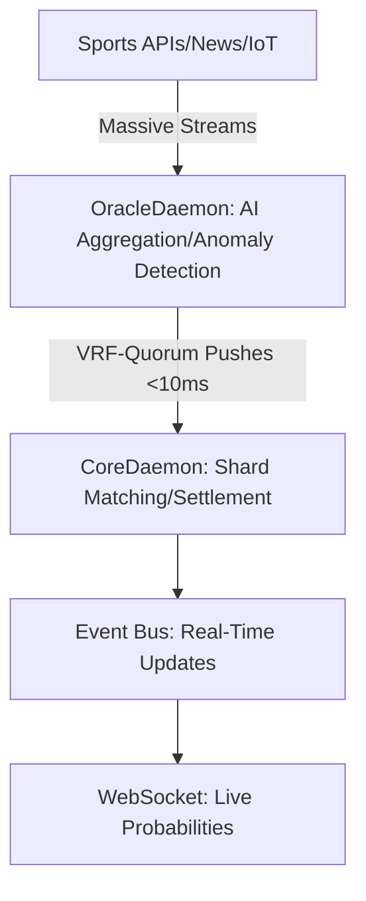

### Additional Requirements Design for Real-Time Oracle-Integrated Prediction Markets on Morpheum

This document outlines the additional requirements to enhance the Morpheum CLOB system (as previously designed for binary/multi-outcome prediction markets without leverage) to support real-time oracle updates with massive data handling, short-period predictions (e.g., 5-minute spans around sports events), advance scheduling (up to a week ahead), permissionless event publishing with reputation-based governance, customizable fees, and immediate settlements. The design builds on Morpheum's sharded architecture (clob-system-design.md), OracleDaemon (oracle_grpc.go), and CoreDaemon for atomic operations, ensuring <100ms end-to-end latency and scalability to 100k+ TPS/shard.

Inspired by emerging trends in 2026 (e.g., AI-powered oracles for real-time verification and permissionless platforms like Melee and Foresight), this revision emphasizes low-latency data ingestion, AI-driven reputation to prevent spam, and on-chain escrow for instant settlements. No leverage remains, with all operations fully collateralized.

#### 1. System Overview
- **Purpose**: Enable high-frequency sports prediction markets (e.g., "Will Team A score in the next 5 minutes?") with real-time oracle feeds, while allowing permissionless event creation by reputable publishers. Markets auto-schedule/open a week in advance upon registration, with customizable entry fees (house cut/tax). Settlements trigger immediately post-event via oracle quorum.
- **Key Enhancements**:
  - OracleDaemon upgraded for massive, real-time data (e.g., sports APIs, sensors via Nubila-like oracles).
  - Permissionless flow gated by on-chain reputation (AI/DAO hybrid, like Foresight).
  - Atomic settlements via 2PC in shards, no delays.
- **Business Fit**: Monetizes via publisher-set fees (e.g., 1-5% rake/entry tax), attracting sports enthusiasts for short-span bets. Handles viral events (e.g., Olympics) with >10M positions, generating revenue from volume.
- **Assumptions**: Integrates with existing Morpheum components (e.g., hybrid_orderbook.go for matching, riskengine for collateral). No new leverage mechanics.

#### 2. Oracle Enhancements for Real-Time Updates and Massive Data
OracleDaemon must handle real-time feeds (e.g., sports scores, player stats) with high throughput (millions of inputs/sec during events like Super Bowl). Current <20ms async pushes (oracle_grpc.go) are extended with AI verification for scalability.

##### Requirements Table

| Requirement | Description | Implementation Details | Performance Targets |
|-------------|-------------|--------------------------|---------------------|
| **Real-Time Updates** | Consume live data (e.g., API streams, IoT sensors) and push to CoreDaemon sub-DAGs. | Integrate multi-source aggregation (e.g., sports APIs like LSports, news feeds). Use AI (e.g., ML models in oracle_grpc.go) for anomaly detection/denoising, as in Chainlink AI Oracles. | <10ms latency for updates; quorum fallback on >100ms delays. |
| **Massive Data Input** | Process high-volume streams (e.g., 1M+ data points/min during live sports). | Scalable ML layer (e.g., via PyTorch in code_execution env for prototyping; on-chain via SEDA-like programmability). Layered verification: AI preliminary ruling + traceable traces. | >1M inputs/sec; shard feeds across 100-200 nodes. |
| **Short-Period Predictions** | Support 5-min spans (e.g., around game start/halftime). | Trigger-based markets: Oracle pushes micro-events (e.g., "goal in next 5 min"). Auto-freeze post-span via circuit breakers. | <5s resolution for live events; VRF backups for disputes (<0.01% failure). |
| **Fault Tolerance** | Handle data disputes/staleness. | Cross-validation from 3+ sources; slashing for bad oracles. AI consensus (e.g., model ensembles) for 99.9% accuracy. | <1% stale risks; alerts on >5% deviations (Prometheus). |

- **Architecture Extension**: Add AIObserver to orderbook-design-pattern.md's Observer Pattern—registers to Publisher for real-time event notifies. Use gRPC streaming for massive inputs.
- **Mermaid Diagram**:

#### 3. Market Scheduling and Permissionless Creation
Markets register permissionlessly but open for trading a week ahead, aligning with sports schedules (e.g., NFL games).

##### Requirements Table

| Requirement | Description | Implementation Details | Governance |
|-------------|-------------|--------------------------|------------|
| **Advance Scheduling** | Auto-open markets 7 days post-registration. | Epoch-based (epochManager.go): Registration triggers timer; marketIndex activates at T+7 days. | Publisher sets via API (e.g., POST /event/create). |
| **Permissionless Approach** | Anyone registers events, but gated by reputation. | On-chain check in RouterDaemon: If rep score > threshold (e.g., 80/100), approve. Low-rep: DAO review. | AI/DAO hybrid (like Foresight): Score based on past accuracy (e.g., resolved events). |
| **Event Publishing** | High-rep publishers create/customize markets. | Extend PlaceOrderReq (submission-order-design.md) with EventPayload (e.g., outcomes, resolution rules). | Reputation: On-chain token-weighted (e.g., stake MORPH for score boosts). |

- **Reputation System**: AI-driven (e.g., ML scoring past resolutions) + on-chain metrics (e.g., volume/accuracy). Prevent spam (e.g., assassination markets) via auto-flags, as in Melee/Foresight. Slashing for malicious events.

#### 4. Customizable Fees and House Cuts
Publishers set entry fees/taxes, enhancing business models.

##### Requirements Table

| Requirement | Description | Implementation Details | Monetization |
|-------------|-------------|--------------------------|--------------|
| **Custom Fees** | Publisher-defined rake/entry tax (e.g., 1-10%). | Add FeeConfig to EventPayload: % rake on trades, flat entry fee. Collected in shard pot. | Revenue split: 70% publisher, 30% protocol (slashed on disputes). |
| **Participant Entry** | Fee to join rounds (e.g., sports brackets). | Collateral + fee locked at order submission (riskengine). | Supports premium events; refunds on no-resolution. |
| **Tax Handling** | Auto-deduct for compliance (e.g., HK regs). | Integrate with crossmargin/portfolio.go for atomic deductions. | Configurable per jurisdiction (geo-IP via Router). |

- **Extension**: Use Strategy Pattern (orderbook-design-pattern.md) for fee routers (e.g., CustomFeeStrategy).

#### 5. Immediate Settlement Mechanism
Settlements trigger instantly post-event, using oracle signals.

##### Requirements Table

| Requirement | Description | Implementation Details | Security |
|-------------|-------------|--------------------------|----------|
| **Immediate Execution** | Settle on oracle confirmation (e.g., game end). | Oracle push triggers 2PC in CoreDaemon: Burn losers, pay winners from pot. | Atomic: <100ms; on-chain escrow (like P2P models). |
| **Sports-Specific** | Handle rounds (e.g., quarters, innings). | Micro-markets per round; cascade settlements (liquidation_engine.go). | Quorum >2/3; disputes via slashing (<1s downtime). |
| **Payout Logic** | Redistribute collateral binary/multi-outcome. | Extend Risk Engine: Proportional for scalars; $1/unit for winners. | No delays: Real-time via Event Bus notifies. |

- **Flow**: Oracle → CoreDaemon (DAG extension) → RiskEngine (atomic payout) → WebSocket (user updates).

#### 6. Integration with Morpheum Infrastructure
- **CoreDaemon**: Embed new logic in consensus/pipeline/stages/ledger_update.go for scheduling/settlements.
- **RouterDaemon**: New endpoints (e.g., /event/register with rep check).
- **Validation**: Extend order-validation-optimal-design.md: Add rep/nonce checks in Keeper Validator.
- **Monitoring**: Add KPIs (e.g., settlement latency <100ms) to clob-system-design.md dashboards.
- **Scalability**: Dynamic sharding for sports spikes (e.g., add 100 shards for Olympics).
- **Future Enhancements**: ML for predictive reputation (machine learning integration in clob-system-design.md).

This design ensures Morpheum's prediction markets are real-time, scalable, and permissionless while maintaining security and business viability. For prototypes (e.g., AI reputation models), we can iterate via code_execution tool.