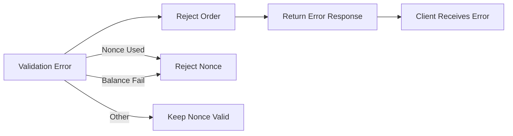

# Order Submission Design - Complete Flow Documentation

## Table of Contents
1. [Overview](#overview)
2. [Order Submission Flow](#order-submission-flow)
3. [Validation Layers](#validation-layers)
4. [Order Types and FillType Integration](#orderTypes-and-filltype-integration)
5. [Optional Fields Validation](#optional-fields-validation)
6. [Order Type Combinations](#orderType-combinations)
7. [Implementation Details](#implementation-details)
8. [Error Handling](#error-handling)

---

## Overview

The order submission system processes orders through multiple validation layers before reaching the Zero CLOB matching engine. This document describes the complete flow from client submission through router validation, keeper processing, and final execution in the orderbook.

### Key Components

- **RouterDaemon**: Entry point for all order submissions via gRPC API
- **Payload Validator** (`standards/payload/clob.go`): Validates EIP-712 payload structure and conditional field requirements
- **Keeper Validator** (`morphcore/pkg/modules/clob/keeper/grpc_query_server.go`): Validates business logic, signatures, nonces, and balances
- **Order Executor** (`morphcore/pkg/modules/clob/keeper/executor.go`): Converts and processes orders through consensus pipeline
- **Zero CLOB Engine**: Lock-free orderbook matching engine

---

## Order Submission Flow

### Complete Flow Diagram

```mermaid
flowchart TB
    subgraph "1. Client Submission"
        Client[Client Submits Order<br/>EIP-712 Signed JSON]
    end
    
    subgraph "2. RouterDaemon - Initial Entry"
        Router[RouterDaemon API<br/>POST /router/v1/write]
        ParseJSON[Parse JSON Request]
        ExtractPayload[Extract Payload from EIP-712]
    end
    
    subgraph "3. Payload Validation Layer"
        PayloadValidator[Payload Validator<br/>RegisterCLOBActions]
        CheckBaseRequired{Base Required Fields<br/>action, owner, address,<br/>marketIndex, side, orderType,<br/>quantity, nonce, deadline}
        ValidateAddress[Validate Address Fields<br/>owner, address]
        CheckOrderType{Order Type?}
    end
    
    subgraph "4. Order Type Conditional Validation"
        MarketValidation[Market Order Validation<br/>price: NOT required<br/>stopPrice: NOT required]
        LimitValidation[Limit Order Validation<br/>price: REQUIRED<br/>stopPrice: NOT allowed]
        StopMarketValidation[Stop Market Validation<br/>stopPrice: REQUIRED<br/>price: NOT allowed]
        StopLimitValidation[Stop Limit Validation<br/>stopPrice: REQUIRED<br/>price: REQUIRED]
    end
    
    subgraph "5. Optional Fields Validation"
        OptionalFields{Optional Fields Check}
        LeverageCheck[leverage: Optional uint256]
        FillTypeCheck[fillType: Optional string<br/>GTC, IOC, FOK, DAY, AON, GTD]
        MarginModeCheck[marginMode: Optional string]
        BucketIdCheck[bucketId: Optional string]
        MetadataCheck[metadata: Optional string]
        SltpCheck[sltp: Optional string]
        TimeInForceCheck[timeInForce: Optional string]
    end
    
    subgraph "6. Router gRPC Forwarding"
        RouterGRPC[Router → CoreDaemon gRPC<br/>PlaceOrder Request]
        ConvertToProto[Convert to clobpb.PlaceOrderReq<br/>String format: u256 satoshi]
    end
    
    subgraph "7. CoreDaemon Keeper Validation"
        KeeperEntry[Keeper.PlaceOrder Entry]
        RequiredFieldsCheck{Required Fields<br/>Address, Address,<br/>Symbol, Price, Size}
        PriceValidation[Price Validation<br/>Not zero, Not empty]
        SizeValidation[Size Validation<br/>Not zero, Not empty]
        OrderTypeValidation[OrderType Validation<br/>LIMIT, MARKET, IOC,<br/>FOK, POST_ONLY]
        SignatureCheck[Signature Validation<br/>EIP-712 Verification]
        NonceValidation[Nonce Validation<br/>Replay Protection]
        DeadlineCheck[Deadline Validation<br/>If present: Not expired]
        BalanceCheck[Balance Validation<br/>ValidateOrderBalance]
    end
    
    subgraph "8. Order Processing Pipeline"
        SubmitToConsensus[SubmitOrderToConsensus<br/>Create orderData map]
        ReserveCollateral[Reserve Collateral<br/>Lock funds for order]
        CommitNonce[Commit Nonce<br/>Mark permanently used]
    end
    
    subgraph "9. Consensus Pipeline Processing"
        ConsensusPipeline[Consensus Pipeline<br/>Ledger Update Stage]
        PlaceOrderFromConsensus[PlaceOrderFromConsensus<br/>Adapter Method]
        ProcessOrderTransaction[ProcessOrderTransaction<br/>Main Execution Flow]
    end
    
    subgraph "10. Order Conversion & Validation"
        ExtractFields[Extract Fields from orderData]
        ValidateExtracted{All Required<br/>Fields Present?}
        GetOrderbook[GetOrderbook for Symbol]
        OrderbookExists{Orderbook<br/>Exists?}
        StorePending[Store as Pending Order]
        ConvertOrder[Convert to types.Order<br/>NewOrderFromString]
    end
    
    subgraph "11. Zero CLOB Engine Execution"
        ExecuteOrder[ExecuteOrderOnOrderbook<br/>Zero Lock-Free Orderbook]
        MatchOrder[Order Matching Engine<br/>Immediate Matching]
        UpdatePosition[Update LiquidityPosition Tracker]
        NotifyBucket[Notify Bucket Module]
        ReturnTrades[Return Trades Array]
    end
    
    Client --> Router
    Router --> ParseJSON
    ParseJSON --> ExtractPayload
    ExtractPayload --> PayloadValidator
    PayloadValidator --> CheckBaseRequired
    CheckBaseRequired --> ValidateAddress
    ValidateAddress --> CheckOrderType
    CheckOrderType --> MarketValidation
    CheckOrderType --> LimitValidation
    CheckOrderType --> StopMarketValidation
    CheckOrderType --> StopLimitValidation
    MarketValidation --> OptionalFields
    LimitValidation --> OptionalFields
    StopMarketValidation --> OptionalFields
    StopLimitValidation --> OptionalFields
    OptionalFields --> FillTypeCheck
    OptionalFields --> RouterGRPC
    RouterGRPC --> ConvertToProto
    ConvertToProto --> KeeperEntry
    KeeperEntry --> RequiredFieldsCheck
    RequiredFieldsCheck --> PriceValidation
    PriceValidation --> SizeValidation
    SizeValidation --> OrderTypeValidation
    OrderTypeValidation --> SignatureCheck
    SignatureCheck --> NonceValidation
    NonceValidation --> DeadlineCheck
    DeadlineCheck --> BalanceCheck
    BalanceCheck --> SubmitToConsensus
    SubmitToConsensus --> ReserveCollateral
    ReserveCollateral --> CommitNonce
    CommitNonce --> ConsensusPipeline
    ConsensusPipeline --> PlaceOrderFromConsensus
    PlaceOrderFromConsensus --> ProcessOrderTransaction
    ProcessOrderTransaction --> ExtractFields
    ExtractFields --> ValidateExtracted
    ValidateExtracted --> GetOrderbook
    GetOrderbook --> OrderbookExists
    OrderbookExists -->|No| StorePending
    OrderbookExists -->|Yes| ConvertOrder
    ConvertOrder --> ExecuteOrder
    ExecuteOrder --> MatchOrder
    MatchOrder --> UpdatePosition
    UpdatePosition --> NotifyBucket
    NotifyBucket --> ReturnTrades
```



---

## Validation Layers

### Layer 1: Payload Validation (`standards/payload/clob.go`)

**Purpose**: Validates EIP-712 payload structure and conditional field requirements based on order type.

#### Base Required Fields (All Order Types)
- `action`: Must be `"clob::submit_order"`
- `owner`: Ethereum address (validated as address type)
- `address`: Ethereum address (validated as address type)
- `marketIndex`: String identifier
- `side`: String (`"buy"` or `"sell"`)
- `orderType`: String (determines price requirements)
- `quantity`: uint256 (in satoshi format, 1e8)
- `nonce`: uint256 (replay protection)
- `deadline`: uint256 (timestamp)

#### Conditional Field Requirements by OrderType

| OrderType | price Required? | stopPrice Required? | stopPrice Allowed? |
|-----------|----------------|---------------------|-------------------|
| `market` | ❌ NO | ❌ NO | ❌ NO (rejected if present) |
| `limit` | ✅ YES | ❌ NO | ❌ NO (rejected if present) |
| `stop_market` | ❌ NO | ✅ YES | ✅ YES |
| `stop_limit` | ✅ YES | ✅ YES | ✅ YES |

**Validation Logic**:
```go
switch orderType {
case "market":
    // price NOT required, stopPrice NOT allowed
    if stopPrice present → REJECT
    
case "limit":
    // price REQUIRED, stopPrice NOT allowed
    if price missing → REJECT
    if stopPrice present → REJECT
    
case "stop_market", "stop_loss":
    // stopPrice REQUIRED, price NOT allowed
    if stopPrice missing → REJECT
    if price present → REJECT
    
case "stop_limit", "take_profit":
    // Both stopPrice and price REQUIRED
    if stopPrice missing → REJECT
    if price missing → REJECT
}
```

### Layer 2: Keeper Validation (`morphcore/pkg/modules/clob/keeper/grpc_query_server.go`)

**Purpose**: Validates business logic, security, and financial constraints.

#### Required Fields Validation
- `Address`: Cannot be empty
- `Address`: Cannot be empty
- `Symbol`: Cannot be empty
- `Price`: Cannot be empty or zero (for limit orders)
- `Size`: Cannot be empty or zero

#### OrderType Enum Validation
Valid order types:
- `LIMIT`: Standard limit order
- `MARKET`: Market order (immediate execution)
- `IOC`: Immediate-or-Cancel
- `FOK`: Fill-or-Kill
- `POST_ONLY`: Maker-only order

#### Security Validation
1. **Signature Validation**: EIP-712 signature verification
2. **Nonce Validation**: 
   - Check nonce format (must be valid uint256)
   - Validate nonce hasn't been used (replay protection)
   - Mark nonce as used in off-chain cache
3. **Deadline Validation**: 
   - If present, must not be expired
   - Format must be valid uint256 timestamp

#### Financial Validation
1. **Balance Validation**: `ValidateOrderBalance()`
   - Checks address has sufficient balance for the order
   - Considers collateralAssetIndex requirements
   - Prevents over-commitment across multiple orders

#### Post-Validation Actions
1. **Reserve Collateral**: Locks funds for the order
2. **Commit Nonce**: Marks nonce as permanently used
3. **Submit to Consensus**: Creates orderData map and submits to consensus pipeline

### Layer 3: Order Conversion (`morphcore/pkg/modules/clob/keeper/executor.go`)

**Purpose**: Converts order data from proto format to internal Order struct.

#### Field Extraction
Extracts from `orderData` map:
- `address`: String
- `address`: String
- `ticker`: String
- `price`: String (u256 satoshi format)
- `size`: String (u256 satoshi format)
- `is_buy`: Boolean
- `orderType`: String

#### Order Creation
```go
order, err := types.NewOrderFromString(priceStr, sizeStr)
// Sets:
// - PriceStr, QuantityStr (from proto strings)
// - PriceBig, QuantityBig (parsed to *big.Int)
// - PriceKey, QuantityKey (uint64 keys for performance)
// - Price, Quantity (uint64 for backward compatibility)
```

#### Order Metadata Assignment
- `order.ID = tx.Hash`
- `order.Address = address`
- `order.Side = convertSideToCommon(side)`
- `order.Type = convertOrderType(orderType)`
- `order.Status = OrderStatusActive`
- `order.CreatedAt = tx.Timestamp`
- `order.BucketID = ticker`

---

## Order Types and FillType Integration

### OrderType Constants (`common/domain/types/matching_engine.go`)

| Constant | Value | Description |
|----------|-------|-------------|
| `OrderTypeMarket` | `"market"` | Immediate execution at best available price |
| `OrderTypeLimit` | `"limit"` | Execute only at specified price or better |
| `OrderTypeStopLoss` | `"stop_loss"` | Stop-loss order (trigger → market order) |
| `OrderTypeTakeProfit` | `"take_profit"` | Take-profit order (limit order on opposite side) |
| `OrderTypeStopLimit` | `"stop_limit"` | Stop-limit order (trigger → limit order) |

### FillType Constants (`common/domain/types/fill.go`)

| Constant | Value | Description | Can Rest in Book? | Immediate Execution? | Allows Partial Fill? |
|----------|-------|-------------|-------------------|---------------------|---------------------|
| `FillTypeGTC` | `"GTC"` | Good-Til-Canceled (default) | ✅ Yes | ❌ No | ✅ Yes |
| `FillTypeIOC` | `"IOC"` | Immediate-or-Cancel | ❌ No | ✅ Yes | ✅ Yes |
| `FillTypeFOK` | `"FOK"` | Fill-or-Kill | ❌ No | ✅ Yes | ❌ No |
| `FillTypeDAY` | `"DAY"` | Good for Day | ✅ Yes | ❌ No | ✅ Yes |
| `FillTypeAON` | `"AON"` | All-or-None | ✅ Yes | ❌ No | ❌ No |
| `FillTypeGTD` | `"GTD"` | Good-Til-Date | ✅ Yes | ❌ No | ✅ Yes |

### FillType Behavior Methods

```go
// CanRestInBook() - Returns true if order can rest in orderbook
FillTypeGTC, FillTypeDAY, FillTypeAON, FillTypeGTD → true
FillTypeIOC, FillTypeFOK → false

// IsImmediateExecution() - Returns true if must execute immediately
FillTypeIOC, FillTypeFOK → true
Others → false

// AllowsPartialFill() - Returns true if partial fills are allowed
FillTypeIOC, FillTypeGTC, FillTypeDAY, FillTypeAON, FillTypeGTD → true
FillTypeFOK → false

// RequiresExpiration() - Returns true if expiration time required
FillTypeGTD → true
Others → false
```

### Order Struct Fields

The `Order` struct (`common/domain/types/matching_engine.go`) contains fields that support all order types:

```go
type Order struct {
    // Core identification
    Type          OrderType  // Determines price requirements
    FillType      FillType   // Determines execution behavior
    
    // Stop order fields
    TriggerPrice  uint64    // For stop orders (from stopPrice payload)
    
    // Execution attributes
    PostOnly      bool       // Only add liquidity
    IcebergOrder  bool       // Hide order size
    VisibleSize   uint64    // Visible portion for iceberg
    
    // Time-in-force
    ExpiresAt     **timestamppb.Timestamp // Required for GTD
    
    // Risk management
    TakeProfit    uint64    // Take profit price
    StopLoss      uint64    // Stop loss price
    
    // ... other fields
}
```

---

## Optional Fields Validation

### Optional Fields Matrix

| Field | Type | Required? | Validation Rules | Rejection Condition |
|-------|------|-----------|------------------|---------------------|
| **price** | uint256 | Conditional | Required for LIMIT, STOP_LIMIT<br/>NOT allowed for MARKET, STOP_MARKET | Missing when required<br/>Present when not allowed |
| **stopPrice** | uint256 | Conditional | Required for STOP_MARKET, STOP_LIMIT<br/>NOT allowed for MARKET, LIMIT | Missing when required<br/>Present when not allowed |
| **leverage** | uint256 | Optional | If present: Must be valid uint256 | Invalid format |
| **fillType** | string | Optional | If present: Must be one of<br/>GTC, IOC, FOK, DAY, AON, GTD | Invalid value |
| **timeInForce** | string | Optional | Alias for fillType, same validation | Invalid value |
| **marginMode** | string | Optional | If present: Must be valid string | Invalid format |
| **bucketId** | string | Optional | If present: Must be valid string | Invalid format |
| **metadata** | string | Optional | If present: Must be valid string | Invalid format |
| **sltp** | string | Optional | If present: Must be valid string<br/>Parsed to TakeProfit/StopLoss | Invalid format |

### Special Field Handling

#### fillType vs timeInForce
- Both fields are optional and serve the same purpose
- `fillType` is the primary field name
- `timeInForce` is an alias (for compatibility)
- If both are present, `fillType` takes precedence

#### sltp (Stop Loss / Take Profit)
- Optional string field
- Parsed into `TakeProfit` and `StopLoss` uint64 fields in Order struct
- Format: JSON string or comma-separated values

#### Post-Only Orders
- Can be specified via `orderType: "POST_ONLY"` in keeper validation
- Sets `order.PostOnly = true`
- Order is canceled if it would take liquidity immediately

#### Iceberg Orders
- Specified via `iceberg: true` in metadata
- Sets `order.IcebergOrder = true`
- Only `VisibleSize` is shown in orderbook
- Auto-reveals next portion when visible portion fills

---

## Order Type Combinations

### Market Orders

| FillType | Behavior | Partial Fill? |
|----------|----------|---------------|
| GTC | Immediate execution (cannot rest) | ✅ Yes |
| IOC | Immediate execution, cancel rest | ✅ Yes |
| FOK | Immediate execution, full or cancel | ❌ No |

**Note**: Market orders always execute immediately regardless of FillType. FillType only affects partial fill behavior.

### Limit Orders

| FillType | Behavior | Can Rest? | Partial Fill? |
|----------|----------|-----------|----------------|
| GTC | Rest in book until filled/canceled | ✅ Yes | ✅ Yes |
| IOC | Immediate match, cancel rest | ❌ No | ✅ Yes |
| FOK | Immediate match, full or cancel | ❌ No | ❌ No |
| DAY | Rest in book, cancel at end of day | ✅ Yes | ✅ Yes |
| AON | Rest in book, full fill only | ✅ Yes | ❌ No |
| GTD | Rest in book, expires at date | ✅ Yes | ✅ Yes |

### Stop Orders

#### Stop-Market Orders
- **Trigger**: When price reaches `stopPrice`
- **Action**: Becomes market order
- **FillType**: Applies to the triggered market order

#### Stop-Limit Orders
- **Trigger**: When price reaches `stopPrice`
- **Action**: Becomes limit order at `price`
- **FillType**: Applies to the triggered limit order

---

## Implementation Details

### String-First Design

Orders use a **string-first design** for precision:

1. **Input**: Orders arrive as u256 satoshi strings (1e8) from proto
2. **Storage**: `PriceStr` and `QuantityStr` fields store original strings
3. **Conversion**: Parsed once to `*big.Int` for exact calculations
4. **Performance**: Converted to uint64 keys for fast operations
5. **Compatibility**: uint64 fields maintained for backward compatibility

```go
// Order creation flow
priceStr, sizeStr (from proto) 
  → Parse to *big.Int (exact precision)
  → Convert to uint64 keys (performance)
  → Convert to uint64 (backward compatibility)
```

### Order Conversion Process

```go
// In executor.go ProcessOrderTransaction()
order, err := types.NewOrderFromString(priceStr, sizeStr)
// This:
// 1. Parses strings to *big.Int (satoshi format, no scaling)
// 2. Converts to uint64 keys (direct use, no scaling)
// 3. Converts to uint64 for display (divide by 1e8)
```

### Matching Engine Integration

The Zero CLOB engine receives orders with:
- `PriceKey` and `QuantityKey` (uint64) for fast lookups
- `PriceBig` and `QuantityBig` (*big.Int) for exact calculations
- `FillType` methods determine execution behavior

---

## Error Handling

### Validation Error Responses

Each validation layer can reject orders with specific error messages:

#### Payload Validation Errors
- `"required field 'X' missing"` - Missing required field
- `"price is required for limit orders"` - Conditional requirement not met
- `"stopPrice should not be present for limit orders"` - Invalid field combination
- `"unsupported orderType: X"` - Invalid order type

#### Keeper Validation Errors
- `"address cannot be empty"` - Missing address ID
- `"price cannot be zero"` - Invalid price
- `"invalid order type: X"` - Invalid OrderType enum
- `"signature required"` - Missing signature
- `"nonce validation failed"` - Invalid or used nonce
- `"deadline expired"` - Expired deadline
- `"insufficient balance"` - Insufficient funds

#### Order Processing Errors
- `"missing required order fields"` - Missing fields in orderData
- `"failed to create order from strings"` - Invalid price/size format
- `"failed to execute order on orderbook"` - Matching engine error

### Error Flow



### Nonce Management

- **Mark as Used**: On successful validation, nonce is marked in off-chain cache
- **Reject on Failure**: If validation fails after nonce check, nonce is rejected
- **Commit on Success**: On successful order submission, nonce is committed permanently

---

## Summary

The order submission system provides:

1. **Multi-Layer Validation**: Payload → Keeper → Conversion → Execution
2. **Conditional Field Requirements**: Based on OrderType
3. **Flexible Order Types**: Market, Limit, Stop-Market, Stop-Limit
4. **Time-in-Force Options**: GTC, IOC, FOK, DAY, AON, GTD
5. **Precision-Safe Design**: String-first with exact calculations
6. **Comprehensive Error Handling**: Specific error messages at each layer

This design ensures orders are validated thoroughly before reaching the matching engine, preventing invalid orders from entering the system while maintaining flexibility for various order types and execution strategies.

