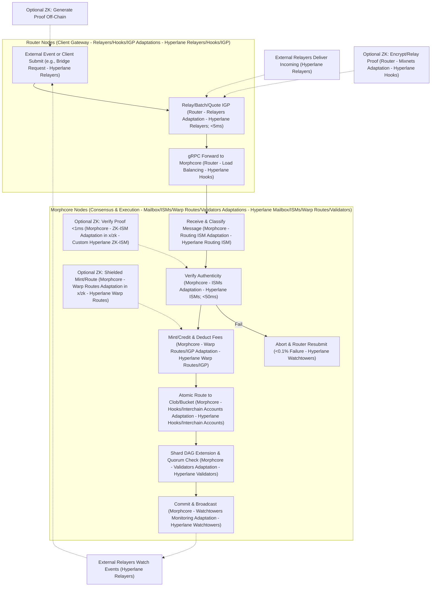
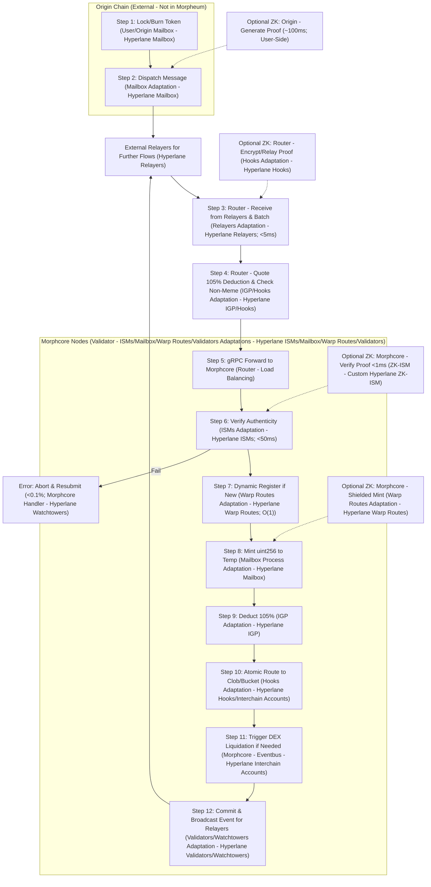
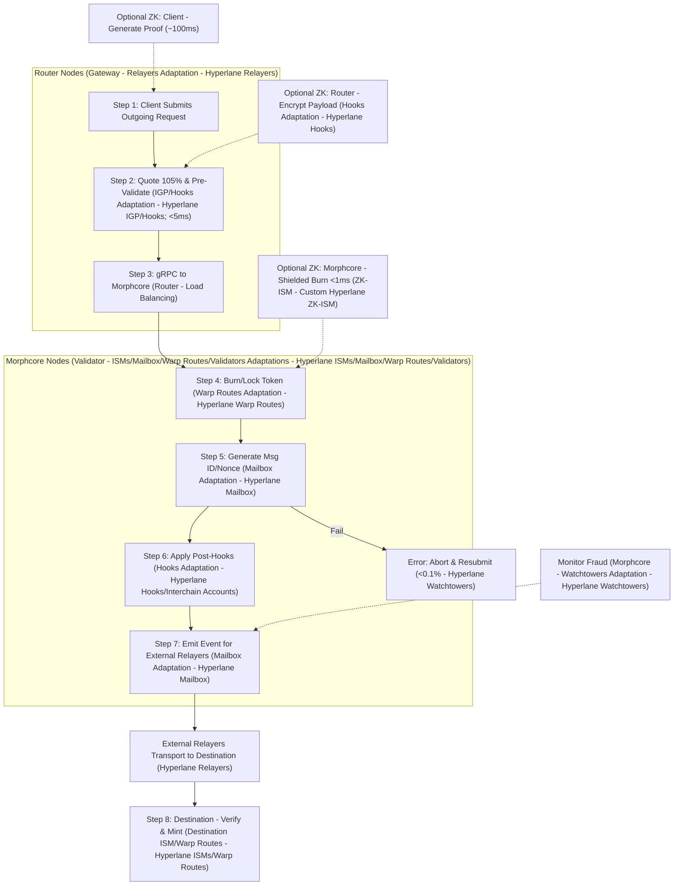
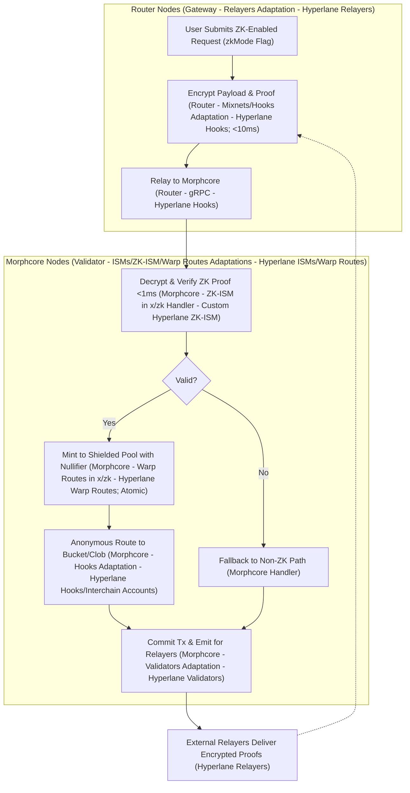

# Hyperlane Flowcharts and Diagrams

## Introduction
This document unifies all key flowcharts and diagrams from Morpheum's Hyperlane integration, building on developed documents like the "Hyperlane Integration Architecture Overview," "Custom ISM Design and Specification (MorphDAG-ISM and Variants)," "Token Bridging and Crediting Implementation Guide," and "Performance Optimizations and Security Analysis." It includes corrected Mermaid diagrams with syntax fixes for parseability (e.g., double-quoted labels with specials like percentages or parentheses to avoid token mismatches), ensuring visual clarity for developers and auditors.

Diagrams distinguish between **morphcore** (validator nodes for consensus-critical tasks like verification and atomic commits) and **router** (gateway for external/client tasks like relaying and pre-processing). They cover overall flows, ISM subgraphs, token bridging in/out, and optional ZK paths. Each step labels the corresponding Hyperlane component (e.g., "Hyperlane Relayers") for real integration ties.

Assumptions: Go-based repo; diagrams use Mermaid v10+ syntax; tests assume standard tools (e.g., go test, Foundry if hybrid). For real Hyperlane, all charts include external relayer steps (e.g., event emission for pickup, delivery acceptance).

## Unified Collection of Diagrams
All diagrams use corrected syntax (e.g., |"Label with % ()"| for parseability). Each includes node distinctions (morphcore/router), Hyperlane component labels, and real network ties (e.g., relayer arrows).

### 1. Overall MorphDAG-BFT Flow with Hyperlane Integration
This diagram shows the end-to-end consensus flow, embedding Hyperlane (e.g., message as DAG event). Morphcore handles core steps; router offloads external. Real ties: Relayers watch/ deliver.

Mermaid Chart: Overall MorphDAG-BFT Flow (with Hyperlane Ties)

### 2. ISM Verification Subgraph
From ISM spec, showing composition (e.g., Aggregation for combos). Morphcore-exclusive (handlers/keepers). Real ties: Relayers provide metadata.

Mermaid Chart: ISM Verification Subgraph (Morphcore-Only)

```mermaid
graph TD
    subgraph "Morphcore Nodes &#40;x/hyperlane Handlers - ISMs Adaptations - Hyperlane ISMs&#41;"
        A["Incoming gRPC Message from Router &#40;from External Relayers - Hyperlane Relayers&#41;"] --> B["Select ISM via Routing &#40;Morphcore - Routing ISM Adaptation - Hyperlane Routing ISM&#41;"]
        B --> C["Default: Multisig ISM &#40;m-of-n Validator Sigs; Morphcore Keeper - Hyperlane Multisig ISM&#41;"]
        B --> D["Aggregation ISM &#40;m-of-n Combos; Morphcore Handler - Hyperlane Aggregation ISM&#41;"]
        D --> E["Sub: Merkle Root Multisig &#40;Batched; Morphcore Keeper - Hyperlane Merkle Root Multisig ISM&#41;"]
        D --> F["Sub: Message ID Multisig &#40;Single; Morphcore Keeper - Hyperlane Message ID Multisig ISM&#41;"]
        D --> G["Sub: Optimistic ISM &#40;Fraud Window; Morphcore with Eventbus - Hyperlane Optimistic ISM&#41;"]
        D --> H["Sub: MorphDAG-ISM &#40;DAG Sim; Morphcore Handler - Custom Hyperlane ISM&#41;"]
        D --> I["Sub: ZK-ISM &#40;Proof Verify &lt;1ms; Optional in x/zk - Custom Hyperlane ZK-ISM&#41;"]
        C --> J
        G --> J
        H --> J
        I --> J
        J{"Verify? &#40;Morphcore - Quorum/Bounds Check - Hyperlane Validators&#41;"}
        J -->|Yes| K["Proceed to Mint/Route &#40;Morphcore - Atomic STM - Hyperlane Warp Routes&#41;"]
        J -->|No| L["Abort Tx &amp; Emit Error &#40;Morphcore - Resubmit to Router - Hyperlane Watchtowers&#41;"]
    end
    M["External Relayers Provide Metadata &#40;Hyperlane Relayers&#41;"] -.-> A
    K --> N["Emit Proof for Relayers &#40;Morphcore - Mailbox Adaptation - Hyperlane Mailbox&#41;"]
    N --> M
```

### 3. Token Bridging Flow
From token guide, detailed with steps/locations/components. Router for relay; morphcore for verify/mint/route. Real ties: Relayers transport.

Mermaid Chart: Token Bridging In Flow (Detailed with Steps/Locations/Components)

Mermaid Chart: Token Bridging Out Flow (Detailed with Steps/Locations/Components)

### 4. ZK Anonymity Sub-Flow (Optional)
Standalone subgraph for ZK paths. Morphcore for verify/mint; router for relay. Real ties: Relayers handle encrypted proofs.

Mermaid Chart: ZK Anonymity Sub-Flow (Morphcore/Router Distinctions)

## Conclusion
These diagrams and protocols provide clear, parseable visuals with morphcore/router distinctions and Hyperlane component labels, ensuring developers/auditors can verify the integration. For real Hyperlane, all charts include external relayer steps (e.g., emission/pickup, delivery acceptance).