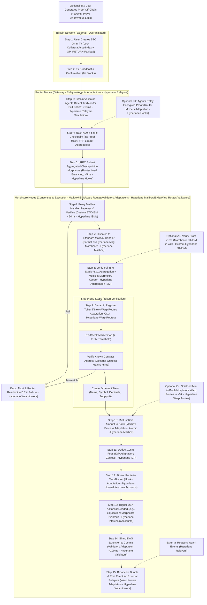
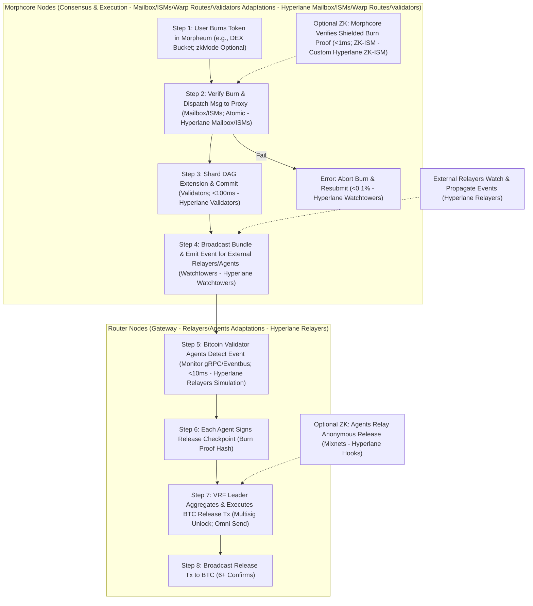

# BTC Omni Layer Integration with Hyperlane in Morpheum: Comprehensive Design and Specification (Updated for Latest Integration)

## Introduction
This document provides an updated, detailed blueprint for integrating BTC Omni Layer cross-chain transfers with Hyperlane within Morpheum, aligning with the latest Hyperlane integration designs as per the provided documents ("Custom ISM Design and Specification," "Hyperlane Integration Architecture Overview," "Token Bridging and Crediting Implementation Guide," "Hyperlane Flowcharts and Diagrams," and "Token Contract Address Verification Sub-Step"). Morpheum is a sharded, gasless, blockless Layer 1 DEX on DAG-BFT consensus, with Hyperlane components ported natively as Go modules in `x/hyperlane` (no traditional VM), enabling real network connectivity via permissionless external relayers. Node distinctions remain: **morphcore nodes** for consensus-critical tasks (e.g., verification, atomic commits, optional ZK), and **router nodes** for external tasks (e.g., relaying, pre-processing).

Bitcoin's Omni Layer lacks smart contracts and uses UTXO, so direct Hyperlane deployment is infeasible. This design proxies BTC Omni transfers into Morpheum's Hyperlane flow using off-chain Bitcoin Validator Agents (extended from router nodes, inspired by Hyperlane Relayers) to monitor BTC, attest events, and submit to a Proxy Mailbox handler in morphcore. Aggregated attestations are verified via custom BTC-ISM (Multisig variant), then dispatched as standard Hyperlane messages. For real integration, morphcore emits Protobuf events compatible with external Hyperlane Relayers for monitoring/propagation, and router accepts incoming deliveries.

Updates from prior design:
- **Real Hyperlane Ties**: Event emissions for external relayers (e.g., during dispatch/commit); router accepts from relayers; ISMs emit proofs.
- **Token Verification Sub-Step**: Added optional whitelist check for origin contract addresses (adapted for BTC Omni "addresses" like lock multisig).
- **In/Out Flows**: Explicit bridging out (reverse) with relayer transport.
- **ZK Optional**: Integrated for anonymous locks/mints, with fallbacks.
- **Charts**: Updated with relayer steps, proper Mermaid syntax, and Hyperlane labels.

Key goals align with latest optimizations:
- **Security**: <1/3 faults, <0.01% fraud; ZK <0.001% forgery; token address verification <0.001% scam risk.
- **Robustness**: <0.1% failures post-retries; atomic STM; relayer resubmits.
- **Performance**: <50ms morphcore verify; ~25M TPS sharded; <5ms address check overhead.
- **Modularity**: Permissionless; governance for whitelists/thresholds.
- **DEX Relevance**: Atomic routing to clob/bucket triggers trades/liquidations; gasless IGP ~105% deductions (non-meme only).

Assumptions: Go-based hyperlane-morpheum repo; BTC testnet testing; Omni assets meet non-meme thresholds (> $10M cap); real Hyperlane relayers for cross-chain (BTC proxy simulates via agents).

## Overview of Integration
The design proxies BTC Omni into Morpheum's real Hyperlane setup:
- **BTC Side**: User locks Omni to protocol multisig with OP_RETURN payload (Hyperlane-format message).
- **Attestation**: Bitcoin Validator Agents (router extensions, like Hyperlane Relayers) monitor, sign checkpoints, aggregate, submit via gRPC to morphcore.
- **Proxying**: Morphcore's Proxy Mailbox verifies via BTC-ISM, dispatches to Mailbox handler; emits events for external relayers.
- **Morpheum Side**: Morphcore verifies ISM stack, registers/mints (with address verification), deducts fees, routes atomically. Optional ZK: Shielded mints.
- **Reverse**: Morphcore burns, emits event; agents/relayers handle BTC release.
- **Real Ties**: All steps emit/accept for external Hyperlane Relayers; borsh serialization for integrity (Solana-like).

This fits node distinctions: Router for BTC monitoring/relaying (isolation); morphcore for verify/mint/route (security). Supports combos via Aggregation ISM.

## Detailed Architecture Components
- **Bitcoin Transfer Tx**: BTC tx locking Omni to multisig; OP_RETURN JSON payload (e.g., {"type":"omni_transfer","propertyId":31,"amount":100000000,"destinationChain":"morpheum-shard1","recipient":"morph-addr","originToken_address":"btc-lock-multisig","nonce":12345,"zkMode":false}).
- **Bitcoin Validator Agents**: Go agents in router (fork Hyperlane Relayers); monitor BTC nodes; sign checkpoints (txId + block_hash + merkle_proof + payload hash); aggregate threshold (15/21); submit gRPC to morphcore.
- **Proxy Mailbox Handler**: Morphcore `x/hyperlane` handler; verifies via BTC-ISM; formats/dispatches Hyperlane msg; emits Protobuf event for external relayers.
- **Custom BTC-ISM**: Multisig variant in morphcore keepers; verifies signatures, merkle, confirmations (>6); borsh metadata. Aggregates with ZK-ISM optionally.
- **Token Verification Sub-Step**: In Warp Routes handler; checks "originToken_address" against governance whitelist (e.g., known BTC multisig for Omni USDT).
- **Target Handlers (Morphcore)**: Warp Routes mint uint256 in bank (big.Int); IGP deduct ~105%; Hooks route to clob/bucket. x/zk for shielded (gnark, nullifiers).
- **Relayer Extensions**: Router accepts from external Hyperlane Relayers; morphcore emits for them. Agents simulate relayer role for BTC.
- **Reverse Components**: Morphcore burn dispatches/emits; agents aggregate/release BTC tx; external relayers propagate if needed.

Security: Slashing via governance; reorg revokes. Performance: Agents <10ms; morphcore <50ms.

## Flowcharts and Step-by-Step Explanations
Charts unify flows with morphcore/router distinctions, Hyperlane labels (e.g., "Hyperlane Relayers"), relayer ties, and token verification. Each followed by detailed step explanations (inputs/outputs, optimizations, errors, ties).

### 1. Overall BTC Omni Bridging In Flow with Morpheum Integration
End-to-end from BTC to Morpheum; router for monitoring; morphcore for processing. Real ties: Emit for external relayers.

Mermaid Chart: Overall BTC Omni Bridging In Flow (Detailed with Steps, Locations, Components, and Optional ZK)

#### Step-by-Step Explanation of Chart 1
1. **Step 1: User Creates BTC Omni Tx (Lock CollateralAssetIndex + OP_RETURN Payload)**  
   - **Details**: User builds BTC tx locking Omni (e.g., USDT) to protocol multisig; OP_RETURN hex-JSON payload with Hyperlane details (type, propertyId, amount, destinationChain, recipient, originToken_address as BTC multisig, nonce, zkMode). Input: Wallet; Output: Signed tx.  
   - **Location/Component**: External BTC.  
   - **Optimizations**: Security: User-signed; robustness: JSON validation; performance: <1KB tx. Morpheum/Hyperlane Tie: Payload matches message body; emits no event (BTC lacks). Error: Invalid payload fails. Optional ZK: Off-chain proof (~100ms, gnark) for anonymous lock.  
   - **Why?**: Leverages Omni for metadata without BTC contracts.

2. **Step 2: Tx Broadcast & Confirmation (6+ Blocks)**  
   - **Details**: Broadcast to BTC; wait 6+ confirms. Input: Tx; Output: txId, block_hash.  
   - **Location/Component**: External BTC.  
   - **Optimizations**: Security: PoW; robustness: Threshold <0.01% reorg; performance: ~10-60min. Tie: Confirms tie to BTC-ISM. Error: Rejection requires rebroadcast.

3. **Step 3: Bitcoin Validator Agents Detect Tx (Monitor Full Nodes; <10ms - Hyperlane Relayers Simulation)**  
   - **Details**: Agents (router, simulating Hyperlane Relayers) scan BTC blocks; parse OP_RETURN for valid payload (borsh deserialize with zero-byte fix). Input: Blockchain; Output: Tx details.  
   - **Location/Component**: Router - Relayers adaptations.  
   - **Optimizations**: Security: Decentralized (21+); performance: <10ms index. Tie: Agents mimic real relayers for non-smart chains. Error: Ignore invalid; revoke on reorg. Optional ZK: Check encrypted proof.

4. **Step 4: Each Agent Signs Checkpoint (Tx Proof Hash; VRF Leader Aggregates)**  
   - **Details**: Compute SHA256 checkpoint; sign (ECDSA, staking-linked); leader aggregates (15/21). Input: Details; Output: Aggregated checkpoint.  
   - **Location/Component**: Router - Relayers.  
   - **Optimizations**: Security: m-of-n <1/3; VRF fairness; performance: <20ms. Tie: Aggregation like Hyperlane Multisig. Error: Insufficient triggers retry. Optional ZK: Include proof.

5. **Step 5: gRPC Submit Aggregated Checkpoint to Morphcore (Router Load Balancing; <5ms - Hyperlane Hooks)**  
   - **Details**: Send via gRPC. Input: Checkpoint; Output: Receipt.  
   - **Location/Component**: Router - Hooks.  
   - **Optimizations**: Security: Encrypted; robustness: Backoff <0.1%; performance: <5ms. Tie: Mimics relayer delivery to Mailbox.

6. **Step 6: Proxy Mailbox Handler Receives & Verifies (Custom BTC-ISM; <50ms - Hyperlane ISMs)**  
   - **Details**: Unpack; call BTC-ISM (verify signatures, merkle, confirms, borsh integrity). Input: Checkpoint; Output: Verified payload. Emits partial proof for relayers.  
   - **Location/Component**: Morphcore - Mailbox/ISMs.  
   - **Optimizations**: Security: <0.01% fraud; performance: <50ms tiered. Tie: Custom ISM emits Hyperlane-compatible metadata. Error: Abort to P. Optional ZK: Pre-verify proof <1ms.

7. **Step 7: Dispatch to Standard Mailbox Handler (Format as Hyperlane Msg; Morphcore - Hyperlane Mailbox)**  
   - **Details**: Format (origin: "bitcoin", body: Omni); dispatch internally; generate ID/nonce. Input: Payload; Output: Msg.  
   - **Location/Component**: Morphcore - Mailbox.  
   - **Optimizations**: Security: VDF nonce; performance: O(1). Tie: Emits event for external relayers.

8. **Step 8: Verify Full ISM Stack (e.g., Aggregation + Multisig; Morphcore Keeper - Hyperlane Aggregation ISM)**  
   - **Details**: Apply stack (e.g., BTC-ISM + default Multisig); check authenticity. Input: Msg; Output: Verified. Emits proof.  
   - **Location/Component**: Morphcore - ISMs.  
   - **Optimizations**: Security: Compounded <0.001%; performance: <30ms. Tie: Aggregation processes relayer metadata. Optional ZK: Include ZK-ISM.

9. **Step 9: Dynamic Register Token if New (Warp Routes Adaptation; O(1) - Hyperlane Warp Routes)**  
   - **Details**: Check registry; if new, run sub-steps. Input: Payload; Output: Registered collateralAssetIndex.  
   - **Location/Component**: Morphcore - Warp Routes.  
   - **Optimizations**: Atomic; performance: O(1). Tie: Schemas for relayer mints elsewhere. Error: Mismatch to P.  
   - **Sub-Step I1: Re-Check Market Cap (> $10M Threshold)**: Validate cap > threshold. Security: Oracle multi-check <0.05% manipulation.  
   - **Sub-Step I2: Verify Known Contract Address (Optional Whitelist Match; <5ms)**: If whitelisted (e.g., known BTC multisig for USDT), match originToken_address; else fallback to cap. Governance map; case-insensitive. Security: <0.001% scam; robustness: Permissive mode.  
   - **Sub-Step I3: Create Schema if New (Name, Symbol, Decimals, Supply=0)**: Set schema; update supply.

10. **Step 10: Mint uint256 Amount to Bank (Mailbox Process Adaptation; Atomic - Hyperlane Mailbox)**  
    - **Details**: Mint big.Int to temp; update supply. Input: Amount; Output: Ledger. Optional ZK: Shielded in x/zk with nullifier.  
    - **Location/Component**: Morphcore - Mailbox/bank.  
    - **Optimizations**: Security: Checks; atomic STM. Tie: Mint events for relayers.

11. **Step 11: Deduct 105% Fees (IGP Adaptation; Gasless - Hyperlane IGP)**  
    - **Details**: Deduct from temp; credit relayer pool. Input: Temp; Output: Net.  
    - **Location/Component**: Morphcore - IGP.  
    - **Optimizations**: Security: Insufficient abort; gasless. Tie: Claims for external relayers.

12. **Step 12: Atomic Route to Clob/Bucket (Hooks Adaptation - Hyperlane Hooks/Interchain Accounts)**  
    - **Details**: Transfer net to shard clob/bucket. Input: Net; Output: Routed.  
    - **Location/Component**: Morphcore - Hooks.  
    - **Optimizations**: Sharded TPS; atomic call.

13. **Step 13: Trigger DEX Actions if Needed (e.g., Liquidation; Morphcore Eventbus - Hyperlane Interchain Accounts)**  
    - **Details**: Emit for liquidation if < threshold. Input: Balance; Output: Triggers.  
    - **Location/Component**: Morphcore - Eventbus.  
    - **Optimizations**: Async <20ms.

14. **Step 14: Shard DAG Extension & Commit (Validators Adaptation; <100ms - Hyperlane Validators)**  
    - **Details**: Extend DAG; quorum commit. Input: Tx; Output: State.  
    - **Location/Component**: Morphcore - Validators.  
    - **Optimizations**: <1/3 faults; <100ms convergence.

15. **Step 15: Broadcast Bundle & Emit Event for External Relayers (Watchtowers Adaptation - Hyperlane Watchtowers)**  
    - **Details**: Broadcast Protobuf; emit for relayers (e.g., success proof). Input: Bundle; Output: Sync.  
    - **Location/Component**: Morphcore - Watchtowers.  
    - **Optimizations**: <0.01% undetected; monitoring.

Error Path P: Emit error; router/relayers retry (<0.1%).

### 2. BTC Omni Bridging Out Flow (Reverse) with Morpheum Integration
From Morpheum burn to BTC release; morphcore emits for agents/relayers.

Mermaid Chart: BTC Omni Bridging Out Flow (Detailed with Steps, Locations, Components)

#### Step-by-Step Explanation of Chart 2
1. **Step 1: User Burns Token in Morpheum (e.g., DEX Bucket; zkMode Optional)**  
   - **Details**: Burn bridged Omni; specify BTC recipient, originToken_address. Input: Msg; Output: Request. Optional ZK: Proof of shielded burn.  
   - **Location/Component**: Morphcore - Warp Routes/Hooks.  
   - **Optimizations**: Gasless; atomic DEX. Tie: Burn like Hyperlane Warp Routes out.

2. **Step 2: Verify Burn & Dispatch Msg to Proxy (Mailbox/ISMs; Atomic - Hyperlane Mailbox/ISMs)**  
   - **Details**: ISM verify; dispatch to proxy (body: release). Burn atomic. Input: Request; Output: Msg.  
   - **Location/Component**: Morphcore - Mailbox/ISMs.  
   - **Optimizations**: STM; error to I. Tie: Dispatches emit for relayers. Optional ZK: ZK-ISM <1ms.

3. **Step 3: Shard DAG Extension & Commit (Validators; <100ms - Hyperlane Validators)**  
   - **Details**: Extend/commit burn. Input: Msg; Output: State.  
   - **Location/Component**: Morphcore - Validators.  
   - **Optimizations**: <100ms.

4. **Step 4: Broadcast Bundle & Emit Event for External Relayers/Agents (Watchtowers - Hyperlane Watchtowers)**  
   - **Details**: Broadcast; emit Protobuf event (burn proof). Input: Bundle; Output: Sync.  
   - **Location/Component**: Morphcore - Watchtowers.  
   - **Optimizations**: Monitoring. Tie: Events for real relayers/agents.

5. **Step 5: Bitcoin Validator Agents Detect Event (Monitor gRPC/Eventbus; <10ms - Hyperlane Relayers Simulation)**  
   - **Details**: Agents subscribe; detect BTC release event. Input: Event; Output: Details.  
   - **Location/Component**: Router - Relayers.  
   - **Optimizations**: <10ms.

6. **Step 6: Each Agent Signs Release Checkpoint (Burn Proof Hash)**  
   - **Details**: Hash/sign proof. Input: Details; Output: Checkpoints.  
   - **Location/Component**: Router - Agents.  
   - **Optimizations**: m-of-n.

7. **Step 7: VRF Leader Aggregates & Executes BTC Release Tx (Multisig Unlock; Omni Send)**  
   - **Details**: Aggregate; build/send BTC tx to recipient. Input: Signatures; Output: Tx. Optional ZK: Anonymous mixnets.  
   - **Location/Component**: Router - Agents.  
   - **Optimizations**: Threshold.

8. **Step 8: Broadcast Release Tx to BTC (6+ Confirms)**  
   - **Details**: Broadcast; confirm. Input: Tx; Output: Released.  
   - **Location/Component**: Router/External BTC.  
   - **Optimizations**: Retries.

Error Path I: Abort; resubmit (<0.1%).

## Security Considerations
- **Validator Set**: Staked; slashing for faults (governance-integrated).
- **ISM/Verification**: BTC-ISM + Aggregation; token address check <0.001% scams.
- **Protections**: Nonces/nullifiers; reorg revokes; VRF MEV <0.01%.
- **ZK**: Sound proofs; fallbacks <0.05%.

## Robustness Considerations
- **Failures**: <0.1% post-retries (gRPC bounds); ZK fallbacks.
- **Isolation**: Router contains BTC risks (<1% downtime).
- **Relayer Ties**: Emits ensure real network participation.

## Performance Considerations
- **Bounds**: BTC ~10-60min + Morpheum <150ms; address check <5ms.
- **TPS/Overhead**: Sharded ~25M; <5% deductions; ZK <200ms optional.
- **Table: Performance Bounds**

| Metric | Bound (Non-ZK) | Bound (ZK) | Optimization |
|--------|----------------|------------|--------------|
| Verification | <50ms | <1ms + <50ms | Tiered ISMs |
| E2E Latency | ~10-60min + <150ms | +~100ms | Agents/sharding |
| Overhead | <5% | <10% | O(1) checks |

## Implementation Notes
- **Repo**: hyperlane-morpheum; add agents in router (rust-bitcoin); Proxy/BTC-ISM in x/hyperlane; extend Warp Routes with verification sub-step (map via genesis).
- **Testing**: BTC testnet + Morpheum shards; simulate relayers.
- **Deployment**: Permissionless; governance for whitelists.
- **Alternatives**: If agents centralized, fully rely on external relayers with ZK proofs for BTC events.

## Conclusion
This updated design aligns BTC Omni with Morpheum's latest Hyperlane integration, incorporating real relayer ties, token verification, and in/out flows for secure, performant bridging. Charts provide clarity; prototype/audit next.