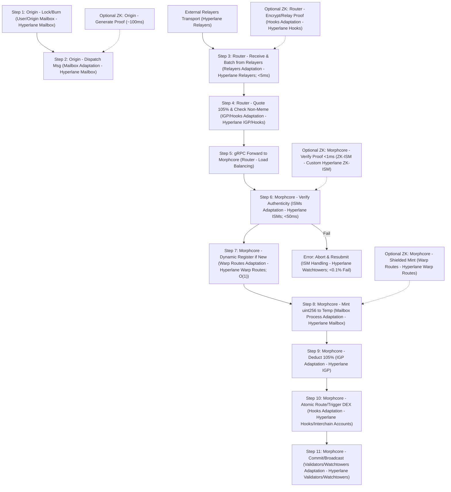
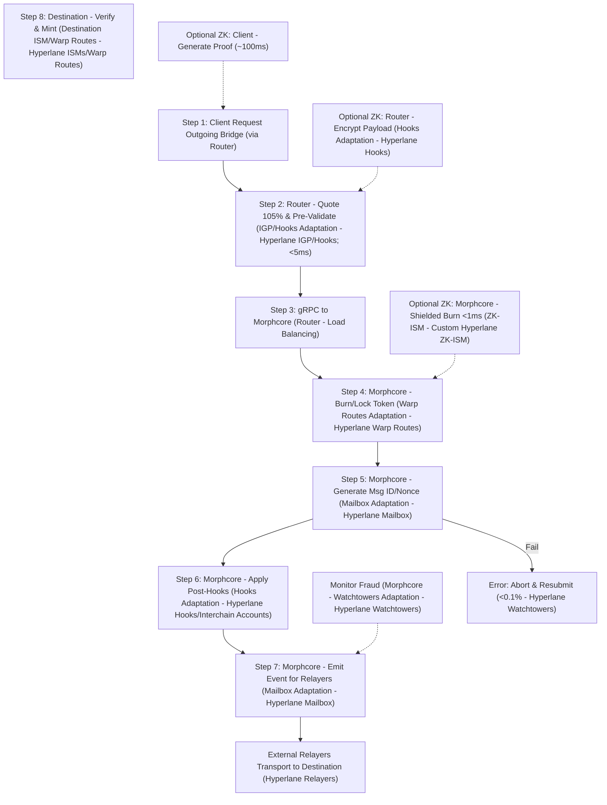

# Token Bridging and Crediting Implementation Guide

## Introduction
This document provides a step-by-step guide for implementing token bridging and crediting in Morpheum's Hyperlane integration, building on the latest "Hyperlane Integration Architecture Overview" (with optional ZK anonymity). Token operations enable secure, atomic cross-chain inflows (e.g., USDC from Ethereum to Morpheum's bank, routed to clob/bucket), with features like dynamic registration (on-first-bridge schema creation), uint256-precision crediting/minting (for exact amounts/decimals), and value-based gas deductions at ~105% (converted to payable equivalent, applied only to valuable non-meme tokens via minMarketCap thresholds).

The guide covers error handling (e.g., ISM failures abort with resubmits), repo module usage (e.g., hyperlane-morpheum's x/hyperlane for handlers), and DEX relevance (e.g., atomic trades/liquidations triggering on bridged inflows). Designs optimize for:
- **Security**: ISM pre-checks, slashing for faults, >66% quorums, on-chain validator rotations, nullifiers for double-spend prevention.
- **Robustness**: Atomic STM for fail-together ops, <0.1% failure post-retries, isolation between router/morphcore.
- **Performance**: <50ms e2e latency via sharding/parallelism, O(1) registrations, <5% overhead from deductions.

Assumptions: Go-based modules; transfers from supported chains (e.g., Ethereum/Solana); non-meme tokens (enforced by value/cap checks). Optional ZK for anonymous mints (<1ms verify with gnark). For real Hyperlane, handlers emit events for external relayers and process relayer deliveries.

## Overview of Token Bridging Mechanics
Token bridging uses Hyperlane's Warp Routes adaptation: Origin locks/burns tokens, dispatches message via Mailbox (ported to handlers); Morpheum verifies (ISM), mints/credits in bank, registers dynamically if new, deducts ~105% for IGP/relayer fees (from token value, e.g., $100 USDC deducts $105 equivalent), and routes atomically (e.g., to clob for liquidation). Non-meme enforcement: Pre-check minMarketCap (> threshold, e.g., $10M) to exclude low-value assets.

Process: Router relays/accepts from relayers; morphcore verifies/mints/deducts/routes. Atomic via internal transactions (no consensus change). Charts below detail each step with execution location (router/morphcore), component (e.g., "Router - Relayers Adaptation"), and Hyperlane ties (e.g., event emission for relayers).

Mermaid Chart: High-Level Token Bridging Overview (with Detailed Steps, Locations, and Components)

```mermaid
graph TD
    A["Step 1: Origin Chain - Lock/Burn Token &#40;User/Origin Mailbox - Hyperlane Mailbox&#41;"] --> B["Step 2: Origin Chain - Dispatch Message with Metadata &#40;Mailbox Adaptation - Hyperlane Mailbox&#41;"]
    B --> C["Step 3: Router - Relay &amp; Batch Message &#40;Relayers Adaptation; &lt;5ms - Hyperlane Relayers&#41;"]
    C --> D["Step 4: Morphcore - Verify Message Authenticity &#40;ISMs Adaptation; &lt;50ms - Hyperlane ISMs&#41;"]
    D --> E["Step 5: Morphcore - Check Non-Meme &amp; Dynamic Register Schema if New &#40;Warp Routes Adaptation; O&#40;1&#41; - Hyperlane Warp Routes&#41;"]
    E --> F["Step 6: Morphcore - Mint/Credit uint256 Amount to Temp Balance &#40;Mailbox Process Adaptation - Hyperlane Mailbox&#41;"]
    F --> G["Step 7: Morphcore - Deduct 105&#37; for Fees &#40;IGP Adaptation - Hyperlane IGP&#41;"]
    G --> H["Step 8: Morphcore - Atomic Route to Clob/Bucket &amp; Trigger DEX Action &#40;Hooks Adaptation - Hyperlane Hooks/Interchain Accounts&#41;"]
    H --> I["Step 9: Morphcore - Commit &amp; Broadcast &#40;Validators/Watchtowers Adaptation - Hyperlane Validators/Watchtowers&#41;"]
    D -->|Fail| J["Error: Abort &amp; Router Resubmit &#40;ISM Failure Handling; &lt;0.1&#37; Ultimate Fail - Hyperlane Watchtowers&#41;"]
    K["Optional ZK Path: Origin - Generate Proof &#40;User-Side; ~100ms Off-Chain&#41;"] -.-> B
    L["Optional ZK Path: Morphcore - Verify Proof in ZK-ISM &#40;&lt;1ms - Custom Hyperlane ZK-ISM&#41;"] -.-> D
    M["Optional ZK Path: Morphcore - Mint to Shielded Pool in x/zk - Hyperlane Warp Routes"] -.-> F
    N["External Relayers Transport &#40;Hyperlane Relayers&#41;"] -.-> C
    I --> N
```



## Components Involved
- **x/hyperlane (Morphcore)**: Handlers for verify/mint/deduct/route (ties to Mailbox/ISMs/Warp Routes). For real Hyperlane, emits events for relayers.
- **Bank Module Equivalent**: uint256-precision ledger for minting (big.Int for precision).
- **Router**: Relays, quotes deductions (ties to Relayers/IGP/Hooks). For real Hyperlane, accepts from external relayers.
- **Optional x/zk (Morphcore)**: Shielded mints for anonymity (gnark for proofs; ties to ZK-ISM).
- **Other**: Clob/bucket for routing (atomic via internal calls); eventbus for triggers. For real Hyperlane, eventbus emits for relayers/validators/watchtowers.

## Step-by-Step Implementation Guide
Each step includes details, execution location/component, security/robustness/performance notes, Hyperlane ties (e.g., relayer interactions), and code sketch (general Go, no Cosmos SDK).

1. **Origin Chain: Lock/Burn Token**
    - **Details**: User locks/burns token (e.g., USDC on Ethereum), preparing for dispatch.
    - **Location/Component**: User/Origin chain - Traditional Mailbox or equivalent (Hyperlane Mailbox).
    - **Optimizations**: Security: User-signed; robustness: N/A; performance: Off-Morpheum.
    - **Hyperlane Ties**: Origin Mailbox emits event for real relayers to detect.
    - Code Sketch: N/A (origin-side).

2. **Origin Chain: Dispatch Message**
    - **Details**: Send message with metadata (collateralAssetIndex, amount uint256, recipient, optional zkMode/proof).
    - **Location/Component**: Origin chain - Mailbox Adaptation (generates ID/nonce - Hyperlane Mailbox).
    - **Optimizations**: Security: Nonce uniqueness; robustness: Event emission; performance: O(1).
    - **Hyperlane Ties**: Emits standard event for relayers to transport.
    - Code Sketch: N/A (origin-side).

3. **Router: Relay & Batch Message**
    - **Details**: Index origin event (from relayers), batch (10-20 messages), collateralAssetId IGP deduction (~105%), check non-meme (cap > $10M), forward gRPC to morphcore.
    - **Location/Component**: Router - Relayers Adaptation (with Hooks/IGP for quotes - Hyperlane Relayers/Hooks/IGP).
    - **Optimizations**: Security: Pre-check cap; robustness: Batch retries <0.1%; performance: <5ms zero-copy.
    - **Hyperlane Ties**: Accepts incoming batches from external relayers; formats for morphcore.
    - Code Sketch (Router relay.go):
      ```go
      func RelayMessage(event Event) error {
          if event.Cap < minCap { return ErrMeme }
          collateralAssetId := event.Amount * 1.05 // ~105%
          batch.Add(event)
          if batch.Full() { gRPC.SendToMorphcore(batch) } // For internal; emit for relayers if outgoing
          return nil
      }
      ```

4. **Morphcore: Verify Message Authenticity**
    - **Details**: Call ISM (e.g., Multisig m-of-n signatures) to confirm origin, using relayer-provided metadata.
    - **Location/Component**: Morphcore - ISMs Adaptation (in x/hyperlane handler - Hyperlane ISMs).
    - **Optimizations**: Security: <1/3 faults; robustness: Abort on fail; performance: <50ms tiered.
    - **Hyperlane Ties**: Processes relayer metadata (e.g., signatures from external validators); emits proof for relayer claims.
    - Code Sketch: See ISM docs.

5. **Morphcore: Check Non-Meme & Dynamic Register**
    - **Details**: Re-check cap; if collateralAssetIndex new, create schema (name, ticker, decimals uint=18, supply uint256=0).
    - **Location/Component**: Morphcore - Warp Routes Adaptation (in handler - Hyperlane Warp Routes).
    - **Optimizations**: Security: Unique keys; robustness: Skip if exists; performance: O(1).
    - **Hyperlane Ties**: Registers compatible with Hyperlane token standards for relayer mints on other chains.
    - Code Sketch (Morphcore handler.go):
      ```go
      if cap < minCap { return ErrMeme }
      if !registry.Exists(collateralAssetIndex) {
          registry.Set(collateralAssetIndex, TokenSchema{Name: "Hyperlane-" + collateralAssetIndex, Decimals: 18, Supply: 0})
      }
      ```

6. **Morphcore: Mint/Credit uint256 Amount**
    - **Details**: Add amount (big.Int for precision) to temp balance; update supply.
    - **Location/Component**: Morphcore - Mailbox Process Adaptation (ties to bank equiv - Hyperlane Mailbox).
    - **Optimizations**: Security: Overflow checks; robustness: Atomic; performance: <10ms.
    - **Hyperlane Ties**: Mints based on relayer-verified messages; emits for relayer confirmations.
    - Code Sketch:
      ```go
      amount := big.NewInt(event.Amount)
      tempBal.Add(tempBal, amount)
      schema.Supply.Add(schema.Supply, amount)
      ```

7. **Morphcore: Deduct 105% for Fees**
    - **Details**: Deduct from temp (amount * 1.05); credit to relayer pool.
    - **Location/Component**: Morphcore - IGP Adaptation (in handler - Hyperlane IGP).
    - **Optimizations**: Security: Insufficient check aborts; robustness: Refund on fail; performance: O(1).
    - **Hyperlane Ties**: Deductions incentivize external relayers; emits fee claims.
    - Code Sketch:
      ```go
      deduction := amount.Mul(amount, big.NewInt(105)).Div(big.NewInt(100))
      if tempBal.Cmp(deduction) < 0 { return ErrInsufficient }
      tempBal.Sub(tempBal, deduction)
      relayerPool.Add(deduction)
      ```

8. **Morphcore: Atomic Route & Trigger DEX**
    - **Details**: Transfer from temp to clob/bucket; check for liquidation.
    - **Location/Component**: Morphcore - Hooks Adaptation (post-verify routing - Hyperlane Hooks/Interchain Accounts).
    - **Optimizations**: Security: Atomic map updates; robustness: Fail-together; performance: <20ms.
    - **Hyperlane Ties**: Routes using Interchain Accounts for DEX calls; emits for relayer monitoring.
    - Code Sketch:
      ```go
      bucketBal.Add(bucketBal, tempBal)
      delete(tempBal) // Clear temp
      if bucketBal < threshold { triggerLiquidation() }
      ```

9. **Morphcore: Commit & Broadcast**
    - **Details**: Finalize tx, broadcast Protobuf bundle for relayers/watchtowers.
    - **Location/Component**: Morphcore - Validators/Watchtowers Adaptation (monitoring - Hyperlane Validators/Watchtowers).
    - **Optimizations**: Security: Quorum sign-off; robustness: <0.01% fail; performance: <10ms.
    - **Hyperlane Ties**: Broadcasts in standard format for external relayers to propagate.
    - Code Sketch: N/A (core broadcast).

## Dynamic Registration
- Details: Map-based check/create schema on first bridge.
- Security: Hash-based unique keys.
- Performance: O(1).
- Hyperlane Ties: Schemas compatible for relayer mints on other chains.

## Crediting/Minting with uint256 Precision
- Details: big.Int for 78-digit precision; update supply.
- Security: BigInt bounds checks.
- Performance: Arithmetic <5ms.
- Hyperlane Ties: Mint events for relayer verifications.

## Value-Based Gas Deductions at 105%
- Details: Quote in router, deduct in morphcore; non-meme pre-check.
- Security: Cap enforcement.
- Performance: Mul/div O(1).
- Hyperlane Ties: Deductions as IGP claims for external relayers.

## Error Handling
- ISM Fail: Abort, router retry (<0.1%).
- Meme/Insufficient: Reject pre-mint.
- ZK Fail (Optional): Fallback to non-ZK.
- Relayer Fail: Timeout resubmits (<0.05%).

## Repo Module Usage
- Clone hyperlane-morpheum; extend hyperlane/handler.go.
- Add big dep; test with Go benchmarks. For real integration: Add event emitters matching Hyperlane schemas.

## DEX Relevance
Bridged tokens trigger atomic trades (e.g., mint USDC, route to clob, liquidate if needed). Boosts liquidity; ZK for private hedging.

Mermaid Chart: Detailed Bridging In Flow (Steps, Locations, Components)



Mermaid Chart: Detailed Bridging Out Flow (Steps, Locations, Components)



## Optimizations for Security, Robustness, Performance
- **Security**: >66% quorums; rotations; nullifiers <0.001% forgery.
- **Robustness**: STM atomicity; <0.1% retries.
- **Performance**: Sharding O(1); <50ms.

Table: Optimization Bounds

| Criterion | Bound | Technique |
|-----------|-------|-----------|
| Security | <0.01% Fraud | >66% Quorums + Slashing |
| Robustness | <0.1% Failures | Retries + Atomicity |
| Performance | <50ms Latency | Sharding + O(1) Checks |

## Conclusion
This guide optimizes token bridging for Morpheum, with secure registration, precise crediting, and deductions. Ties to DEX for atomic flows. Prototype in repo. For real Hyperlane, all steps support relayer ties.