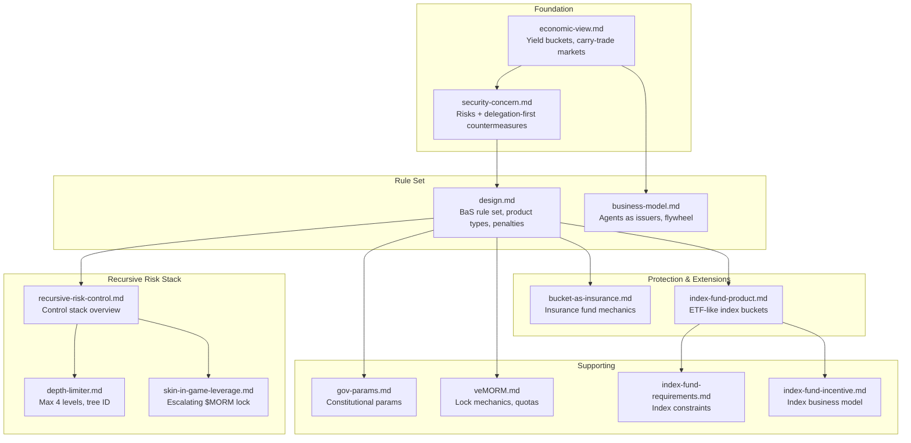

# Bucket-as-Service (BaS) Documentation

Agent-deployed, position-backed, asset-backed, and mix-backed structural products on Morpheum's secondary and P2P markets. Built on MWVM v2.5 (safe wrappers, KYA/VC delegation) and native bucket infrastructure.

---

## Overview

Bucket-as-Service enables agents (AI or human) to:

- **Deploy** bucket products via `deploy_bucket_product` wrapper with KYA/VC claims
- **List** on secondary/P2P markets with immutable health snapshots
- **Trade** at cash, premium, or discount with atomic escrow settlement
- **Drive** $MORM value through fees, burns, staking, and treasury buybacks

Product types: **Position-Backed** (perp portfolios), **Asset-Backed** (stable yield), **Mix-Backed** (hybrid).

---

## Document Index

| Document | Description |
|----------|-------------|
| [Design Decision Section](#design-decision-section) | **Ideas & relationships** — Core philosophy, security-by-design, recursive risk stack, supporting docs, security from new business ideas |
| [design.md](./design.md) | **BaS rule set** — Creation, listing, trading, settlement, exploit countermeasures; Step 9 amendable |
| [business-model.md](./business-model.md) | **Strategic blueprint** — Agents as issuers, revenue streams, $MORM flywheel, DeFi comparison |
| [security-concern.md](./security-concern.md) | **Security analysis** — Severity-ranked concerns, countermeasures, delegation-first policy |
| [economic-view.md](./economic-view.md) | **Yield & carry** — BaaS as yield buckets, recursive layers, systemic risk controls |
| [bucket-as-insurance.md](./bucket-as-insurance.md) | Insurance fund mechanics and victim compensation |
| [gov-params.md](./gov-params.md) | Governance parameters and constitutional tuning |
| [veMORM.md](./veMORM.md) | veMORM integration with BaS quotas and incentives |
| [skin-in-game-leverage.md](./skin-in-game-leverage.md) | Skin-in-the-game leverage and issuer alignment |
| [depth-limiter.md](./depth-limiter.md) | Recursion depth limits and risk controls |
| [recursive-risk-control.md](./recursive-risk-control.md) | Recursive bucket risk management |
| [index-fund-product.md](./index-fund-product.md) | **Index funds** — Single vs collective buckets, ETF-like structures |
| [index-fund-requirements.md](./index-fund-requirements.md) | Index fund requirements and constraints |
| [index-fund-incentive.md](./index-fund-incentive.md) | Index fund incentives and issuer economics |

---

## Quick Reference

| Topic | Start Here |
|-------|------------|
| Design decisions & idea evolution | [Design Decision Section](#design-decision-section) |
| BaS rule set & product types | [design.md](./design.md) |
| Business model & flywheel | [business-model.md](./business-model.md) |
| Security concerns & mitigations | [security-concern.md](./security-concern.md) |
| Index funds on buckets | [index-fund-product.md](./index-fund-product.md) |
| MWVM v2.6 BaS policy | [../proposals/draft11-v2.6.md](../proposals/draft11-v2.6.md) §5 |

---

## Design Decision Section

This section explains the core ideas behind Bucket-as-Service and how they evolved and relate to each other.

### 1. Core Philosophy: Host is God, WASM is Pure Compute

BaS is built on MWVM’s strict boundary: **native protocol primitives (bucket/perp core, bank transfers, order placement) are never exposed raw**. Access is only through safe Host API wrappers that enforce KYA/VC delegation, business-logic scoping, and resource quotas. This keeps BaS inside the same security model as the rest of MWVM.

### 2. Why Bucket-as-Service?

The idea starts from **economic-view.md**: buckets as “yield buckets” that deploy capital across strategies and naturally spawn carry-trade markets. Users borrow against bucket collateral and redeploy into higher-yield buckets → buckets become tradable collateral instruments. Instead of banning recursion (which would limit growth), we **control and monetize it** with $MORM.

### 3. Security-by-Design: Delegation-First

**security-concern.md** ranks risks (fraud, contagion, non-atomic sales, spam) and defines the countermeasure stack:

- **Delegation-first**: All bucket creation/sale flows through KYA/VC with scoped claims.
- **Atomic escrow**: `buy_bucket` locks payment, verifies health, transfers bucket, and releases payment in one atomic step — no reentrancy window.
- **Immutable health snapshots**: Every listing and purchase records margin, positions, and risk ratio at that moment.
- **Economic penalties**: Misrepresentation → slashing + reputation ban + insurance payout. Spam → deposit burn + quota reduction.

These choices turn permissionless issuance into a safe marketplace: bad actors are penalized, good actors earn via reputation and fees.

### 4. Recursive Risk: From Danger to $MORM Utility

**recursive-risk-control.md** treats recursion as inevitable and turns it into a controlled, value-accruing system:

| Idea | Document | Role |
|------|----------|------|
| **Depth Limiter** | [depth-limiter.md](./depth-limiter.md) | Hard cap at 4 nesting levels per bucket family. Deeper strategies require more $MORM skin-in-the-game. |
| **Escalating Skin-in-the-Game** | [skin-in-game-leverage.md](./skin-in-game-leverage.md) | Level 0: 1.5% locked $MORM; each level adds ~2%. All locked $MORM is first-loss capital for that tree. |
| **Effective Leverage Cap** | [recursive-risk-control.md](./recursive-risk-control.md) | Global family cap ~3.5× total recursive multiplier. Prevents hidden 10×+ leverage. |
| **Insurance Fund** | [bucket-as-insurance.md](./bucket-as-insurance.md) | 30% of fees fund victim compensation; remainder for $MORM buybacks. |

Together: **deeper recursion → more $MORM locked → higher fees → more buybacks**. Recursion becomes a $MORM demand engine instead of a systemic risk.

### 5. Economic Flywheel and $MORM Appreciation

**business-model.md** and **design.md** define the flywheel:

1. Agents create products → more buckets on secondary market → more trading.
2. Trading → $MORM fees (creation, listing, resale) → burn + treasury + insurance.
3. Fees & staking → $MORM demand → price appreciation.
4. Appreciation → more agents/stakers → more products → repeat.

$MORM is the only risk-buffer token: staking unlocks quotas, verified badges, and fee discounts. The insurance fund surplus drives buybacks. This aligns protocol growth with token value.

### 6. Evolution of Ideas (How Documents Relate)

- **economic-view** → Why buckets as yield/carry primitives; why controlled recursion instead of banning it.
- **security-concern** → What can go wrong and how delegation + atomicity + snapshots address it.
- **design** + **business-model** → Concrete rules, product types, and flywheel.
- **recursive-risk-control** → How recursion is bounded and monetized.
- **depth-limiter** + **skin-in-game-leverage** → Specific mechanisms for depth and $MORM lock.
- **bucket-as-insurance** → Buyer protection and surplus handling.
- **index-fund-product** → Extension to ETF-like collective buckets.
- **gov-params** + **veMORM** → Constitutional and economic infrastructure for all BaS products.
- **index-fund-requirements** + **index-fund-incentive** → Constraints and economics for the index fund extension.

### 7. Governance and Tunability

All parameters (quotas, fees, insurance split, depth limits, skin-in-game %) are **constitutional** (Step 9 amendable). veMORM holders can adjust thresholds, throttle new Level-3/4 creations, or pause specific bucket families. This keeps the system adaptable without changing core design.

### 8. Supporting Documents Not in the Core Flow

Several documents support the main idea evolution but sit outside the primary flow. They address **operational**, **economic**, and **extension** concerns:

| Document | Role | How It Relates |
|----------|------|----------------|
| [gov-params.md](./gov-params.md) | Constitutional parameters for BaS launch | Defines all tunable values (deposits, fees, quotas, safe mode). Enables governance to respond to new risks without code changes. |
| [veMORM.md](./veMORM.md) | Vote-escrowed locking mechanics | Powers skin-in-the-game (veMORM balance = lock proof), governance voting, and quota boosts. Long-term alignment layer that reduces circulating supply. |
| [index-fund-requirements.md](./index-fund-requirements.md) | Technical + governance checklist for index funds | Constrains index fund design: min child buckets, max weight per child, redemption delay. Prevents concentration and flash-redemption attacks. |
| [index-fund-incentive.md](./index-fund-incentive.md) | Business model for index funds | Revenue streams, participant types, phased rollout. Ensures index funds are economically sustainable and recognizable as ETF-like products. |

These documents are **dependencies** for safe rollout: gov-params and veMORM underpin the rule set; index-fund-* define how BaS extends to a new product category without weakening security.

### 9. Security from New Business Ideas: Unintended Consequences

Opening new business ideas (BaS, index funds, recursive buckets) introduces **new attack surfaces and unintended results**. The design addresses this in layers:

#### New Capabilities → New Risks

| New Capability | Potential Unintended Result | Mitigation |
|----------------|-----------------------------|------------|
| **Agent-issued buckets** | Spam, fraud, misrepresentation, rug pulls | Creation deposit, quotas, VC scoping, immutable health snapshots, insurance fund, slashing |
| **Secondary P2P market** | Non-atomic sales, reentrancy, MEV | Atomic escrow, minimum listing duration, reputation gating |
| **Recursive buckets** | Hidden leverage, cascade liquidations | Depth limiter (max 4), escalating skin-in-the-game, effective leverage cap, tree isolation |
| **Index funds** | NAV manipulation, concentration risk, flash redemption | Min child buckets, max weight per child, redemption delay, multi-oracle NAV |
| **veMORM / governance** | Governance capture, parameter gaming | Supermajority (66.67%), timelock, decay-based voting power |
| **Permissionless issuance** | Regulatory exposure, bad-actor products | Optional KYC-gated verified issuers, on-chain transparency, insurance for victims |

#### Design Principle: Fail-Safe by Default

- **Safe Mode** (`bas_safe_mode_enabled`): Emergency pause for creation and sales. Governance can activate without code deploy.
- **Constitutional parameters**: All new product types (e.g., index funds) get dedicated params (`index_fund_*`) so governance can tune or disable them.
- **Insurance fund**: Covers proven misrepresentation; surplus used for buybacks. Limits blast radius of new product failures.
- **First-loss $MORM buffer**: Recursive trees absorb losses in locked $MORM before user capital. New recursive products inherit this.

#### When Adding New Business Ideas

Before extending BaS (e.g., tranches, derivatives, cross-chain buckets):

1. **Identify new attack surface** — What can go wrong that does not exist today?
2. **Reuse existing controls** — VC scoping, atomicity, snapshots, quotas.
3. **Add product-specific params** — Constitutional, Step 9 amendable.
4. **Define insurance/compensation** — How does the insurance fund or slashing apply?
5. **Document in security-concern style** — Severity-ranked concerns + countermeasures.

This keeps new business ideas from introducing unintended systemic risk while preserving permissionless innovation.
