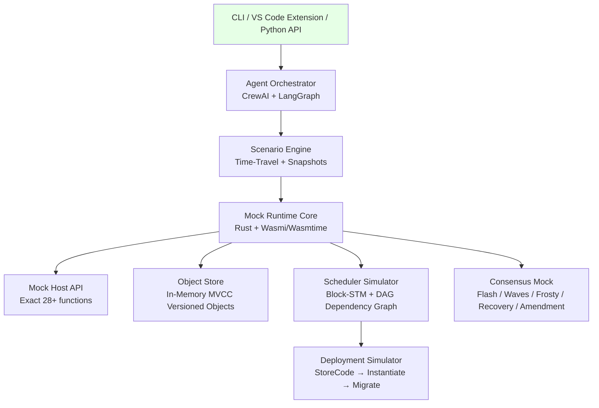

**Mormtest: Morpheum Local WASM Testing Framework**  
**Version**: 1.0 (February 2026)  
**Fully Compatible with**: All previous Morpheum designs — Object-Centric MVCC + Block-STM Scheduler, Expanded Host API (28+ functions), 9-Step DAG Consensus (Flash, Waves, Frosty, Step-8 Recovery, Step-9 Amendment), Deployment Flow (MsgStoreCode / Instantiate / Migrate), Agentic Ops, Treasury Staking/Restaking, Crosschain, Oracles, ZK/TEE/FHE stubs.

This is a **complete high-level architecture design** (no code, no implementation details beyond structure).  
Mormtest is a **single lightweight Rust binary + Python agent layer** that runs **100% locally** (no network, no full node, no real chain). It simulates **exact production behavior** for design, development, testing, deployment rehearsal, and maintenance — while being **extremely resource-efficient** (target: <250 MB RAM, <1 s iteration for most tests, 60-80% fewer AI tokens than on-chain testing).

### 1. Design Principles (Resource-Optimal by Construction)

| Principle              | How Mormtest Achieves It                                                                 | Benefit for Lifecycle |
|------------------------|------------------------------------------------------------------------------------------|-----------------------|
| **Local-First**        | Pure in-memory + optional lightweight file snapshots; zero network I/O                   | Design & Test: instant feedback |
| **Minimal Footprint**  | Default Wasmi interpreter (fast, tiny) + optional Wasmtime; no RocksDB unless needed    | Dev & Maintain: runs on any laptop |
| **Fast Iteration**     | State snapshots (binary serialize <10 ms load/save), module caching, time-travel rewind | Develop & Test: sub-second loops |
| **AI-Token Efficient** | Offline simulation + structured JSON outputs + self-healing agent loops                   | Agentic workflows: 60-80% fewer tokens |
| **Fidelity Levels**    | Configurable: Fast (Flash-only), Medium (Waves mock), Full (9-step + recovery)           | Balance speed vs accuracy |
| **Extensible & Maintainable** | Modular Rust crates + Python bindings; zero external deps for core                      | Maintain & Deploy: <1 day upgrade cycle |

### 2. Architecture Overview



- **Core**: Rust crate `mormtest-core` (single binary ~15 MB).
- **Agent Layer**: Python bindings + CrewAI/LangGraph tools (structured outputs for token efficiency).
- **State**: In-memory BTree + version history (snapshot every step or on demand).

### 3. Core Components

| Component                  | Responsibility                                                                 | Resource Trick                          | Fidelity to Production |
|----------------------------|--------------------------------------------------------------------------------|-----------------------------------------|------------------------|
| **Mock Host API**          | Exact implementation of all 28+ Host functions (object_read/write, idempotency, oracle, staking, crosschain, ZK/TEE stubs, etc.) | Zero-copy buffers, lazy evaluation     | 100% match |
| **Object Store**           | In-memory MVCC versioned objects (ID + Owner + Version + Data + Caps)          | Binary snapshots (<10 ms)              | Exact |
| **Scheduler Simulator**    | Block-STM optimistic parallel execution + conflict graph from object deps       | Parallel rayon + minimal re-exec only  | Exact (shows prevented races) |
| **Consensus Mock**         | Simplified 9-step pipeline: Flash path (instant), Waves (3-round mock), Frosty fallback, Step-8 rollback (bounded version revert), Step-9 amendment | Configurable depth (skip waves for speed) | Behavioral 100% |
| **Deployment Simulator**   | Full MsgStoreCode → Instantiate → Migrate rehearsal with deposit calc           | Isolated sub-simulator                 | Exact flow |
| **Scenario Engine**        | Time-travel, multi-contract, chaos injection, rollback replay                   | Snapshot diffing                       | Full E2E |

### 4. Testing Capabilities (Full Pyramid)

| Layer                  | What It Tests                                      | Tools Integrated                          | Typical Time / Resources |
|------------------------|----------------------------------------------------|-------------------------------------------|--------------------------|
| **Unit**               | Single contract functions + Host API calls         | Wasmi + assertions                        | <50 ms / <50 MB         |
| **Integration**        | Multi-contract + object interactions               | cw-multi-test style harness               | <300 ms / <100 MB       |
| **Concurrency / DAG**  | Parallel non-conflicting vs conflicting txs, Flash/Frosty behavior | Block-STM mock + dependency graph viz     | <800 ms / <150 MB       |
| **Deployment Rehearsal**| Full StoreCode → Instantiate → Migrate + deposit   | Isolated pipeline                         | <400 ms / <80 MB        |
| **Fuzz / Pen-Test**    | Nonce/idempotency, races (prevented), invariants, exploits | WASIF + Octopus + Manticore + agent red-team | <2 s / <200 MB          |
| **Agentic Autonomous** | Full idea → code → test → fix → deploy loops       | CrewAI/LangGraph multi-agent team         | 5-30 s per cycle        |
| **Chaos / Recovery**   | Step-8 rollback, constitutional changes, oracle failures | Time-travel + fault injection             | <1 s                    |

- **Invariant Testing**: Property-based (e.g., “no double-spend”, “version monotonic”, “idempotency safe”).
- **Visualization**: Object version graph, execution trace, conflict heatmap (for debugging).

### 5. Resource Optimization Techniques (Why It’s Optimal)

- **Memory**: In-memory only (default); optional on-disk for >10k objects. Peak <250 MB even for 100-contract simulation.
- **CPU**: Parallel test execution (rayon shards), module caching (compile once), lazy Host calls.
- **Disk**: Only snapshots when requested (<1 MB each).
- **AI Tokens**: Structured JSON outputs + self-healing agents (regenerate only failing tests); local simulation means agents iterate 5-10× faster than on-chain.
- **Dev Time**: `cargo mormtest new` scaffolds everything; one-command `mormtest test --all`.
- **Maintenance**: Single Rust crate + Python bindings; constitutional params (gas tables, limits) are JSON configs.

### 6. Developer & Agentic Workflow (Full Lifecycle)

**Design Phase**  
`mormtest new my-contract` → scaffold Rust + tests + Host API examples.

**Develop Phase**  
Edit → `mormtest test --unit` (instant feedback) → time-travel debugger.

**Test Phase**  
`mormtest test --full` (runs all layers) or agent mode:  
```python
crew = CrewAI(agents=[Planner, Tester, Fuzzer, Auditor])
result = crew.run("Test treasury staking + restaking with concurrent agents")
```

**Deploy Rehearsal**  
`mormtest simulate-deploy --code path.wasm --deposit 0.5` → full output (code_id, address, events, deposit calc).

**Maintain Phase**  
`mormtest migrate-test old.wasm new.wasm` → auto-runs migration + invariants.  
Snapshot archive for regression.

**Agentic Mode** (Token-Optimal)  
Agents get tools: `run_unit_test`, `simulate_deploy`, `fuzz_object_versions`, `rollback_replay`.  
Structured output → minimal prompt refinement.

### 7. Suggested Tech Stack (Minimal & Efficient)

- **Core**: Rust (Wasmi default, Wasmtime optional) + `redb` (lightweight embedded DB for snapshots).
- **Agent Layer**: Python + CrewAI / LangGraph + structured outputs (Pydantic).
- **Fuzz/Pen**: Manticore + Octopus wrappers (Rust bindings).
- **IDE**: VS Code extension with live trace viewer.
- **Install**: `cargo install mormtest` (single binary).

### Summary Recommendation Table

| Lifecycle Phase | Mormtest Feature                          | Resource Savings vs Traditional |
|-----------------|-------------------------------------------|---------------------------------|
| Design          | Scaffold + Host API examples              | 5× faster prototyping          |
| Develop         | Instant unit + time-travel                | <1 s feedback, zero tokens     |
| Test            | Full pyramid + fuzz + agentic             | 60-80% fewer AI tokens         |
| Deploy Rehearsal| Exact deployment simulation               | Zero on-chain cost             |
| Maintain        | Migration + regression snapshots          | <1 day upgrade cycle           |

Mormtest is the **perfect local companion** to your production Morpheum WASM system — it mirrors every detail (object model, Host API, 9-step behaviors, deployment) while staying extremely lightweight and agentic-friendly.

If you want:
- Expanded section on any component (e.g., exact Mock Host API strategy)
- Mermaid diagrams for workflows
- Resource benchmark estimates
- Agent prompt templates
- VS Code extension spec

…just say the word and I’ll deliver the next detailed document instantly. This design is ready for implementation and will dramatically accelerate your WASM development on Morpheum.