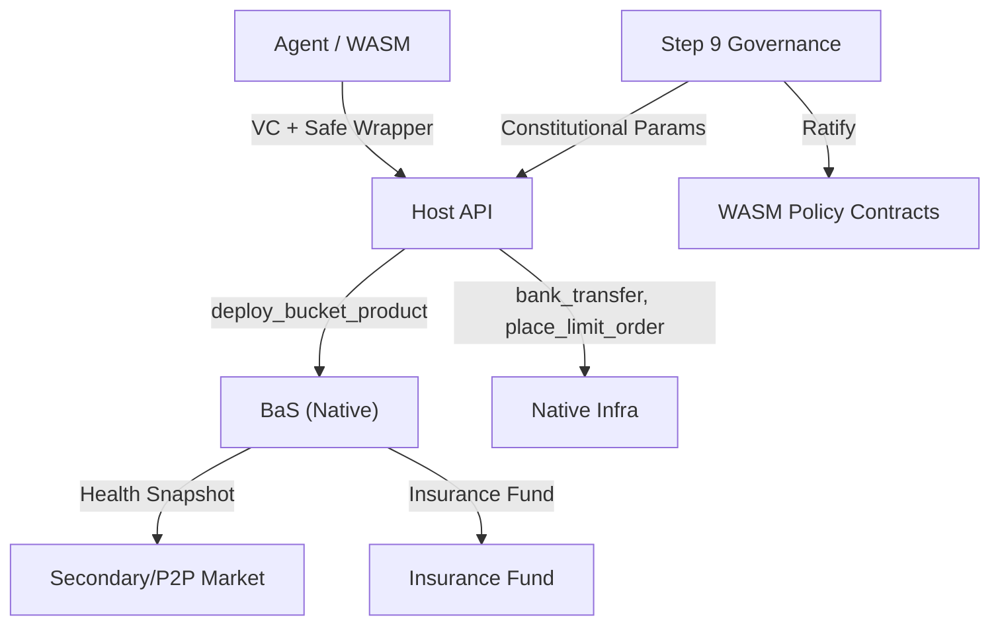

# MWVM System — Architecture

**Version**: 1.0  
**Date**: 05 March 2026  
**Status**: Design

## High-Level Architecture

```
┌─────────────────────────────────────────────────────────────────────────────┐
│                           MWVM ECOSYSTEM                                      │
├─────────────────────────────────────────────────────────────────────────────┤
│                                                                              │
│  ┌──────────────────────┐     KYA/VC + Quotas                               │
│  │  AGENT / WASM         │◄────────────────────────────────────────────────│
│  │  (Transient Memory)   │     Safe Wrappers only                             │
│  ├──────────────────────┤     ┌──────────────────────┐                       │
│  │ - No raw native      │     │  HOST API            │                       │
│  │ - VC-scoped calls    │     │  (Safe Wrappers)     │                       │
│  └──────────┬───────────┘     ├──────────────────────┤                       │
│             │                 │ - deploy_bucket_product│                      │
│             │  Wrapper calls  │ - list_bucket_for_sale │                      │
│             │  (O(1) cached)  │ - buy_bucket          │                      │
│             │                 │ - issue_token         │                      │
│             │                 │ - bank_transfer       │                      │
│             │                 │ - place_limit_order   │                      │
│             │                 └──────────┬───────────┘                       │
│             │                            │                                    │
│             │                 ┌──────────▼───────────┐                       │
│             │                 │  NATIVE INFRA        │     Mormcore           │
│             │                 │  (Never Exposed Raw) │──────────────────────►│
│             │                 ├──────────────────────┤  CLAMM, CLOB,         │
│             │                 │ - Bucket/Perp core   │   Buckets, Staking,   │
│             │                 │ - CLAMM/ReClamm      │   Bank, Order placement│
│             │                 │ - Staking, Multisig   │                       │
│             │                 └──────────────────────┘                       │
│                                                                              │
└─────────────────────────────────────────────────────────────────────────────┘
```

## Cross-Module Data Flow



### Safe Wrapper Flow

1. Agent/WASM calls safe wrapper (e.g., `deploy_bucket_product`)
2. Host API checks `check_delegation_scope` + `vc_verify` (O(1) cached)
3. Quota check (constitutional params)
4. Native operation executed atomically
5. Immutable action/delegation log emitted
6. Fail closed on quota exceed or VC mismatch

## Component Dependencies

### MWVM Depends On

| Module | Provides | MWVM Consumes |
|--------|----------|---------------|
| Mormcore | Native bucket, CLAMM, CLOB, staking, bank | Safe wrapper targets |
| KYA/VC | DID validation, VC verification | Delegation checks |
| Governance | Constitutional params | read_constitution_param |

### MWVM Provides

| Consumer | Receives |
|----------|----------|
| Agents | Safe wrappers, BaS deploy/list/buy |
| Sub-DAOs | WASM policy deployment (with ratification) |
| Indexer | BaS events, listing metadata |

## DAG-Native Optimizations

| Feature | How It Works | Benefit |
|---------|--------------|---------|
| Causal Snapshot Materialization | host_get_dag_context() + versioned snapshot | Deterministic execution on partial-order DAG |
| Stable Contract Address | Instance address never changes; only code_ref updates | Seamless upgrades + delegation |
| Agent Delegation Routing | DID hash → shard routing + reputation cache | Low-latency, reputation-aware calls |

## Safe Native Infrastructure Wrappers (v2.5)

| Wrapper | VC Claim Required | Resource Quota |
|---------|-------------------|----------------|
| issue_token | can_issue_token(max_supply, expiry) | 1 new token/epoch per DID |
| bank_transfer | can_transfer(to, max_amount, token, expiry) | 20 transfers/sec, $100k daily |
| bucket_to_bucket_transfer | can_transfer_bucket(from, to, max_amount) | Same as bank_transfer |
| bank_to_bucket_transfer | can_fund_bucket(bucket_id, max_amount) | Same + IM check |
| bucket_to_bank_transfer | can_withdraw_from_bucket(bucket_id, max_amount) | Cannot drop below IM |
| place_limit_order | can_place_order(market, max_size, max_freq, expiry) | 50 orders/sec, daily notional cap |
| cancel_limit_order | can_cancel_order(market, max_count) | 100 cancels/sec |
| multi_send | can_multi_send(max_recipients, max_total_value) | Max 50 recipients/call |
| deploy_bucket_product | can_deploy_bucket(type, max_value, expiry) | 5 products/DID/epoch |
| list_bucket_for_sale | can_sell_bucket(bucket_id, min_price, max_premium) | Listing fee 5 $MORM |
| buy_bucket | can_buy_bucket(listing_id, max_price) | Atomic escrow |

## Performance Targets

| Operation | Target |
|-----------|--------|
| Wrapper + BaS checks | <0.4% overhead (O(1) cached) |
| VC validation | O(1) cached |
| DAG read (depth calc) | <1 ms |

## Related Documents

- [03-bucket-as-service.md](03-bucket-as-service.md) — BaS rule set
- [04-governance.md](04-governance.md) — Hybrid governance
- [09-module-structure.md](09-module-structure.md) — Native vs WASM scope
