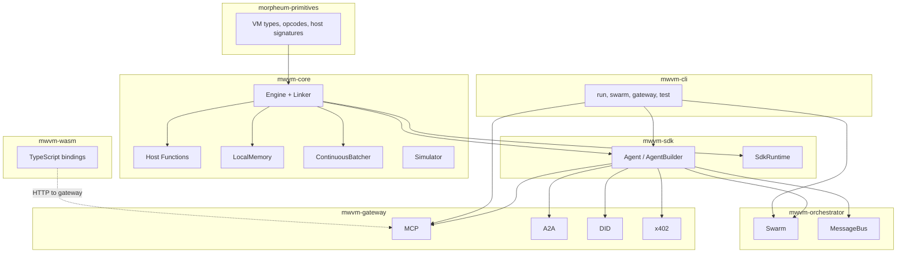
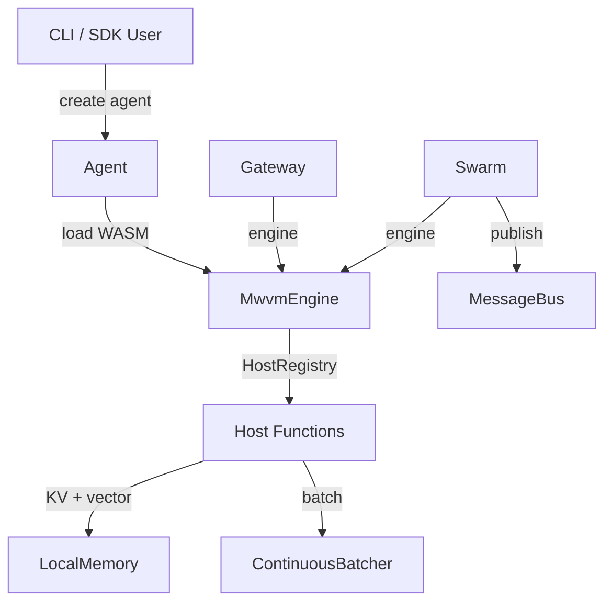

# MWVM System — Architecture

**Version**: 1.0  
**Date**: 08 March 2026  
**Status**: Design  
**Source**: Aligned with `mwvm/crates`

## High-Level Architecture

## Crate Layout

| Crate | Contents |
|-------|----------|
| **mwvm-core** | Engine, linker, host functions (infer, store_context, vector_search, zkml_tee, actor_messaging), LocalMemory, ContinuousBatcher, Simulator, error |
| **mwvm-sdk** | Agent, AgentBuilder, SdkRuntime, SdkConfig — re-exports from core |
| **mwvm-gateway** | Gateway, GatewayBuilder, GatewayConfig; mcp_server, a2a_server, did_resolver, x402_handler |
| **mwvm-orchestrator** | Swarm, SwarmBuilder, MessageBus, Event |
| **mwvm-cli** | run, swarm, gateway, test commands |
| **mwvm-wasm** | McpToolCall, tools_list_request, hex_to_bytes, bytes_to_hex |
| **mwvm-tests** | parity, integration, gateway_e2e |

## Host Functions

| Host | Purpose |
|------|---------|
| **infer** | Local inference via ContinuousBatcher; uses morpheum-primitives InferenceRequest |
| **store_context** | Store blob under key in LocalMemory |
| **vector_search** | Cosine-similarity search over embeddings in LocalMemory |
| **zkml_verify** | Mock zkML verification (simulation) |
| **tee_verify** | Mock TEE attestation (simulation) |
| **actor_messaging** | Send message to agent (actor model) |

All host functions use the shared namespace from morpheum-primitives.

## Gateway Endpoints

| Protocol | Path | Purpose |
|----------|------|---------|
| MCP | `/mcp` | tools/list, tools/call (JSON-RPC) |
| A2A | `/a2a` | AgentCard (dynamic) |
| DID | `/did/{agent-id}` | DID Document |
| x402 | `/x402/pay` | Payment required (402 when unpaid) |

Gateway binds to configurable address (default 0.0.0.0:8080). Each protocol can be enabled or disabled via GatewayConfig.

## Cross-Module Data Flow

## Component Dependencies

### MWVM Depends On

| Module | Provides |
|--------|----------|
| morpheum-primitives | VM types, opcodes, host signatures, MemoryBackend trait |
| wasmtime | WASM engine, linker, store |
| tokio | Async runtime |
| axum | HTTP router for gateway |
| dashmap | Concurrent KV for LocalMemory |
| flume | Channels for MessageBus |

### MWVM Provides

| Consumer | Receives |
|----------|----------|
| Agent developers | SDK, CLI, gateways |
| MCP/A2A clients | HTTP endpoints |
| Mormcore | Parity-tested WASM blobs |

## Related Documents

- [09-module-structure.md](09-module-structure.md) — Crate structure and integration
- [11-mwvm-vs-mormcore-vm.md](11-mwvm-vs-mormcore-vm.md) — MWVM vs Mormcore responsibilities
- [13-mwvm-architecture-flow.md](13-mwvm-architecture-flow.md) — Execution flows
