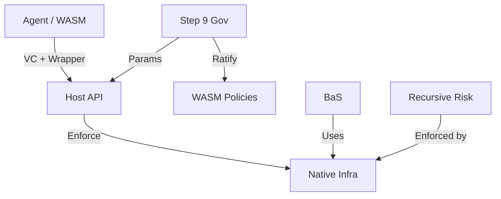

# MWVM — Scope Boundary & Responsibility Matrix

**Version**: 1.0  
**Date**: 05 March 2026  
**Status**: Design  
**Purpose**: Locked responsibility boundary for MWVM ecosystem.

## 1. Purpose

This document **locks** the exact responsibility boundary of the MWVM ecosystem so that:

- Native infrastructure remains protected and never exposed raw
- WASM operates only through safe wrappers with KYA/VC and quotas
- Hybrid governance keeps core native and application-level in WASM
- Single-responsibility per layer (Host API, BaS, Governance, Recursive Risk)

## 2. Locked Ownership Boundaries

| Layer | Sole Owner Of |
|-------|---------------|
| **Native Infrastructure** | Consensus, CLAMM, CLOB, buckets, staking core, multisig, bank transfers, order placement |
| **Host API** | Safe wrappers, capability checks, version checks, KYA/VC enforcement, quota checks |
| **BaS** | deploy_bucket_product, list_bucket_for_sale, buy_bucket; product types; health snapshots |
| **Governance (Step 9)** | Constitutional amendments, global params, supermajority voting, emergency pause |
| **WASM Contracts** | Application policies, sub-DAOs, custom templates (with native ratification) |
| **Recursive Risk** | Depth limiter, skin-in-the-game, effective leverage cap (enforced by native) |

## 3. Core Scope (MUST be implemented)

| Category | Included? | Detail |
|----------|-----------|--------|
| Safe Native Wrappers | YES | issue_token, bank_transfer, bucket transfers, place_limit_order, deploy_bucket_product, list_bucket_for_sale, buy_bucket |
| KYA/VC Delegation | YES | did_validate, vc_verify, check_delegation_scope, revoke_vc; scoped claims per operation |
| Bucket-as-Service | YES | Position/asset/mix-backed products; atomic escrow; insurance fund |
| Hybrid Governance | YES | Native Step 9 for core; WASM for application-level with native ratification |
| Recursive Risk Controls | YES | Depth limiter (max 4), skin-in-the-game, effective leverage cap |
| Overlap Penalties | YES | Economic disincentives for WASM duplicating native; Mormtest guidance |
| Constitutional Params | YES | All bas_*, wasm_overlap_*, clamm_a2a_* params; Step 9 amendable |

## 4. Explicitly Out-of-Scope (MUST NOT)

| Feature | Belongs In | Reason |
|---------|------------|--------|
| Raw native access | Never | WASM never gets direct access to native primitives |
| Pure WASM governance | N/A | Core remains native; only application-level in WASM |
| Uncontrolled recursion | N/A | Depth limiter and skin-in-the-game mandatory |
| EVM-style upgrade proxies | N/A | Object-centric model; native migration via MsgMigrate |
| Funding rate calculation | fundingrate (rclob) | MWVM/BaS scope is bucket products, not perp funding |
| Order matching | clob (rclob) | MWVM provides safe wrappers; CLOB owns matching |

## 5. Enforcement Rules

1. **WASM** calls only safe wrappers — never raw native functions
2. **Host API** enforces VC + quota on every high-risk call
3. **BaS** uses deploy_bucket_product, list_bucket_for_sale, buy_bucket exclusively
4. **Governance** amends params via MsgConstitutionalAmendment; Step 9 supermajority
5. **Recursive Risk** enforced at native bucket/risk layer; depth and lock checked on create/deposit

## 6. Cross-Layer Dependency Diagram

## 7. Fail-Safe Countermeasure Index

| Mechanism | Governance Backing |
|-----------|-------------------|
| Safe Mode (emergency pause) | MORP-GOV-001, gov-params |
| Constitutional params | gov-params, MORP-GOV-001 |
| Insurance fund | bucket-as-insurance, BA-OVERLAP-PENALTY-001 |
| VC scoping & A2A quotas | MORP-GOV-2026-02, MORP-GOV-2026-03 |
| Anti-overlap penalties | BA-OVERLAP-PENALTY-001 |
| Hybrid governance | design, hypbrid-governance |

## 8. Key Invariants

- **Host is God**: WASM = pure compute; all I/O via Host API
- **Delegation-first**: All bucket creation/sale through KYA/VC
- **Atomic escrow**: Every buy_bucket is atomic — no reentrancy
- **Constitutional tunability**: All params Step 9 amendable

This boundary guarantees **maximum security** while enabling permissionless agentic innovation.

## Related Documents

- [00-mwvm-business-scope.md](00-mwvm-business-scope.md) — Business scope
- [09-module-structure.md](09-module-structure.md) — Native vs WASM scope
- [../government/README.md](../government/README.md) — Governance index
