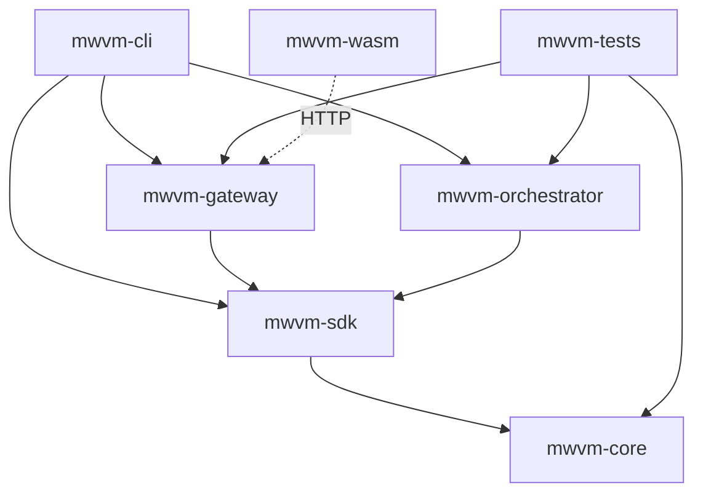

# MWVM — Scope Boundary & Responsibility Matrix

**Version**: 1.0  
**Date**: 08 March 2026  
**Status**: Design  
**Source**: Aligned with `mwvm/crates`

## 1. Purpose

This document locks the responsibility boundary of the MWVM crates so that:

- Each crate has a single, clear responsibility
- Dependencies flow inward (adapters → application → core)
- No overlap between crates

## 2. Crate Ownership Boundaries

| Crate | Sole Owner Of |
|-------|---------------|
| **mwvm-core** | Engine, linker, host functions, LocalMemory, batcher, simulation, error |
| **mwvm-sdk** | Agent, AgentBuilder, SdkRuntime, SdkConfig, SdkError |
| **mwvm-gateway** | Gateway, GatewayBuilder, GatewayConfig; MCP, A2A, DID, x402 routes |
| **mwvm-orchestrator** | Swarm, SwarmBuilder, MessageBus, Event |
| **mwvm-cli** | run, swarm, gateway, test commands |
| **mwvm-wasm** | McpToolCall, tools_list_request, hex_to_bytes, bytes_to_hex |
| **mwvm-tests** | parity, integration, gateway_e2e tests |

## 3. In-Scope (Implemented)

| Category | Crate | Detail |
|----------|-------|--------|
| WASM Engine | mwvm-core | wasmtime, linker, host registration |
| Host Functions | mwvm-core | infer, store_context, vector_search, zkml_tee, actor_messaging |
| Persistent Memory | mwvm-core | LocalMemory — KV + vector search |
| Continuous Batching | mwvm-core | ContinuousBatcher |
| Simulation | mwvm-core | SimulationMode, Simulator |
| SDK | mwvm-sdk | Agent, AgentBuilder, SdkRuntime |
| Gateways | mwvm-gateway | MCP, A2A, DID, x402 |
| Orchestrator | mwvm-orchestrator | Swarm, MessageBus |
| CLI | mwvm-cli | run, swarm, gateway, test |
| TypeScript | mwvm-wasm | Gateway client bindings |
| Tests | mwvm-tests | Parity, integration, E2E |

## 4. Explicitly Out-of-Scope (Mormcore)

| Feature | Belongs In | Reason |
|---------|------------|--------|
| On-chain execution | Mormcore | MWVM is off-chain only |
| Consensus, sharding | Mormcore | Not in MWVM scope |
| Bucket-as-Service | Mormcore | See 03-bucket-as-service |
| KYA/VC, governance | Mormcore | See 04-governance |
| Funding rate, order matching | rclob | CLOB scope |

## 5. Dependency Rules

1. **mwvm-core** — Depends only on morpheum-primitives, wasmtime, tokio, dashmap, etc. No mwvm-* crates.
2. **mwvm-sdk** — Depends on mwvm-core.
3. **mwvm-gateway** — Depends on mwvm-sdk (for MwvmEngine).
4. **mwvm-orchestrator** — Depends on mwvm-sdk.
5. **mwvm-cli** — Depends on mwvm-sdk, mwvm-gateway, mwvm-orchestrator.
6. **mwvm-wasm** — Depends on serde_json, hex, wasm-bindgen. No mwvm-core (wasmtime not available in wasm32).
7. **mwvm-tests** — Depends on mwvm-core, mwvm-orchestrator, mwvm-gateway.

## 6. Cross-Layer Diagram

## 7. Key Invariants

- **Core is engine-only** — No HTTP, no CLI, no gateway logic
- **SDK is facade** — No duplication of core logic
- **Gateways mount routes** — Single Axum router; protocols toggleable
- **Orchestrator is stateless** — Swarm + MessageBus; no persistent storage

## Related Documents

- [00-mwvm-business-scope.md](00-mwvm-business-scope.md) — Business scope
- [09-module-structure.md](09-module-structure.md) — Crate structure
