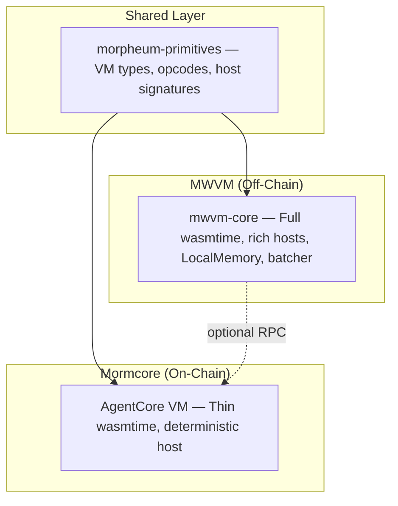

# MWVM vs Mormcore VM — Responsibilities

**Version**: 1.0  
**Date**: 08 March 2026  
**Status**: Design  
**Source**: Aligned with `mwvm/crates`

## 1. Layered Architecture

## 2. Shared Layer: morpheum-primitives

Single source of truth for VM contracts. Both MWVM and Mormcore implement against it.

**Contained in morpheum-primitives:**
- Types: InferenceRequest, ZkmlProof, TeeAttestation, MemoryEntry, VectorEmbedding, etc.
- Opcode and host-function signatures
- Error variants, constants
- MemoryBackend trait
- Validatable trait

**DRY guarantee:** Changing an opcode or type updates both runtimes.

## 3. MWVM Responsibilities (Off-Chain)

**Primary audience:** Agent developers, SDK users, local testing, MCP/A2A clients.

**Implemented in mwvm crates:**
- Full wasmtime engine with rich host implementations
- Local inference via ContinuousBatcher
- LocalMemory — KV store + brute-force vector search
- TEE/zkML simulation (mock attestation, mock verification)
- Multi-agent Swarm and MessageBus
- MCP, A2A, DID, x402 gateways
- Rust SDK (Agent, AgentBuilder, SdkRuntime)
- TypeScript bindings (mwvm-wasm) for gateway clients
- CLI: run, swarm, gateway, test

**No on-chain code** — never touches consensus or sharding.

## 4. Mormcore Responsibilities (On-Chain)

**Primary audience:** L1, ShardExecutor, AgentPortal nodes.

**Implemented in Mormcore:**
- Thin wasmtime host inside ShardExecutor
- Deterministic, replayable execution
- Zero-copy host functions calling existing hot-paths
- infer → model commitments, memory, proof submission
- zkml_verify, tee_verify → native verification
- vector_search, store_context → PersistentMemoryHot
- Runs on AgentPortal nodes; validators get no-op stub for replay

**No developer tools** — pure on-chain kernel.

## 5. Interaction Boundaries

- **Shared:** Types and signatures in morpheum-primitives
- **No code sharing** between MWVM and Mormcore (except primitives)
- **Versioning:** Primitives version pins both
- **Testing:** mwvm-tests parity suite runs same WASM on both; asserts identical results

## 6. Why This Split Works

- **Separation of concerns:** MWVM = developer experience; Mormcore = deterministic L1
- **DRY at contract level:** One definition of host semantics; two implementations
- **Future-proof:** New opcode in primitives → both sides update
- **Performance:** On-chain stays minimal; off-chain gets rich features

## Related Documents

- [12-native-agent-core.md](12-native-agent-core.md) — Native Agent Core guide
- [13-mwvm-architecture-flow.md](13-mwvm-architecture-flow.md) — Architecture and flows
