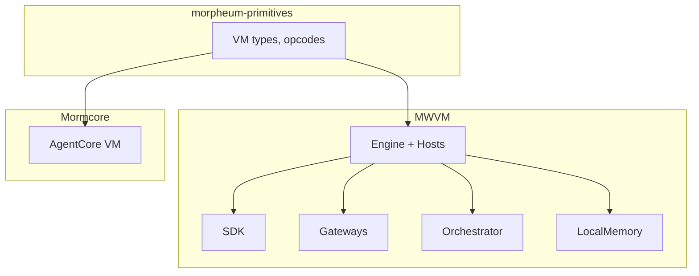

# MWVM Architecture & Flow

**Version**: 1.0  
**Date**: 08 March 2026  
**Status**: Design  
**Source**: Aligned with `mwvm/crates`

## 1. Executive Summary

MWVM is the **portable off-chain WASM runtime and SDK** for Morpheum AI agents. It provides rich local execution, gateways, and multi-agent orchestration while guaranteeing behavioral parity with Mormcore via shared primitives.

## 2. Purposes

1. **Developer velocity** — Local model serving, batching, simulation; no testnet wait
2. **Behavioral parity** — Same opcodes, memory model, types as on-chain
3. **Interoperability** — MCP, A2A, DID, x402 gateways
4. **Simulation** — Multi-agent swarm, MessageBus, offline mode
5. **Portability** — Agents compile once; run locally or on Mormcore

## 3. Crate Tree

| Crate | Role |
|-------|------|
| mwvm-core | Engine, host functions, LocalMemory, batcher, simulation |
| mwvm-sdk | Agent, AgentBuilder, SdkRuntime |
| mwvm-gateway | MCP, A2A, DID, x402 |
| mwvm-orchestrator | Swarm, MessageBus |
| mwvm-cli | run, swarm, gateway, test |
| mwvm-wasm | TypeScript bindings for gateway clients |
| mwvm-tests | parity, integration, gateway_e2e |

## 4. Architecture Diagram

## 5. Execution Flows

### Local Development

User runs agent via CLI or SDK. Engine loads WASM, registers hosts, instantiates. Host calls hit LocalMemory and ContinuousBatcher. No network required.

### Gateway

User starts gateway with engine. MCP/A2A/DID/x402 clients send HTTP requests. Gateway routes to engine; handlers execute agent logic. Bind address configurable (default 8080).

### Multi-Agent Swarm

User builds Swarm with agent count and base WASM. Each agent gets own runtime; shared engine. MessageBus supports send_to(agent_id) and broadcast. Topic-based subscribe/publish.

### Parity Verification

mwvm-tests loads minimal WASM fixture. Runs same calls on MWVM and (when available) Mormcore. Asserts identical outputs. Validates shared primitives and host dispatch.

## 6. Fixtures

**mwvm-tests/fixtures:**
- minimal_agent.wat — WAT module exporting host call stubs
- minimal_agent.wasm — Compiled binary (generated)
- generate-fixtures.sh — Regenerates WASM from WAT

## 7. Interactions

| Component | Interaction |
|-----------|-------------|
| morpheum-primitives | Single source for types and signatures |
| Mormcore | Optional RPC for hybrid testing |
| MCP/A2A/DID/x402 | Standard protocols; gateways expose endpoints |

## 8. Design Principles

- **100% DRY** at contract level (shared primitives)
- **Thin facades** — SDK, gateway, orchestrator wrap core
- **Builder pattern** — All major types use builders
- **Observable** — Tracing throughout

## Related Documents

- [02-architecture.md](02-architecture.md) — System architecture
- [11-mwvm-vs-mormcore-vm.md](11-mwvm-vs-mormcore-vm.md) — MWVM vs Mormcore
- [14-mwvm-implementation-plan.md](14-mwvm-implementation-plan.md) — Implementation plan
