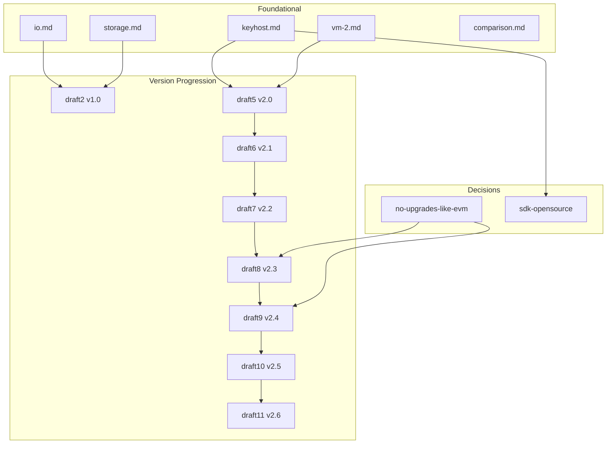

# MWVM Proposal Index

Index of all Morpheum WASM VM (MWVM) design proposals, with links to supporting documents that explain the ideas and decisions behind each version.

---

## Version Progression

| Version | Document | Summary | Key Additions |
|---------|----------|---------|---------------|
| **draft1** | [draft1.md](./draft1.md) | WASM feasibility in DAG blockchains | Research: IOTA, Aleph Zero, CosmWasm; local testbeds; pen-testing tools |
| **draft2** | [draft2.md](./draft2.md) | MWVM v1.0 architecture | Object-centric MVCC, Host API, 9-step DAG integration |
| **draft3** | [draft3-v1.0.md](./draft3-v1.0.md) | Mormtest v1.0 | Local testing framework, Wasmi/Wasmtime, agent orchestration |
| **draft4** | [draft4-v1.0.md](./draft4-v1.0.md) | Mormtest v1.1 agentic | Hierarchical memory hub, multi-model router, parallel exploration |
| **draft5** | [draft5-v2.0.md](./draft5-v2.0.md) | **MWVM v2.0** | Production spec: DAG-native optimizations, 28 Host API functions |
| **draft6** | [draft6-v2.1.md](./draft6-v2.1.md) | **MWVM v2.1** | Agentic extensions: `agent_publish`, `ai_infer`, swarm parallelism |
| **draft7** | [draft7-v2.2.md](./draft7-v2.2.md) | **MWVM v2.2** | Permissionless safety: `set_safe_mode`, `get_call_depth`, reentrancy guards |
| **draft8** | [draft8-v2.3.md](./draft8-v2.3.md) | **MWVM v2.3** | Native upgrade & migration: stable contract address, changelog, `migrate` entry point |
| **draft9** | [draft9-v2.4.md](./draft9-v2.4.md) | MWVM v2.4 | KYA/DID + VC delegation: `did_validate`, `vc_verify`, `vp_present`, `check_delegation_scope`, `revoke_vc`, x402 micropayments |
| **draft10** | [draft10-v2.5.md](./draft10-v2.5.md) | MWVM v2.5 | Host API security review, permission model, Safe Native Infrastructure Wrappers (issue_token, bank_transfer, place_limit_order, etc.) |
| **draft11** | [draft11-v2.6.md](./draft11-v2.6.md) | **MWVM v2.6** *(current)* | Bucket-as-Service (BaS) policy, agent-deployed structural products, exploit-aware countermeasures |

---

## Foundational Design Documents

These documents define the core architecture that all MWVM versions build on.

| Document | Purpose | Links To |
|----------|---------|----------|
| [io.md](./io.md) | Load/write/execute, race prevention, MVCC + Block-STM | Explains why WASM has no persistent storage; object-centric design; DAG causal order |
| [storage.md](./storage.md) | WASM storage model | Linear memory vs host-provided KV; CosmWasm, NEAR, Substrate comparison |
| [keyhost.md](./keyhost.md) | Host API (43+ functions) | Object management, DAG context, idempotency, oracle, staking, crosschain, KYA/delegation |
| [vm-2.md](./vm-2.md) | v2.0 compatibility matrix | Maps io, storage, keyhost, cost to v2.0 implementation |
| [comparison.md](./comparison.md) | VM comparison | ZK Cairo vs Move vs WASM — design philosophy, performance, security |

---

## Design Decisions & Rationale

| Document | Decision | Rationale |
|----------|----------|-----------|
| [no-upgrades-like-evm.md](./no-upgrades-like-evm.md) | **No OpenZeppelin-style upgrade complexity** | Object-centric model avoids storage slots, proxies, delegatecall; v2.3 native migration; v2.4 KYA/DID delegation |
| [sdk-opensource.md](./sdk-opensource.md) | **morpheum_std SDK design** | High-level wrappers over 43+ Host APIs; Rust primary, Go secondary; Mormtest integration |

---

## Cross-Cutting Topics

| Document | Topic | Key Points |
|----------|-------|------------|
| [sync-clock.md](./sync-clock.md) | Explorer & execution sync | MWVM execution uses same finality clock as DAG; specialized explorer needed for contract state |

---

## Quick Reference

| Need | Start Here |
|------|------------|
| Current production spec | [draft11-v2.6.md](./draft11-v2.6.md) |
| Host API reference | [keyhost.md](./keyhost.md) |
| Why object-centric + MVCC | [io.md](./io.md) |
| Why no EVM-style upgrades | [no-upgrades-like-evm.md](./no-upgrades-like-evm.md) |
| VM choice (ZK Cairo / Move / WASM) | [comparison.md](./comparison.md) |
| SDK architecture | [sdk-opensource.md](./sdk-opensource.md) |

---

## Document Relationships

