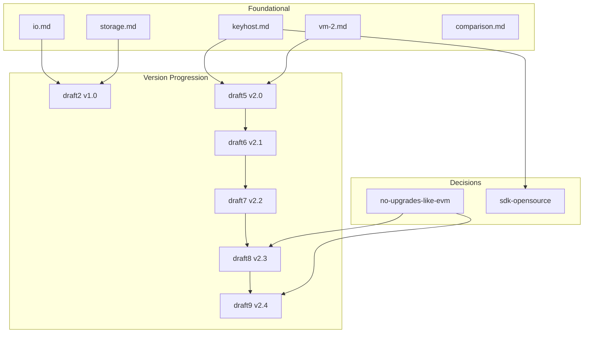

# MWVM Proposal Index

Index of all Morpheum WASM VM (MWVM) design proposals, with links to supporting documents that explain the ideas and decisions behind each version.

---

## API Summary (All Proposals)

Consolidated list of all Host API functions and transaction types across MWVM proposals. Source: [keyhost.md](./keyhost.md), [draft5-v2.0.md](./draft5-v2.0.md) through [draft9-v2.4.md](./draft9-v2.4.md).

### Host API by Category

| Category | Function | Signature | Introduced | Description |
|----------|----------|-----------|------------|-------------|
| **Object Management** | `object_read` | `(id: Hash, expected_ver: u64) → (data: Vec<u8>, actual_ver: u64)` | draft2 | Read versioned object; returns snapshot consistent with DAG predecessors |
| | `object_read_batch` | `(ids: Vec<Hash>, expected_vers: Vec<u64>) → Vec<(data, ver)>` | keyhost | Batch read for scheduler optimization |
| | `object_write` | `(id: Hash, new_data: Vec<u8>, new_ver: u64)` | draft2 | Schedule update; host commits after finality |
| | `object_write_batch` | `(ids: Vec<Hash>, data: Vec<Vec<u8>>, new_vers: Vec<u64>)` | keyhost | Batch write-set for Block-STM |
| | `object_create` | `(owner: ID, initial_data: Vec<u8>) → Hash` | draft2 | Create new owned object |
| | `object_delete` | `(id: Hash)` | keyhost | Destroy object (refund storage) |
| | `object_transfer` | `(id: Hash, new_owner: ID)` | draft2 | Transfer ownership atomically |
| **DAG Context** | `get_dag_context` | `() → (parents: Vec<Hash>, round: u64, finality: bool)` | draft2 | Causal parents + round from blocklace |
| | `host_get_dag_context` | `() → (parents: Vec<Hash>, round: u64, epoch_mode: Even\|Odd)` | draft5 | Alias; DAG-aware context |
| | `get_epoch_info` | `() → (epoch_id: u64, validators_hash: Hash, constitution: Bytes)` | keyhost | Current epoch + constitution |
| | `host_query_object_history` | `(id: Hash, version_range) → snapshot` | draft5 | Agentic time-travel queries |
| **Idempotency** | `idempotency_check` | `(key: Hash) → bool` | draft2 | Check if operation already processed |
| | `idempotency_mark` | `(key: Hash)` | keyhost | Mark operation done for retries |
| **Events & Oracle** | `emit_event` | `(topic: Hash, data: Vec<u8>)` | draft2 | Emit indexed event |
| | `call_oracle` | `(feed_id: Hash, params: Vec<u8>) → (data: Vec<u8>, proof: Vec<u8>)` | draft2 | TEE/ZK-backed external data |
| **Crosschain** | `crosschain_send` | `(dest_chain: ID, msg: Vec<u8>, object_locks: Vec<Hash>) → Hash` | keyhost | Atomic crosschain message |
| | `crosschain_recv` | `(inbound_id: Hash) → (msg: Vec<u8>, proof: Vec<u8>)` | keyhost | Receive and verify inbound |
| **Staking** | `stake` | `(object_id: Hash, amount: u128, protocol: Hash)` | keyhost | Lock tokens into staking pool |
| | `restake` | `(staked_id: Hash, new_protocol: Hash)` | keyhost | EigenLayer-style restaking |
| | `claim_yield` | `(staked_id: Hash)` | keyhost | Collect accrued rewards |
| **Gas & Random** | `gas_charge` | `(cost: u64)` | draft2 | Meter operation; out-of-gas → revert |
| | `get_random` | `() → [u8; 32]` | keyhost | VRF-derived 32-byte seed |
| **Security (ZK/TEE/FHE)** | `require_zk_proof` | `(proof: Vec<u8>, public_inputs: Vec<u8>)` | keyhost | Enforce ZK proof before commit |
| | `enable_tee_mode` | `()` | keyhost | Run tx in hardware enclave |
| | `fhe_encrypt` / `fhe_decrypt` / `fhe_compute` | Various | keyhost | FHE ops (TFHE/OpenFHE) |
| | `zk_prove_execution` | `(trace) → proof` | draft5 | Prove execution (zkWASM) |
| | `tee_attest_call` | `()` | draft5 | Enclave attestation |
| **Agentic (v2.1)** | `agent_publish` | `(topic: Hash, data: Vec<u8>)` | draft6 | Broadcast to agent swarm |
| | `agent_subscribe` | `(topic: Hash) → subscription_id` | draft6 | Listen for messages |
| | `agent_send_direct` | `(target_agent_id: Hash, data: Vec<u8>)` | draft6 | Private agent message |
| | `ai_infer` | `(model_id: Hash, inputs: Vec<u8>) → (output: Vec<u8>, proof: Vec<u8>)` | draft6 | On-chain AI inference with proof |
| | `agent_migrate` | `(new_code_id: Hash)` | draft6 | Self-upgrade agent contract |
| | `agent_self_destruct` | `()` | draft6 | Terminate agent safely |
| | `agent_log_metric` | `(key: Hash, value: Vec<u8>)` | draft6 | Log performance metric |
| | `agent_emit_trace` | `(trace_id, data)` | draft5 | Verifiable Mormtest replay |
| **Security Helpers (v2.2)** | `set_safe_mode` | `(enabled: bool)` | draft7 | Disable intra-tx messaging / reentrancy risk |
| | `get_call_depth` | `() → u32` | draft7 | Current call depth for guards |
| **Migration (v2.3)** | `migrate` | `(new_code_id: Hash, migration_data: Vec<u8>) → Result<()>` | draft8 | Upgrade contract (same address) |
| | `get_contract_version` | `() → u64` | draft8 | Current code version |
| | `require_version` | `(min_version: u64)` | draft8 | Reject if version too old |
| | `emit_migration_log` | `(old_ver: u64, new_ver: u64, notes: Vec<u8>)` | draft8 | Record immutable changelog |
| **KYA / Delegation (v2.4)** | `did_validate` | `(did: String) → Result<DidInfo>` | draft9 | Parse and validate DID |
| | `vc_verify` | `(vc: Vec<u8>) → Result<VerifiedClaims>` | draft9 | Verify owner-signed VC |
| | `vp_present` | `(vp: Vec<u8>) → Result<VerifiedClaims>` | draft9 | Present VP with VCs |
| | `check_delegation_scope` | `(claims, tx_context) → bool` | draft9 | Enforce VC limits on tx |
| | `get_agent_reputation` | `(did: String) → u32` | draft9 | KYA reputation score |
| | `x402_verify_micropayment` | `(header: Vec<u8>) → bool` | draft9 | Verify x402 payment proof |
| | `revoke_vc` | `(vc_id: Hash)` | draft9 | Revoke issued VC (issuer only) |
| | `emit_delegation_log` | `(action: String, vc_id: Hash, notes: Vec<u8>)` | draft9 | Record delegation event |
| **Governance** | `read_constitution_param` | `(key)` | draft5 | Live param from Step 9 |

### Transaction Types (Msg)

| Msg | Description | Source |
|-----|-------------|--------|
| `MsgStoreCode` | Store immutable code object (deposit = 1 $MORPH / 100 KB, refundable) | draft5, keyhost |
| `MsgInstantiate` | Create new contract instance (0.01 $MORPH flat) | draft5 |
| `MsgMigrate` | Upgrade existing instance (same address; 0.05 $MORPH) | draft8 |
| `MsgIssueVC` | On-chain VC issuance (optional, Flash-eligible) | draft9 |

### Native-Only (Not Exposed via Host API)

Per [v2.4-clarifications.md](./v2.4-clarifications.md): multisig wallet FSM, full CLAMM/ReClamm operations, bucket/perp core, direct staking core logic. Contracts access these only via KYA delegation.

### Function Count by Version

| Version | Total Functions | New in Version |
|---------|-----------------|----------------|
| v2.0 | 28 | Core + DAG + Agentic base |
| v2.1 | 35+ | +7 agentic (publish, subscribe, send_direct, ai_infer, migrate, self_destruct, log_metric) |
| v2.2 | 37+ | +2 security (set_safe_mode, get_call_depth) |
| v2.3 | 39+ | +4 migration (migrate, get_contract_version, require_version, emit_migration_log) |
| v2.4 | 43+ | +8 KYA (did_validate, vc_verify, vp_present, check_delegation_scope, get_agent_reputation, x402_verify_micropayment, revoke_vc, emit_delegation_log) |

---

## Version Progression

| Version | Document | Summary | Key Additions |
|---------|----------|---------|---------------|
| **draft1** | [draft1.md](./draft1.md) | WASM feasibility in DAG blockchains | Research: IOTA, Aleph Zero, CosmWasm; local testbeds; pen-testing tools |
| **draft2** | [draft2.md](./draft2.md) | MWVM v1.0 architecture | Object-centric MVCC, Host API, 9-step DAG integration |
| **draft3** | [draft3-v1.0.md](./draft3-v1.0.md) | Mormtest v1.0 | Local testing framework, Wasmi/Wasmtime, agent orchestration |
| **draft4** | [draft4-v1.0.md](./draft4-v1.0.md) | Mormtest v1.1 agentic | Hierarchical memory hub, multi-model router, parallel exploration |
| **draft5** | [draft5-v2.0.md](./draft5-v2.0.md) | **MWVM v2.0** | Production spec: DAG-native optimizations, 28 Host API functions |
| **draft6** | [draft6-v2.1.md](./draft6-v2.1.md) | **MWVM v2.1** | Agentic extensions: `agent_publish`, `ai_infer`, swarm parallelism |
| **draft7** | [draft7-v2.2.md](./draft7-v2.2.md) | **MWVM v2.2** | Permissionless safety: `set_safe_mode`, `get_call_depth`, reentrancy guards |
| **draft8** | [draft8-v2.3.md](./draft8-v2.3.md) | **MWVM v2.3** | Native upgrade & migration: stable contract address, changelog, `migrate` entry point |
| **draft9** | [draft9-v2.4.md](./draft9-v2.4.md) | **MWVM v2.4** *(current)* | KYA/DID + VC delegation: `did_validate`, `vc_verify`, `vp_present`, `check_delegation_scope`, `revoke_vc`, x402 micropayments |

---

## Foundational Design Documents

These documents define the core architecture that all MWVM versions build on.

| Document | Purpose | Links To |
|----------|---------|----------|
| [io.md](./io.md) | Load/write/execute, race prevention, MVCC + Block-STM | Explains why WASM has no persistent storage; object-centric design; DAG causal order |
| [storage.md](./storage.md) | WASM storage model | Linear memory vs host-provided KV; CosmWasm, NEAR, Substrate comparison |
| [keyhost.md](./keyhost.md) | Host API (43+ functions) | Object management, DAG context, idempotency, oracle, staking, crosschain, KYA/delegation |
| [vm-2.md](./vm-2.md) | v2.0 compatibility matrix | Maps io, storage, keyhost, cost to v2.0 implementation |
| [comparison.md](./comparison.md) | VM comparison | ZK Cairo vs Move vs WASM — design philosophy, performance, security |

---

## Design Decisions & Rationale

| Document | Decision | Rationale |
|----------|----------|-----------|
| [no-upgrades-like-evm.md](./no-upgrades-like-evm.md) | **No OpenZeppelin-style upgrade complexity** | Object-centric model avoids storage slots, proxies, delegatecall; v2.3 native migration; v2.4 KYA/DID delegation |
| [sdk-opensource.md](./sdk-opensource.md) | **morpheum_std SDK design** | High-level wrappers over 43+ Host APIs; Rust primary, Go secondary; Mormtest integration |

---

## Cross-Cutting Topics

| Document | Topic | Key Points |
|----------|-------|------------|
| [sync-clock.md](./sync-clock.md) | Explorer & execution sync | MWVM execution uses same finality clock as DAG; specialized explorer needed for contract state |

---

## Quick Reference

| Need | Start Here |
|------|------------|
| Current production spec | [draft9-v2.4.md](./draft9-v2.4.md) |
| **All APIs (consolidated)** | [API Summary](#api-summary-all-proposals) above |
| Host API reference (detailed) | [keyhost.md](./keyhost.md) |
| Why object-centric + MVCC | [io.md](./io.md) |
| Why no EVM-style upgrades | [no-upgrades-like-evm.md](./no-upgrades-like-evm.md) |
| VM choice (ZK Cairo / Move / WASM) | [comparison.md](./comparison.md) |
| SDK architecture | [sdk-opensource.md](./sdk-opensource.md) |

---

## Document Relationships

