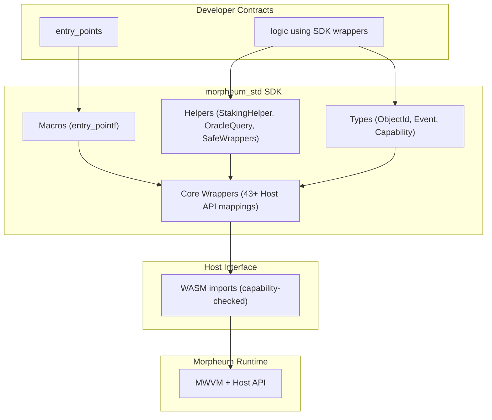

### Morpheum_std SDK: High-Level Design and Architecture Overview

The `morpheum_std` SDK is the developer-facing library that abstracts and wraps the **43+ Host APIs** (see [keyhost.md](./keyhost.md)) for building WASM smart contracts on Morpheum. It follows the exact Host API signatures, categories, and security semantics — capability-checked, versioned objects, DAG-aware calls, KYA/VC delegation, and Safe Native Infrastructure Wrappers (v2.5+) — to ensure seamless integration with the MWVM execution layer, object-centric MVCC, Block-STM scheduler, and 9-step DAG consensus.

The SDK's development must **strictly follow the 43+ APIs** as the foundation: it provides ergonomic wrappers, types, and utilities around them without adding new runtime logic (to preserve determinism and gasless execution). No low-level WASM imports are exposed directly — everything is mediated through safe, high-level abstractions.

**Spec alignment**: MWVM v2.6 ([draft11-v2.6.md](./draft11-v2.6.md)), Host API v1.1 ([keyhost.md](./keyhost.md)).

This is a **pure top-level design** (no code, no pseudocode). It covers the overall design principles, then the architecture for Rust (primary, as Morpheum is Rust-based via Mormcore) and GoLang (secondary, for broader ecosystem support).

#### 1. Top-Level Design Principles
The SDK adheres to these core guidelines to align with Morpheum's gasless, DAG-native, agentic-friendly philosophy:

- **API Fidelity**: 100% coverage of the 43+ Host APIs (grouped as in keyhost.md: Object Management, DAG Context, Idempotency, Events/Oracle, Crosschain, Staking, Gas/Metering, ZK/TEE/FHE; plus KYA/Delegation and Safe Native Infrastructure Wrappers from v2.4–v2.5). Wrappers add zero overhead — direct pass-through to host calls.
- **Developer Ergonomics**: High-level types (e.g., `ObjectId`, `EventEmitter`) with serialization (Serde/JSON), error enums, and macros for entry points (instantiate/execute/query/migrate).
- **Safety First**: Built-in checks for versions, capabilities, and idempotency keys. Compile-time enforcement where possible (e.g., via traits/types).
- **Modularity**: Core crate + optional extensions (e.g., for ZK/TEE, staking helpers, oracle wrappers).
- **Cross-Language**: Rust as reference impl (native to Mormcore); GoLang as secondary (via bindings or native re-impl) for broader adoption.
- **DAG-Native Features**: Helpers for querying DAG context (e.g., parents, epoch mode) and handling Flash-path vs. wave execution.
- **Agentic Focus**: Built-in support for multi-call batches, idempotency, verifiable randomness, and KYA/VC delegation to enable autonomous agents.
- **Versioning & Upgradability**: SDK versions tied to constitutional params (Step 9 amendments can deprecate/add APIs).
- **Dependencies**: Minimal — Serde for serialization, no heavy libs to keep WASM binaries small (~50–200 KB optimized).
- **Testing Integration**: Seamless with Mormtest (local sim mirrors the SDK).

The SDK turns raw Host API calls into a "standard library" feel, similar to `cosmwasm-std` (Cosmos) or `ink!` (Polkadot), but optimized for Morpheum's object-centric + DAG model.

#### 2. High-Level Architecture Diagram

- **Flow**: Developer imports SDK → uses wrappers/macros → compiles to WASM → deploys via MsgStoreCode/Instantiate → executes via MsgRouter post-consensus.
- **Modular Crates**: Split into `morpheum-std` (core), `morpheum-std-ext` (ZK/TEE/FHE), `morpheum-std-agentic` (idempotency/multi-call tools), `morpheum-std-safe` (Safe Native Infrastructure Wrappers: issue_token, bank_transfer, place_limit_order, etc.).

Now, language-specific architectures.

#### 3. Architecture for Rust Implementation
Rust is the ideal primary language (aligns with Mormcore's Rust base, efficient WASM compilation via `wasm32-unknown-unknown` target).

- **Crate Structure** (Modular, Cargo-based):
  - **Root Crate**: `morpheum-std` (core wrappers + types).
    - Submodules: `api` (Host API wrappers), `types` (ObjectId, Event, Capability), `macros` (entry_point! for instantiate/execute), `errors` (enum for version mismatch, capability denied).
  - **Extension Crates**: `morpheum-std-staking` (stake, restake, claim_yield), `morpheum-std-oracle` (call_oracle abstractions), `morpheum-std-agentic` (idempotency_check builder, multi_call batcher), `morpheum-std-safe` (issue_token, bank_transfer, place_limit_order, cancel_limit_order, multi_send — VC-gated Safe Native Infrastructure Wrappers).
  - **Build Pipeline**: Cargo.toml with `[lib] crate-type = ["cdylib"]`; optional `no_std` for minimal size.

- **Layered Components**:
  - **Interface Layer**: Traits like `HostApi` (impl wraps all 43+ calls, e.g., `fn object_read(&self, id: ObjectId, ver: u64) -> Result<(Vec<u8>, u64)>`).
  - **Abstraction Layer**: Builders/Helpers (e.g., `EventEmitter::new().emit("Greeting", data)` wraps emit_event).
  - **Safety Layer**: Generic wrappers with compile-time checks (e.g., `VersionedObject<T>` for auto-version handling).
  - **Integration Layer**: Macros integrate with MWVM entry points; Serde for JSON msg parsing.

- **Key Benefits in Rust**: Zero-cost abstractions, strong typing for ObjectId/Capability, easy WASM optimization (rust-optimizer integration in build script).

#### 4. Architecture for GoLang Implementation
GoLang as secondary (for teams preferring it, or non-Rust ecosystems). Use `tinygo` for WASM compilation (efficient, small binaries).

- **Package Structure** (Modular, Go modules-based):
  - **Root Package**: `github.com/morpheum/morpheum-std` (core wrappers + types).
    - Subpackages: `api` (Host API funcs), `types` (structs like ObjectId, Event), `errors` (custom error types), `macros` (no true macros, but helper funcs like NewEntryPoint).
  - **Extension Packages**: `morpheum-std-staking`, `morpheum-std-oracle`, `morpheum-std-agentic` (idempotency utils), `morpheum-std-safe` (Safe Native Infrastructure Wrappers).
  - **Build Pipeline**: Go.mod with WASM target; `tinygo build -o contract.wasm -target=wasm main.go`.

- **Layered Components**:
  - **Interface Layer**: Interfaces like `HostAPI` (methods mirror 43+ APIs, e.g., `ObjectRead(id ObjectId, ver uint64) ([]byte, uint64, error)`).
  - **Abstraction Layer**: Structs/Builders (e.g., `EventEmitter{}.Emit("Greeting", data)` wraps emit_event).
  - **Safety Layer**: Runtime checks (e.g., `VersionedObject[T]` struct with embedded version validation).
  - **Integration Layer**: Entry point funcs (e.g., `export instantiate` for WASM linkage); JSON marshaling via encoding/json.

- **Key Benefits in GoLang**: Simpler concurrency patterns for agentic tools, easier cross-platform builds, but slightly larger binaries (~20–50% vs Rust) — mitigate with tinygo optimizations.

This design ensures `morpheum_std` is lightweight, secure, and fully compliant with the 43+ Host APIs, enabling fast contract development while preserving Morpheum's DAG-native strengths and v2.5+ permission model (KYA/VC delegation, Safe Wrappers, resource quotas).